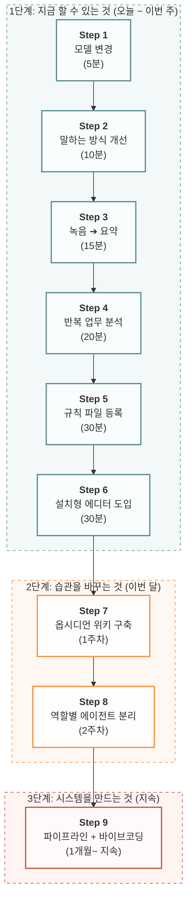

# 00. 시작 — 어디서부터 할 것인가

> 4개의 가이드를 관통하는 **단계별 실행 로드맵**.
> "지금 나는 뭘 해야 하는가?"에 대한 답을 이 문서 하나로 끝낸다.

---

## 이 문서의 사용법

아래의 스텝을 **위에서 아래로 순서대로** 따라간다.
각 스텝은 **판단 기준 → 할 일 → 해당 가이드 참조** 세 줄로 끝난다.
이미 완료한 스텝은 건너뛴다.

---

## Step 0. 지금 내 상태를 확인한다

| 질문 | 예 → 건너뛸 스텝 | 아니오 → 시작할 스텝 |
|------|-----------------|-------------------|
| AI 유료 결제를 한 적 있는가? | [→ Step 2로](#step-2-말하는-방식을-바꿔라-10분) | [→ **Step 1**](#step-1-모델을-바꿔라-5분) |
| AI에게 요청할 때 "역할 + 맥락 + 형식"을 넣고 있는가? | [→ Step 3으로](#step-3-녹음부터-시작하라-15분) | [→ **Step 2**](#step-2-말하는-방식을-바꿔라-10분) |
| 내 작업 폴더에 AI가 직접 접근하고 있는가? (Cursor/Antigravity) | [→ Step 4로](#step-4-반복하는-일을-찾아라-20분) | [→ **Step 3**](#step-3-녹음부터-시작하라-15분) |
| CLAUDE.md 또는 규칙 파일을 쓰고 있는가? | [→ Step 5로](#step-5-규칙-파일을-만들어라-30분) | [→ **Step 4**](#step-4-반복하는-일을-찾아라-20분) |
| 에이전트를 2개 이상 분리 운용하고 있는가? | [→ Step 8로](#step-8-에이전트를-나눠라-2주) | [→ **Step 5**](#step-5-규칙-파일을-만들어라-30분) |

> 어디에 해당하는지 모르겠으면 **Step 1부터 시작**하면 된다.

---

## Step 1. 모델을 바꿔라 (5분)

**판단**: AI를 쓰고 있는데 결과가 항상 두루뭉술하다.

**할 일**:

1. 지금 쓰는 AI 서비스(ChatGPT / Claude / Gemini)에 접속한다.
2. 대화창 상단의 모델 선택 드롭다운을 누른다.
3. 가장 높은 등급(GPT-5.5 / Claude Sonnet 4.6 / Gemini 3.1 Pro)으로 변경한다.

**결제 가이드**:
| 상황 | 추천 |
|------|------|
| 하나만 결제 | Claude Pro 또는 ChatGPT Plus ($20/월) |
| 두 개 결제 | Claude Pro + Gemini Advanced |
| 무료로 최대한 | Gemini (무료 범위 가장 넓음) + NotebookLM |

> **참조**: [01_도구 — 1. AI 모델 등급 및 요금제 가이드](01_도구_뭘_쓸_것인가.md#1-ai-모델-등급-및-요금제-가이드)

---

## Step 2. 말하는 방식을 바꿔라 (10분)

**판단**: 높은 모델을 쓰는데도 결과가 뻔하다. "이거 내가 원하는 게 아닌데" 경험.

**할 일**:

1. **요청 전에 맥락을 먼저 던진다** — 명령이 아니라 상황을 공유한다.
   ```
   [상황] 나는 지금 ~하고 있다
   [생각] 이런 느낌/질문이 있다
   [방향] 이런 쪽으로 가고 싶다
   [제약] 이건 하지 마
   ```
2. **단순 거절 대신 구체적인 피드백을 제시한다** — "이거 너무 뻔하다. 다시"라고 단순 거절하기보다, "전문 용어를 빼고 구체적인 액션 아이템 위주로 3가지 다시 제시해 줘"와 같이 개선 방향(Do)과 제약 조건(Don't)을 명확하게 피드백하는 것이 고품질 답변을 얻는 지름길입니다.
3. **프롬프트는 짧을 필요가 없다** — 오히려 이슈의 배경, 물리적 제약, 에러 상황을 그대로 길게 넣어라. 맥락이 풍부할수록 AI는 한 번에 정확한 결과를 낸다.

> **참조**: [01_도구 — 4. 프롬프트 작성 원칙](01_도구_뭘_쓸_것인가.md#4-프롬프트-작성-원칙-역할-맥락-형식)
> **참조**: [02_루틴 — 1. AI 협업 기본 원칙](02_루틴_어디에_넣을_것인가.md#1-ai-협업의-기본-원칙)

---

## Step 3. 녹음부터 시작하라 (15분)

**판단**: AI를 쓰고 싶은데 뭘 넣어야 할지 모르겠다. 타이핑이 귀찮다.

**할 일**:

1. 핸드폰으로 회의/아이디어를 녹음한다 (기본 녹음 앱).
2. [notebooklm.google.com](https://notebooklm.google.com) 접속 → 녹음 파일 업로드.
3. "핵심 요약 3가지 + 액션 아이템 뽑아줘" 입력.
4. 결과를 확인하고 틀린 부분만 수정한다.

**자동화까지 가고 싶다면**:
- 아이폰 단축어 → 뒷면 이중 탭 → 녹음 → Google Drive 자동 업로드
- Make.com 시나리오로 Whisper(텍스트 변환) → Claude(요약) → Drive(저장) 자동 파이프라인 구축

> **참조**: [01_도구 — 3. 녹음 정리 및 자료 요약](01_도구_뭘_쓸_것인가.md#3-녹음-정리-및-자료-요약-notebooklm-실전)
> **참조**: [02_루틴 — 6. 아이폰 음성 단축어 및 Make 자동화](02_루틴_어디에_넣을_것인가.md#6-아이폰-음성-단축어-및-make-자동화-파이프라인)

---

## Step 4. 반복하는 일을 찾아라 (20분)

**판단**: AI로 할 수 있는 건 알겠는데, 어디에 먼저 넣어야 효과가 큰지 모르겠다.

**할 일**:

1. 매일/매주 반복하는 작업 5개를 적는다.
2. 각각에 빈도 × 소요시간 × 귀찮은 정도를 곱한다.
3. 점수가 높은 것부터 AI로 전환한다.

| 작업 예시 | 빈도 | 시간 | 귀찮음 | **점수** | **판정** |
|----------|------|------|--------|---------|---------|
| 미팅 후 정리 | 4 | 3 | 5 | **60** | 🔴 즉시 전환 |
| 견적서 작성 | 3 | 4 | 4 | **48** | 🔴 즉시 전환 |
| SNS 캡션 | 5 | 2 | 3 | **30** | 🟡 전환 추천 |

**데이터 포맷 팁**:
- AI에게 줄 문서는 **마크다운(.md)** 파일이 기본이다.
- HWP는 토큰을 5배 이상 낭비한다. 같은 돈으로 5배 더 일시킬 수 있다.

> **참조**: [02_루틴 — 2. 루틴 분석 및 우선순위 설계](02_루틴_어디에_넣을_것인가.md#2-루틴-분석-및-우선순위-설계)
> **참조**: [02_루틴 — 8. AI 최적화 마크다운 변환 가이드](02_루틴_어디에_넣을_것인가.md#8-ai-최적화-마크다운md-변환-및-검증-가이드라인)

---

## Step 5. 규칙 파일을 만들어라 (30분)

**판단**: AI에게 매번 같은 설명을 반복하고 있다. "나는 ~이고, ~하게 해줘"를 10번째 치고 있다.

**할 일**:

1. 아래 템플릿을 복사한다.
2. 괄호 안을 내 정보로 채운다.
3. 사용하는 서비스에 등록한다.

```markdown
# 나의 AI 규칙

## 나는 누구인가
- 직업: [예: 프리랜서 사진작가]
- 주 작업: [예: 상업 인물촬영, 클라이언트 견적, SNS 마케팅]

## AI에게 바라는 것
- 톤: [예: 전문적이고 간결하게]
- 형식: [예: 표와 불릿 포인트 위주]

## 내 업무 규칙
- [예: 견적서에 VAT 별도 명시]
- [예: 수치는 반드시 출처를 붙여라]

## 금지 사항
- [예: "혁신적", "시너지" 같은 상투어 금지]
```

| 서비스 | 어디에 넣나 | 제한 |
|--------|-----------|------|
| **ChatGPT** | 설정 → 개인화 → 사용자 지정 지침 | ~1,500자 |
| **Claude** | Projects → 새 프로젝트 → 지식 추가 | 200K 토큰 |
| **Gemini** | Gem Manager → 새 Gem 만들기 | 넓음 |
| **Cursor / Antigravity** | 프로젝트 루트에 `CLAUDE.md` 파일 생성 | 무제한 |

> **참조**: [03_확장 — 1. 규칙 파일 설계 및 에이전트 개인화](03_확장_사고를_시스템으로.md#1-규칙-파일-설계-및-에이전트-개인화)
> **참조**: [04_시스템 — 2. 규칙 파일](04_시스템_에이전트와_파이프라인.md#2-규칙-파일-rule-files-ai의-기본-행동-지침)

---

## Step 6. 설치형 에디터를 깔아라 (30분)

**판단**: 웹 채팅으로 복사-붙여넣기를 반복하고 있다. 파일을 직접 조작하고 싶다.

**할 일**:

1. **Cursor** 또는 **Antigravity** 중 하나를 설치한다.
2. 내 작업 폴더를 에디터에서 연다 — AI가 폴더 전체를 직접 읽고 수정할 수 있게 된다.
3. "이 폴더의 파일 이름을 날짜_프로젝트_번호 형식으로 전부 바꿔줘" — 1초에 끝난다.

**크롬 확장도 같이 깔아라**:
- **Glasp YouTube Summary** ([glasp.co/youtube-summary](https://glasp.co/youtube-summary)) 설치
- 유튜브 영상 → 자막 원클릭 복사 → 내 CLAUDE.md와 비교 → "내가 아직 적용 안 한 노하우 3개 뽑아줘"
- 남의 시스템을 통째로 복사하지 않는다. **내 시스템과 비교해서 차이점만 흡수**한다.

> **참조**: [01_도구 — 5. 웹 vs 설치형](01_도구_뭘_쓸_것인가.md#5-웹saas-vs-설치형에디터-및-확장-개념)
> **참조**: [01_도구 — 3-4. 크롬 확장 프로그램 연동 팁](01_도구_뭘_쓸_것인가.md#3-4-크롬-확장-프로그램-연동-팁-glasp-youtube-summary)

---

## Step 7. 메모가 쌓이는 구조를 만들어라 (1주)

**판단**: 파일이 여기저기 흩어져 있다. 레퍼런스를 모아도 나중에 못 찾는다.

**할 일**:

1. **옵시디언(Obsidian)** 설치 — 무료, 로컬 저장, 양방향 링크.
2. 3-폴더 구조를 만든다:
   ```
   /raw     ← 날것 자료 (녹음, 메모, 스크랩). 절대 수정 금지.
   /wiki    ← AI가 정리한 지식. 시간이 쌓일수록 풍부해짐.
   /schema  ← 정리 규칙. CLAUDE.md가 여기에 들어간다.
   ```
3. 1주일간 매일 메모 습관만 들인다 — 아직 AI 연동 안 해도 됨.
4. 2주차에 Smart Connections 플러그인 설치 → AI에게 "내 노트 중 이 주제와 관련된 것 찾아줘".

> **참조**: [03_확장 — 3. 옵시디언 LLM 위키 구축](03_확장_사고를_시스템으로.md#3-옵시디언obsidian-llm-위키-구축)

---

## Step 8. 에이전트를 나눠라 (2주)

**판단**: AI에게 모든 걸 한 번에 시키고 있다. 결과가 항상 중간쯤이다.

**할 일**:

1. 내가 AI에게 시키는 일을 종류별로 분류한다.
2. 종류별로 에이전트를 분리한다:

| 에이전트 | 역할 | 예시 요청 |
|----------|------|----------|
| **Writer** | 문서 작성 | "제안서 초안 써줘" |
| **Reviewer** | 검토/비평 | "이 제안서에서 수치 불일치 찾아줘" |
| **Researcher** | 리서치 | "이 공고의 핵심 요구사항 정리해줘" |

3. 검증 루프를 추가한다 — Writer가 쓴 결과를 Reviewer가 비평한다.
4. "칭찬은 한 줄도 쓰지 마라. 까는 게 일이다." — 악플러 에이전트.

> **참조**: [04_시스템 — 3. 에이전트](04_시스템_에이전트와_파이프라인.md#3-에이전트-agents-역할-기반의-ai-분업화)

---

## Step 9. 파이프라인을 연결하라 (1개월~)

**판단**: 에이전트가 각각 잘 동작하는데, 이걸 자동으로 연결하고 싶다.

**할 일**:

1. 에이전트 간의 흐름을 그린다:
   ```
   리서치 → 분석 → 문서 작성 → 검증 → 수정 → 최종
   ```
2. 결정 로그를 만든다 — 한 번 확정한 것은 재론하지 않는다.
3. 변주 매트릭스를 적용한다 — 패턴이 반복되면 경고.

**+ 바이브코딩으로 도구를 만들어라**:
- 코딩 지식 필요 없음. 말로 설명하면 AI가 만든다.
- 조명 큐시트 자동 생성, 견적 웹앱, 포트폴리오 사이트, DM 자동응답 — 전부 가능.

> **참조**: [03_확장 — 4. 바이브코딩 7대 영역](03_확장_사고를_시스템으로.md#4-크리에이터를-위한-바이브-코딩vibe-coding)
> **참조**: [04_시스템 — 파이프라인](04_시스템_에이전트와_파이프라인.md)

---

## 전체 로드맵 한눈에 보기



각 세부 단계별 정보는 아래 요약 표와 가이드 링크를 참고하여 차례대로 수행하세요.

| 단계 | 소요 시간 및 시점 | 주요 액션 및 목표 | 추천 가이드 링크 |
| :--- | :--- | :--- | :--- |
| **Step 1** | ⏱️ 5분 (오늘) | **모델 등급 높이기** (Pro/Advanced 결제 및 설정) | [01_도구 ➔ 모델 가이드](01_도구_뭘_쓸_것인가.md#1-ai-모델-등급-및-요금제-가이드) |
| **Step 2** | ⏱️ 10분 (오늘) | **맥락 제공 및 구체적 피드백** (질문 방식 개선) | [01_도구 ➔ 프롬프트 원칙](01_도구_뭘_쓸_것인가.md#4-프롬프트-작성-원칙-역할-맥락-형식) |
| **Step 3** | ⏱️ 15분 (오늘) | **음성 녹음 및 요약** (NotebookLM 실전 활용) | [01_도구 ➔ NotebookLM](01_도구_뭘_쓸_것인가.md#3-녹음-정리-및-자료-요약-notebooklm-실전) |
| **Step 4** | ⏱️ 20분 (이번 주) | **반복 업무 분석** (AI 도입 우선순위 평가) | [02_루틴 ➔ 루틴 분석](02_루틴_어디에_넣을_것인가.md#2-루틴-분석-및-우선순위-설계) |
| **Step 5** | ⏱️ 30분 (이번 주) | **나만의 규칙 파일 등록** (Custom Instructions/CLAUDE.md) | [03_확장 ➔ 규칙 파일](03_확장_사고를_시스템으로.md#1-규칙-파일-설계-및-에이전트-개인화) |
| **Step 6** | ⏱️ 30분 (이번 주) | **설치형 에디터 도입** (Cursor / Antigravity 연동) | [01_도구 ➔ 웹 vs 설치형](01_도구_뭘_쓸_것인가.md#5-웹saas-vs-설치형에디터-및-확장-개념) |
| **Step 7** | 📅 1주 (이번 달) | **옵시디언 3-폴더 위키 구축** (지식 누적 시스템) | [03_확장 ➔ 옵시디언](03_확장_사고를_시스템으로.md#3-옵시디언obsidian-llm-위키-구축) |
| **Step 8** | 📅 2주 (이번 달) | **역할별 에이전트 분리** (Writer - Reviewer 비평 루프) | [04_시스템 ➔ 에이전트](04_시스템_에이전트와_파이프라인.md#3-에이전트-agents-역할-기반의-ai-분업화) |
| **Step 9** | 🚀 1개월~ (지속) | **자동 파이프라인 및 바이브코딩** (도구 제작 및 자동화) | [04_시스템 ➔ 파이프라인](04_시스템_에이전트와_파이프라인.md#6-크리에이티브-및-실무-파이프라인-시나리오) |

---

> **이 문서를 읽었으면 → Step 1부터 순서대로. 한 번에 다 하지 않는다.**
> 오늘 Step 1~3만 끝내도 내일의 업무가 달라진다.
