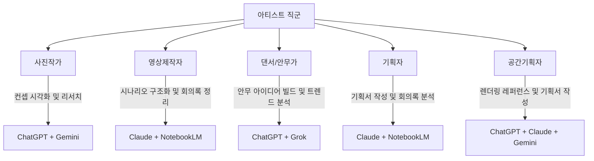
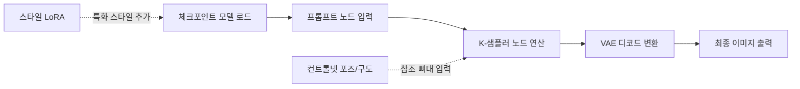
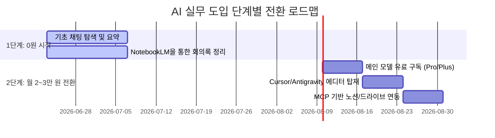

# 01. 도구 — 뭘 쓸 것인가

> **이 문서는 아티스트가 AI 도구를 선택하고 실무에 도입할 때 필요한 실전 통합 가이드라인입니다.**

---

## 목차
1. [1. AI 모델 등급 및 요금제 가이드](#1-ai-모델-등급-및-요금제-가이드)
2. [2. 주요 언어모델 상세 비교 및 직군별 추천](#2-주요-언어모델-상세-비교-및-직군별-추천)
3. [3. 녹음 정리 및 자료 요약 (NotebookLM 실전)](#3-녹음-정리-및-자료-요약-notebooklm-실전)
4. [4. 프롬프트 작성 원칙: 역할, 맥락, 형식](#4-프롬프트-작성-원칙-역할-맥락-형식)
5. [5. 웹(SaaS) vs 설치형(에디터) 및 확장 개념](#5-웹saas-vs-설치형에디터-및-확장-개념)
6. [6. Claude 심화: Chat / Projects / Code 모드](#6-claude-심화-chat--projects--code-모드)
7. [7. 이미지 생성 모델 비교 및 심화 제어](#7-이미지-생성-모델-비교-및-심화-제어)
8. [8. MCP (Model Context Protocol) 실전 가이드](#8-mcp-model-context-protocol-실전-가이드)
9. [9. 최종 요약 및 실무 실행 체크리스트](#9-최종-요약-및-실무-실행-체크리스트)

---

## 1. AI 모델 등급 및 요금제 가이드

AI의 성능 한계를 느끼는 주된 요인은 질문의 기술 부족 이전에 **낮은 등급의 모델 사용**에 있습니다. 각 서비스의 기본 무료 모델은 성능이 가장 낮게 설정되어 있으므로 업무 목적에 맞는 적절한 등급 선택이 필수적입니다.

### 1-1. 모델 등급 체계 (Fast / Standard / Deep)

모든 주요 AI 모델은 속도, 품질, 연산 비용에 따라 3개 등급으로 나뉩니다.

```
Fast (빠른 모델)
├── 용도: 단순 질문, 번역, 대량 텍스트 요약
├── 예: GPT-5.5 Mini, Claude Haiku, Gemini 3.5 Flash, Llama 4 Scout
└── 비유: 인턴 — 신속하나 결과물의 깊이가 얕음

Standard (기본 모델)
├── 용도: 일반적인 대화, 문서 초안 작성, 기본적인 아이디어 도출
├── 예: GPT-5.5, Claude Sonnet 4.6, Gemini 3.1 Pro, Grok 4.3, Llama 4 Maverick
└── 비유: 대리 — 범용적이고 합리적인 수준의 작업 수행

Deep (깊은/추론 모델)
├── 용도: 복잡한 논리 분석, 정밀 문서 작성, 코드 생성 및 디버깅, 기획서 최종 감수
├── 예: GPT-5.5 Thinking, Claude Opus 4.8, Gemini Deep Research, Llama 4 Maverick (large)
└── 비유: 팀장 — 연산 속도는 느리지만 깊이 있는 추론 결과 도출
```

### 1-2. 등급별 성능 비교표

| 항목 | Fast | Standard | Deep |
| :--- | :--- | :--- | :--- |
| **작동 속도** | ★★★★★ (최상) | ★★★☆☆ (보통) | ★★☆☆☆ (느림/추론 시간 소요) |
| **출력 품질** | ★★☆☆☆ (낮음) | ★★★☆☆ (보통) | ★★★★★ (최상) |
| **비용 소비** | 최저 (무료 제공 다수) | 중간 (월 구독 범위 내) | 최고 (사용량 제한 및 추가 과금) |
| **적합한 작업** | 번역, 요약, 간단한 데이터 분류 | 일반적인 초안 작성, 브레인스토밍 | 제안서 작성, 계약서 정밀 분석, 코딩 |

### 1-3. 서비스별 모델 설정 및 대응표

| 등급 | ChatGPT (OpenAI) | Claude (Anthropic) | Gemini (Google) | Llama (Meta) |
| :--- | :--- | :--- | :--- | :--- |
| **Fast** | GPT-5.5 Mini | Claude Haiku 4.6 | Gemini 3.5 Flash | Llama 4 Scout |
| **Standard** | GPT-5.5 | Claude Sonnet 4.6 | Gemini 3.1 Pro | Llama 4 Maverick |
| **Deep** | GPT-5.5 Thinking | Claude Opus 4.8 | Gemini Deep Research | Llama 4 Maverick (large) |

> [!IMPORTANT]
> **중요도가 높은 문서나 최종 결과물 산출 시에는 반드시 Deep 모델을 사용하십시오.**
> Fast 또는 Standard 모델로 작성된 제안서나 계약서 검토는 오류 발생 가능성이 높으며 디테일이 부족합니다.

---

### 1-4. 단일 모델 내 추론 레벨 설정 (Thinking Level)

최근 AI 플랫폼들은 단순히 모델을 전환하는 것을 넘어, 동일한 모델 내에서 **생각의 깊이(추론 레벨)**를 설정할 수 있는 기능을 제공합니다 (예: Antigravity, Gemini API 등). 이 설정은 앞서 다룬 모델 등급 체계(Fast / Standard / Deep)를 단일 모델 내부에서 소프트웨어적으로 제어하는 것과 유사합니다.

| 설정 레벨 | 작동 방식 | 대응되는 모델 등급 | 특징 및 추천 용도 |
| :--- | :--- | :--- | :--- |
| **Low (낮음)** | 생각(추론) 과정을 생략하고 즉각 답변 생성 | **Fast** | 속도가 가장 빠름. 가벼운 코드 편집, 단순 오타 교정, 포맷 변환 등 |
| **Medium (보통)** | 기본적인 문제 해결 및 분석 흐름을 적용 | **Standard** | 균형 잡힌 속도와 품질. 일반적인 기능 구현, 기획안 초안 작성 등 (기본값) |
| **High (높음)** | 여러 단계를 쪼개어 스스로 검증 및 추론 수행 | **Deep** | 정밀도가 가장 높음. 전체 시스템 설계 검토, 복잡한 버그 디버깅, 다각도 피드백 등 |

> [!TIP]
> 단순 텍스트 변환이나 단순 조작 작업은 **Low** 또는 **Medium**으로 설정하여 빠른 작업 속도를 챙기고, 코드 아키텍처 재설계나 대형 기획 분석 등 고도의 논리적 판단이 필요할 때는 반드시 **High**로 상향 설정하여 활용하는 것이 훨씬 생산적입니다.

---

### 1-5. 결제 및 구독 가이드

업무용 AI 도구 도입 시 월 2~3만 원 수준의 구독 비용 투자는 필수적입니다. 무료 플랜은 모델의 쿼리 제한이 심하거나 하위 모델로 자동 전환됩니다.

#### A. 단일 서비스 구독 시

| 서비스 | 월 비용 | 추천 이유 |
| :--- | :--- | :--- |
| **ChatGPT Plus** | $20/월 (약 ₩27,000) | 가장 범용적임. 고성능 이미지 생성(DALL-E), 데이터 분석, 코드 실행 환경을 단일 플랫폼에서 완결하고 싶을 때 적합. |
| **Claude Pro** | $20/월 (약 ₩27,000) | 정밀한 텍스트 작성 및 구조화 최우선. 문서 작업 비중이 높고 긴 코드나 긴 텍스트 분석이 잦은 경우 추천. |

#### B. 이중 서비스 구독 시 (추천 조합)
**Claude Pro ($20/월) + Gemini Advanced ($20/월)**

* **Claude Pro**: 제안서, 보고서 작성, 프로젝트 단위 데이터 구축 및 정밀 분석에 활용.
* **Gemini Advanced**: 회의록 녹음 파일 대량 정리, 구글 워크스페이스(Workspace) 연동 문서 검색, NotebookLM 연동 리서치에 활용.

#### C. 무료 활용 중심 구성 시
* **Gemini (Google)**: 타 서비스 대비 무료 제공 범위가 넓으며, 파일 분석 및 검색 연동에 강점이 있습니다.
* **NotebookLM**: 완전 무료로 제공되며 대용량 문서 및 오디오 분석에 최적화되어 있습니다.

---

### 1-6. 보안 및 데이터 환각(Hallucination) 관리

#### A. 데이터 학습 방지 및 보안 가이드

| 서비스 | 유료 플랜 (Plus/Pro) | 무료 플랜 |
| :--- | :--- | :--- |
| **ChatGPT** | ❌ 학습 제외 (기본 설정) | ⚠️ 설정에서 'Chat history & training' 비활성화 필요 |
| **Claude** | ❌ 학습 제외 | ⚠️ 데이터가 서비스 품질 개선용으로 수집될 수 있음 |
| **Gemini** | ❌ 학습 제외 | ⚠️ 데이터가 인간 검토자에 의해 분석 및 사용될 수 있음 |

> [!CAUTION]
> 개인정보(주민등록번호, 주소, 연락처), 금융 정보(계좌번호, 카드 비밀번호), 기업 기밀(미공개 특허 자료, 상세 고객 명단)은 등급 및 요금제와 무관하게 AI 입력창에 절대 직접 입력하지 마십시오.

#### B. 환각 현상(거짓 답변) 대응 매뉴얼
1. **정밀 검증 대상**: 통계 수치, 법률 조항 번호, 인물 검색 결과, 역사적 사실은 AI가 잘못된 정보를 진짜처럼 서술할 확률이 높습니다.
2. **해결 절차**:
   - 실시간 팩트체크가 필요한 질문은 검색 기능이 내장된 **Perplexity** 또는 **Gemini**를 사용하여 실시간 출처를 함께 조회하십시오.
   - 프롬프트 끝에 `"답변의 근거가 되는 원문 출처 또는 URL을 본문 내에 명시해라"`를 포함시키십시오.
   - 중요한 정보는 반드시 사람이 직접 원문을 교차 검증해야 합니다.

---

## 2. 주요 언어모델 상세 비교 및 직군별 추천

### 2-1. 5대 핵심 언어모델 비교표

| 구분 | ChatGPT | Claude | Gemini | Grok | Llama |
| :--- | :--- | :--- | :--- | :--- | :--- |
| **개발사** | OpenAI | Anthropic | Google | xAI | Meta |
| **강점** | 이미지 생성(DALL-E), 범용 대화 | 문서 구조화, 고성능 코딩, 아티팩트 | 대용량 컨텍스트(긴 문서), 구글 검색 | 실시간 X(트위터) 데이터, 무제한 톤 | 로컬 설치 가능, 완전 폐쇄망 운영 |
| **약점** | 긴 문서의 정밀한 구조화 부족 | 이미지 생성 품질이 DALL-E 대비 낮음 | 정밀 추론 작업 시의 미세 오류 | 공식 기획서 작성 등 포멀한 톤 | 로컬 구동 시 고성능 GPU 필수 |
| **비용** | $20/월 (무료 제한적) | $20/월 (무료 제한적) | $20/월 (무료 Flash 제공) | X Premium 요금제 포함 | 무료 (오픈소스) |
| **특이사항** | GPTs 커스텀 챗봇 빌더 지원 | 프로젝트(Project) 단위 작업 최적 | NotebookLM과의 데이터 호환 | 가감 없는 트렌드 정보 수집 | 내 컴퓨터 단독 구동으로 데이터 유출 0% |

---

### 2-2. 특수 목적 모델 활용처

#### A. Grok (실시간 트렌드 및 시장 반응 리서치)
X(구 트위터)의 실시간 포스팅 데이터를 **검색·참조**하므로 다른 검색 엔진이나 일반 AI 모델이 접근할 수 없는 최신 트렌드를 파악할 수 있습니다.

* **적합한 활용 사례**:
  - 특정 브랜드 또는 신규 팝업 스토어에 대한 대중의 실시간 반응 피드백 수집
  - 서브컬처, 서브안무, 특정 밈(Meme)의 유행 흐름 추적
  - 공식 보도자료 외 실제 사용자들의 가감 없는 업계 동향 및 불만 사항 수집

* **실전 프롬프트 예시**:
  ```text
  최근 48시간 동안 X(트위터) 내에서 '성수동 팝업스토어 공간 디자인'에 관한 반응을 긍정적 의견과 부정적 의견으로 분류하여 리포트 형태로 요약해라. 특히 공간 구성 요소 중 가장 많이 언급된 특징 3가지를 명시해라.
  ```

#### B. Llama (데이터 오프라인 완전 보안화)
메타가 배포한 오픈소스 모델로, 기업 내부망이나 개인 PC에 패키지 형태로 빌드하여 인터넷 연결 없이 사용할 수 있습니다.

* **적합한 활용 사례**:
  - 외부 유출 시 법적 책임이 따르는 내부 재무 보고서, 미발표 IP 기획서 분석
  - 오프라인 작업 환경(보안 구역, 현장 작업실 등)에서의 AI 어시스턴트 구동

* **설치 프로토콜 (Ollama 기준)**:
  1. 공식 웹사이트([ollama.com](https://ollama.com))에서 OS에 맞는 Ollama 설치 프로그램을 다운로드하여 실행합니다.
  2. 터미널(Terminal) 또는 명령 프롬프트(CMD)를 엽니다.
  3. 아래 명령어를 입력하여 Llama 모델을 로컬로 내려받고 실행합니다:
     ```bash
     ollama run llama4
     ```
  4. 설치 완료 즉시 터미널 상에서 실시간 로컬 대화가 가능해집니다.
  > [!WARNING]
  > 로컬 환경에서 원활한 구동을 위해서는 최소 16GB 이상의 RAM과 외장 GPU(Nvidia RTX 시리즈 또는 Apple Silicon M 시리즈 프로세서)가 장착된 하드웨어가 강력히 권장됩니다.

---

### 2-3. 아티스트 직군별 추천 모델 조합

각 아티스트의 작업 성향과 결과물의 형태에 따른 맞춤형 도구 조합 레이아웃입니다.



| 직군 | 메인 도구 | 보조 도구 | 조합 목적 및 실무 활용 방식 |
| :--- | :--- | :--- | :--- |
| **사진작가** | **ChatGPT (DALL-E)** | **Gemini** | DALL-E를 활용해 촬영 전 조명, 구도, 의상 톤을 사전 시각화하고, Gemini의 검색 연동을 사용해 해외 로케이션 촬영지 정보 및 기상 데이터를 수집합니다. |
| **영상제작자** | **Claude (Projects)** | **NotebookLM** | 기획서와 촬영 대본의 씬(Scene) 구조를 Claude Projects로 관리하고, 현장 연출 회의나 편집본 피드백 녹음 파일을 NotebookLM에 올려 정리합니다. |
| **댄서 / 안무가** | **ChatGPT** | **Grok** | 공연 컨셉 시각화 이미지를 ChatGPT로 구체화하고, Grok을 통해 최신 숏폼 댄스 챌린지 밈과 음악적 트렌드를 모니터링하여 안무 구성에 도입합니다. |
| **기획자** | **Claude (Projects)** | **NotebookLM** | 제안서 아웃라인과 본문 작성을 Claude의 구조화 기능을 통해 정교화하고, 다양한 회의 녹취록과 참고 논문 PDF 파일들을 NotebookLM으로 분석하여 뼈대를 잡습니다. |
| **공간기획자** | **ChatGPT + Claude** | **Gemini** | ChatGPT로 조감도와 공간 무드보드 기초 시안을 제작하고, Claude로 예산서 및 제안서를 구조화하며, Gemini를 통해 관련 법적 규제(건축법, 소방법 등)를 확인합니다. |

---

## 3. 녹음 정리 및 자료 요약 (NotebookLM 실전)

회의록 작성, 긴 설명회 분석, 인터뷰 정리 시 타이핑을 대체하여 시간을 절약할 수 있는 구글 NotebookLM 활용 프로토콜입니다.

### 3-1. 도구 프로필

* **제공사**: Google (구글)
* **비용**: 완전 무료
* **핵심 기능**: 사용자가 업로드한 문서(PDF, TXT, Markdown, Google Docs) 및 오디오 파일(MP3, WAV 등)을 기반으로 외부 검색 데이터의 방해 없이 업로드된 소스 데이터 내부에서만 팩트체크, 요약, 추출, 마인드맵 구조화 작업을 수행합니다.

### 3-2. 회의 녹음 정리 6단계 워크플로우

1. **음성 녹음 파일 확보**:
   - 모바일 기기 또는 녹음 장비의 기본 탑재 녹음 기능을 통해 회의나 인터뷰를 녹음합니다. 파일 형식은 MP3, WAV, M4A 등 대중적인 포맷을 사용합니다.
2. **NotebookLM 접속**:
   - 웹 브라우저를 통해 [notebooklm.google.com](https://notebooklm.google.com)에 접속하여 구글 계정으로 로그인합니다.
3. **새 노트북 생성**:
   - 화면 좌상단의 `"새 노트북(New Notebook)"` 버튼을 클릭합니다.
4. **오디오 파일 업로드**:

   - 소스 업로드 창에서 `"오디오 파일(Audio)"` 또는 `"로컬 파일 업로드"`를 선택하고 준비된 녹음 파일을 드래그 앤 드롭하여 업로드합니다. 업로드 즉시 백엔드에서 텍스트 변환(Speech-to-Text) 연산이 자동 개시됩니다.

5. **질의응답 및 요약 지시**:

   - 텍스트 변환이 끝나면 대화창에 아래의 지침 프롬프트를 입력하여 구조화된 정보를 받아냅니다.

6. **내용 검수 및 수정**:

   - AI가 간혹 오청취하여 고유명사나 금액 수치를 잘못 변환하는 경우가 있으므로, 최종 확인 과정에서 반드시 수치와 인명 데이터를 재검증해야 합니다.

### 3-3. 현장 녹음 파일 분석용 3종 프롬프트 템플릿

녹음 파일 업로드 완료 후 하단 채팅 입력창에 입력할 실전용 명령 템플릿입니다.

#### 템플릿 1: 회의록 요약 및 액션 아이템 추출
```text
업로드된 오디오 데이터 전체를 상세히 분석하여 다음 형식에 맞춰 요약본을 출력해라.

1. 회의의 핵심 아젠다 (요약형 불릿 포인트 3개)
2. 참가자별 주요 의견 및 발언 요약
3. 최종 결정사항 및 승인된 안건
4. 담당자별 액션 아이템 (담당자 이름 - 마감 기한 - 상세 태스크 순으로 표로 정리할 것)
```

#### 템플릿 2: 회의 흐름 마인드맵 텍스트화
```text
회의 내에서 다루어진 주제들의 인과관계와 계층적 관계를 파악하여 하향식(Top-down) 마인드맵 구조의 텍스트 형태로 도식화해라. 대주제, 중주제, 세부사항 단계로 인덴트(들여쓰기)를 적용하여 정돈할 것.
```

#### 템플릿 3: 핵심 리스크 분석
```text
이 회의에서 언급되었거나 내재되어 있는 사업/프로젝트적 리스크 3가지를 도출하고, 이에 대한 회의 내 해결책 제안 내용과 아직 해결되지 않은 미결 과제를 각각 정리하여 출력해라.
```

### 3-4. 크롬 확장 프로그램 연동 팁 (Glasp YouTube Summary)

영상을 처음부터 끝까지 시청하지 않고도 핵심 정보와 맥락을 3초 만에 텍스트로 추출하여 공부하고 내 위키 시스템에 적용하는 초고속 학습 프로토콜입니다.

* **추천 도구**: **Glasp - YouTube Summary with ChatGPT & Claude** ([glasp.co/youtube-summary](https://glasp.co/youtube-summary))
* **설치 및 구동 절차**:
  1. 크롬 웹 스토어에서 `Glasp` 또는 `YouTube Summary`를 검색하여 크롬 브라우저에 확장 프로그램을 설치합니다.
  2. 설치 완료 후 YouTube 동영상 페이지에 접속하면, 우측 상단에 `Transcript & Summary` 패널이 자동 활성화됩니다.
  3. 패널 내부의 `Copy` 아이콘을 누르면 영상 전체 자막 대본(타임스탬프 포함)이 클립보드에 복사되며, `AI Summary` 버튼을 누르면 ChatGPT/Claude 웹 인터페이스로 자동 연동되어 전체 내용 요약본이 실시간 렌더링됩니다.
  
* **이 가이드를 기반으로 한 실전 적용법**:

  - **자막 텍스트 추출**: 위 단축 툴로 영상 자막을 복사합니다.
  - **내 시스템과 비교 대조**: 복사한 자막 원본 텍스트를 내 로컬 에디터(Cursor/Antigravity)나 Claude Projects 지식 창에 통째로 던집니다.
  - **실전 쿼리**: 아래의 프롬프트 템플릿을 복사하여 AI에게 질문을 던집니다.

* **추천 유튜브 영상 목록 (실무 활용편)**:

  | 추천 영상 제목 / 채널 | 핵심 학습 목표 | 추천 이유 및 실전 활용 |
  | :--- | :--- | :--- |
  | **[Intro to Large Language Models](https://youtu.be/zjkBMFhNj_g)**<br>(Andrej Karpathy) | LLM의 작동 원리 및 미래 전망 | AI의 보안, 토큰 제약, 작동 메커니즘을 근본적으로 이해하여 프롬프트 작성 시 모델의 잠재력을 100% 끌어올릴 수 있는 내공을 다집니다. |
  | **[How I Build AI Agents](https://youtu.be/F8NKVhkZZWw)**<br>(조코딩 JoCoding 등 에디터 실무) | Cursor 에디터 기반 바이브코딩 실전 | 코드를 모르는 기획자/디자이너/아티스트가 Cursor 에디터를 켜고 어떻게 폴더를 직접 제어하며 작동하는 앱을 1시간 만에 빌드하는지 과정을 배웁니다. |
  | **[Claude 3.5 Sonnet: Developer Guide](https://youtu.be/yWpS142x4b0)**<br>(Anthropic 공식 채널) | Claude의 시스템 프롬프트 및 Projects 기능 | Claude를 프로젝트 단위의 든든한 연구 조서이자 규칙(CLAUDE.md)이 작동하는 뇌로 활용하기 위한 공식 최적화 테크닉을 파악합니다. |

* **실전 유튜브 자막 기반 규칙 파일(CLAUDE.md) 업데이트 프롬프트 템플릿**:

  ```text
  [나의 기본 설정]
  나는 ~분야에서 일하는 창작자/기획자다. 현재 내 프로젝트 규칙 파일(CLAUDE.md)의 핵심 내용은 다음과 같다:
  ---
  (여기에 본인의 기존 규칙 파일 내용 복사 및 붙여넣기)
  ---

  [추출한 유튜브 자막 대본]
  ---
  (여기에 Glasp 등으로 복사한 유튜브 자막 텍스트 전체 붙여넣기)
  ---

  [요청 사항]
  입력된 유튜브 자막 대본 중에서 내가 기존 규칙 파일(CLAUDE.md)에 아직 반영하지 않은 '실전 AI 활용 팁'이나 '시스템 최적화 규칙' 3가지를 명확히 뽑아내라. 그리고 내 기존 규칙 파일의 어느 위치에 이를 보완해야 하는지 구체적인 업데이트 양식(diff 형식 또는 수정된 최종 코드 블록)으로 제안해 줘.
  ```

---

## 4. 프롬프트 작성 원칙: 역할, 맥락, 형식

### 4-0. 맥락 중심의 프롬프트 설계 전략 (Long-context Prompting)

> **"프롬프트가 짧을 필요는 없다. 오히려 풍부한 맥락의 프롬프트가 고품질의 결과물을 보장한다."**

일반적인 맹신과 달리, 최신 대형 언어 모델은 수만 자에서 수십만 자의 긴 텍스트를 막힘없이 인지하는 컨텍스트 창(Context Window)을 갖추고 있습니다. 따라서 프롬프트를 한 줄로 짧게 압축하려 애쓰지 말고, **해당 도메인의 실제 이슈, 기존 레퍼런스, 데이터 한계점 및 내가 통제하고자 하는 모든 상세 명세(Context)를 프롬프트에 그대로 노출시키는 것**이 훨씬 정밀한 결과물을 유도합니다.

#### 실전 문제 상황을 직접 주입하여 해결하는 방법
단순히 "이런 에러 해결해줘" 대신, 에러가 발생한 주변 맥락과 이전 해결 시도 내역까지 통째로 프롬프트에 담아 제공하십시오.

* **예시 상황**: 조명 DMX 제어 코드를 바이브코딩하는 도중 특정 채널 오버플로우 에러가 발생하는 경우
* **나쁜 긴 프롬프트 (단순 중언부언)**:
  ```text
  조명 코드가 에러가 나는데 이거 조명 큐시트 자동화할 때 에러가 나거든. dmx 채널이 뭐가 안 맞는대. GrandMA 형식으로 바꾸는 중에 에러가 났어. 고쳐줘.
  ```

* **좋은 맥락 위주 프롬프트 (이슈의 완전한 노출)**:
  ```text
  [배경 상황]
  - 나는 TouchDesigner에서 추출한 BPM 데이터(Python 기반)를 DMX 채널 값(GrandMA2 형식)으로 실시간 매핑하여 조명 큐시트를 자동 생성하는 도구를 제작 중이다.
  
  [발생한 구체적 에러 이슈]
  - 10번째 곡의 BPM 값이 140에서 180으로 급변하는 시점에 조명 페이드 속도가 오버플로우되면서 DMX 채널 512 범위를 초과하는 에러가 감지되었다.
  
  [나의 분석 및 제약 사항]
  - DMX 컨트롤러 하드웨어의 최대 대역폭은 512 채널로 물리적 제한이 있다. 
  - 코드가 512를 넘어가기 전에 자동으로 다음 유니버스(Universe 2)로 DMX 채널을 분할 매핑하거나, 최대치를 512로 클리핑(Clipping)하는 예외 처리 루틴이 코드에 누락된 것으로 추정된다.
  
  [요청 사항]
  - 이 문제 상황과 제약 조건을 해결할 수 있도록 기존 Python 매핑 소스코드 중 예외 처리 핸들러 파트를 작성해라. 수식과 예외 처리 분기 코드를 포함하여 명확하게 고쳐라.
  ```

이처럼 실제 마주한 현장의 **이슈 배경, 물리적 제약, 에러 내용 및 나의 의심점**을 투명하게 드러내는 맥락 위주의 긴 프롬프트를 제공할 때, AI는 문제의 정확한 본질을 짚어내고 단 한 번의 피드백 루프만으로 정상 작동하는 결과물을 돌려줍니다.

---

AI로부터 높은 품질의 답변을 얻으려면 프롬프트 작성 시 **역할(Role)**, **맥락(Context)**, **형식(Format)**의 세 가지 요소를 명확히 지시해야 합니다.

### 4-1. 나쁜 프롬프트 vs 좋은 프롬프트 비교표

| ❌ 나쁜 프롬프트 (단발성/무맥락) | ✅ 좋은 프롬프트 (역할 + 맥락 + 형식 정의) |
| :--- | :--- |
| "미술 전시회 기획서 써줘." | "너는 10년 경력의 미디어아트 전시 기획자다. 타겟은 IT 업계 직장인(20~30대)이며 예산은 5천만 원 선이다. 관람객이 상호작용할 수 있는 인터랙티브 인터페이스 요소가 가미된 미디어 전시 기획안 초안을 [기획서 포맷] 템플릿에 맞추어 작성해라." |
| "촬영 대본 고쳐줘." | "아래 촬영 대본의 가독성을 개선하고자 한다. 2인 대화 씬에서 감정 고조가 드러나도록 인물 간의 호흡(대사 간 간격, 지문 추가)을 수정하고, 대사 톤은 비즈니스 격식체로 수정하여 원본과 수정본의 차이를 보여줄 수 있는 전후(Before/After) 대조 테이블로 정리해라." |
| "함수가 오류 나는데 왜 이래?" | "엑셀 시트 내에서 C열의 이름 값을 매칭하여 D열의 매출액 정보를 가져오기 위해 =VLOOKUP(A2, C2:E100, 2, FALSE)를 입력했으나 #N/A 에러가 발생한다. 매칭 값의 공백 문자 유무를 확인하는 수식 적용 방안을 제시하고 에러 해결책을 단계별로 설명해라." |
| "화장품 브랜드 이름 추천해줘." | "천연 유기농 원료만을 사용하는 프리미엄 스킨케어 브랜드 이름을 기획 중이다. 핵심 타겟은 피부 자극에 민감한 30대 초반 여성이며, 핵심 키워드는 '투명함', '자연주의', '안심'이다. 영문 이름 5개와 각 이름의 기획 의도 및 도메인 등록 가능성 체크 포인트를 리스트로 제시해라." |
| "번역 좀 해줘." | "첨부된 영문 라이선스 계약서 전문을 한국어로 번역하되, 법률 용어(계약 당사자 정의, 위약금 조항, 면책 사항 등)는 한국 민법 표준 계약서 용어로 의역하고 모호한 영문 명사구는 괄호 안에 원문을 병기해라." |

---

### 4-2. 프롬프트 설계 3대 구성 원칙

#### ① 역할 정의 (Role)

AI에게 전문가의 가상 페르소나를 부여하는 단계입니다. AI 내부의 거대한 매개변수 중 특정 영역의 가중치를 집중시켜 답변의 전문성을 대폭 향상시킵니다.

* **사용 문구 예시**:
  - `"너는 15년 차 영화 전문 촬영 감독이다."`
  - `"너는 문화체육관광부 예술 지원 사업의 외부 심사위원단 소속 평가위원이다."`

#### ② 맥락 제공 (Context)

작업이 진행되는 구체적인 배경, 사용 제한사항, 타겟층, 하드웨어 사양 등의 세부 환경 정보를 입력하여 모호성을 줄입니다.

* **사용 문구 예시**:
  - `"이 제안서는 디자인 전공을 하지 않은 예산 결정 부서 임원진에게 보고될 양식이다."`
  - `"이 프로젝트는 가로 20m, 세로 10m 크기의 어두운 창고 공간에서 연출되는 실내 인스톨레이션 전시다."`

#### ③ 출력 형식 명시 (Format)

답변의 외형적 구조를 강제하여 정보의 스캐너빌리티(Scannability)를 확보합니다.

* **사용 문구 예시**:
  - `"최종 결과물은 마크다운 테이블(Markdown Table) 형식으로 정리해라."`
  - `"핵심 주장을 먼저 두 줄로 요약하고, 세부 사항은 불릿 포인트를 사용하여 기술해라."`

---

## 5. 웹(SaaS) vs 설치형(에디터) 및 확장 개념

AI를 다루는 수단은 웹 브라우저를 통한 대화 방식에서 내 하드웨어 및 로컬 파일에 직접 연동하는 에디터 방식으로 고도화되고 있습니다.

### 5-1. 웹 서비스 vs 설치형 에디터 비교표

| 비교 항목 | 웹 (SaaS - claude.ai, chatgpt.com 등) | 설치형 에디터 (Cursor, Antigravity 등) |
| :--- | :--- | :--- |
| **작동 환경** | 크롬 등 웹 브라우저 | 로컬 PC 내 설치 앱 구동 |
| **파일 접근 권한** | 수동으로 파일을 드래그하여 업로드해야 함 | 폴더 전체에 대한 탐색기 권한 소유 (자동 읽기/수정) |
| **외부 연동(MCP)** | 지원 불가 (클라우드 환경에 격리됨) | 지원 가능 (내 로컬 환경을 매개로 외부 서비스 호출) |
| **주요 활용 방식** | 텍스트 대화, 간단한 코딩 질문, 이미지 렌더링 | 폴더 일괄 제어, 로컬 코드 작성, 외부 툴 자동 조작 |
| **비유** | 전화를 통해 비서에게 매번 작업을 구두 지시 | 비서가 내 책상에 앉아서 모든 폴더와 도구를 직접 조작 |

---

### 5-2. AI 확장 단계 (5-Step Evolution)

AI 도구 활용 능력이 고도화됨에 따라 사용자는 다음과 같은 구조적 단계로 도구를 확장해 나가게 됩니다.

```
[ 5단계: 시스템화 ] ─ 규칙 파일(.cursorrules), 자율 에이전트, 파이프라인 자동화 구축
        ▲
[ 4단계: 지식 축적 ] ─ 옵시디언(Obsidian) 로컬 노트 연동 및 개인지식베이스(PKM) 구축
        ▲
[ 3단계: 도구 연결 ] ─ MCP(Model Context Protocol) 적용, Notion/구글 드라이브/Figma API 연동
        ▲
[ 2단계: 파일 조작 ] ─ 설치형 에디터(Cursor/Antigravity) 도입, 로컬 폴더 직접 분석 및 대량 처리
        ▲
[ 1단계: 단순 대화 ] ─ 웹 브라우저를 통한 단순 Q&A 질의응답 (일반 사용자 수준)
```

1. **1단계 (대화)**: 웹 브라우저 창에서 단순히 궁금한 점을 치고 복사하여 필요한 곳에 옮겨 붙이는 단계입니다.
2. **2단계 (파일 조작)**: Cursor 나 Antigravity 같은 전용 에디터에 로컬 프로젝트 폴더를 열고, AI가 폴더 내 여러 파일을 교차 참조하며 코드 및 문서를 생성하도록 지시하는 단계입니다.
3. **3단계 (도구 연결)**: MCP 프로토콜을 통과시켜 AI가 구글 드라이브의 문서를 읽거나, 피그마 레이아웃 정보를 긁어오거나, 노션 데이터베이스에 값을 직접 쓰는 단계입니다.
4. **4단계 (지식 축적)**: 로컬 텍스트 위키 파일 그룹(Obsidian 등)에 모든 지식과 매뉴얼을 축적해 두고, 이를 AI가 상시 조회하여 사용자의 취향과 이력을 맞춤식으로 인지하도록 설계하는 단계입니다.
5. **5단계 (시스템화)**: `.cursorrules` 등 룰 파일을 설정하고 반복 작업을 알아서 처리하는 크론 잡(Cron job)이나 스크립트를 빌드하여 완전한 업무 자동화를 구축하는 최종 단계입니다.

---

### 5-3. 설치형 에디터 3대 도구 상세 분석

| 항목 | Cursor | Antigravity | Claude Code |
| :--- | :--- | :--- | :--- |
| **인터페이스** | VS Code 기반 GUI 에디터 | VS Code 기반 GUI 에디터 | CLI 터미널 환경 (커맨드라인 입력) |
| **지원 언어 모델** | Claude, GPT, Gemini, Llama 선택 가능 | Claude 중심 세팅 | Claude 전용 (최적화 모델 탑재) |
| **작동 특징** | 개발자 중심의 편리한 편의기능 다수 탑재 | 아티스트 및 비개발자 지향 맞춤 설계 | 터미널 내 명령어 전송 및 즉시 파일 조작 |
| **MCP 지원 여부** | 지원 가능 | 지원 가능 | 지원 가능 |
| **추천 사용자** | 다중 모델을 교차 활용하려는 유저 | 직관적인 에디터를 활용하려는 아티스트 | 터미널 명령어 입력에 숙달된 중상급자 |

---

## 6. Claude 심화: Chat / Projects / Code 모드

Claude 3.5 제품군은 사용되는 인터페이스 및 타겟 경로에 따라 **Chat**, **Co-work (Projects)**, **Code**의 세 가지 운용 모드를 제공합니다. 각 모드의 특성을 이해하고 다르게 접근해야 합니다.

### 6-1. 모드별 기능 분석표

| 구분 | Chat | Co-work (Projects) | Code |
| :--- | :--- | :--- | :--- |
| **사용 환경** | claude.ai 기본 대화창 | claude.ai 내의 Projects 페이지 | 로컬 컴퓨터 터미널 창 |
| **데이터 유지 범위** | 개별 대화창 단위로 정보 유실 | 프로젝트 폴더 내 파일 상시 상주 | 실행하는 로컬 디렉토리 전체 조회 |
| **대상 소스 등록 방식** | 대화 시마다 매번 수동 첨부 | 프로젝트 지식 베이스에 상시 업로드 | 터미널 내부에서 전체 소스 자동 검출 |
| **로컬 파일 수정 권한** | 불가 (텍스트로만 코드 제안) | 불가 (텍스트로만 결과물 출력) | **가능 (사용자 승인 하에 직접 파일 수정)** |
| **주요 타겟 작업** | 1회성 질문, 용어 정의, 간단 번역 | 기획서 관리, 브랜드 가이드라인 적용 | 프로그램 빌드, 폴더 일괄 파일명 처리 |

---

### 6-2. 모드별 실전 구축 및 활용 가이드

#### A. Chat 모드
* **실행 프로세스**: `claude.ai` 접속 후 신규 채팅 세션을 열어 단발성 태스크를 지시합니다.
* **사용 지침**: 긴 작업 이력 축적이 불필요하며, 특정 텍스트를 급하게 마크다운 형태로 변환하거나 영어 메일을 교정하는 작업 등에 한정하여 사용합니다.

#### B. Co-work (Projects) 모드
* **실행 프로세스**: 
  1. `claude.ai` 좌측 사이드바 메뉴에서 **Projects** 탭을 선택하고 `"Create Project"`를 실행합니다.
  2. 프로젝트 타이틀(예: `2026_아티스트_브랜드_리뉴얼`)을 입력합니다.
  3. `Project Instructions` 영역에 프로젝트 전체에 공통 적용될 핵심 규칙(예: `"모든 문서는 한국어 격식체로 작성하고, 핵심 개념은 굵게 표기해라"`)을 기입합니다.
  4. 우측 `Add Content` 창에 참고 문서, 가이드라인 파일(PDF/TXT/MD), 로고 규격 가이드 등을 업로드합니다.
  5. 프로젝트 내 세션을 열어 대화합니다. AI는 이미 학습된 전체 문서 맥락을 상시 파악하여 답변합니다.

#### C. Code 모드
* **실행 프로세스**:
  1. PC의 터미널 프로그램을 엽니다.
  2. 작업할 폴더 경로로 이동합니다 (`cd /path/to/project`).
  3. 아래 명령어를 실행하여 Claude Code 환경을 시작합니다:
     ```bash
     claude
     ```
  4. 커맨드 창 상에서 파일 자동 수정을 승인하면, 로컬 파일 시스템 내 파일을 직접 편집하고 스크립트를 구동하여 자동 제어를 수행합니다.

---

## 7. 이미지 생성 모델 비교 및 심화 제어

크리에이티브 워크플로우에 시각적 레퍼런스를 매칭하고 최종 시안을 정교하게 다듬기 위한 이미지 생성 모델들의 분류와 활용법입니다.

### 7-1. 4대 이미지 생성 도구 비교표

| 항목 | ChatGPT (DALL-E) | Midjourney | ComfyUI | Gemini (Imagen) |
| :--- | :--- | :--- | :--- | :--- |
| **생성 방식** | 대화창 내 자연어 요청 | Discord 채널 명령어 기반 | 노드 기반 로컬 조작 | 대화창 내 자연어 요청 |
| **최대 강점** | 영어/한국어 프롬프트 해석력 탁월, 텍스트 삽입 정확 | **초실사 및 예술적 스타일 퀄리티 최고** | **완벽한 파이프라인 수동 제어, 무료 구동** | 인위적이지 않은 구도, 빠른 반응성 |
| **최대 약점** | 디테일 수정 및 정교한 각도 제어 한계 | 유료 요금제만 지원 ($10/월 이상) | 높은 학습 난이도, 고성능 그래픽카드 필수 | 인물 및 상표 이미지 제한 사항 다수 |
| **비용** | ChatGPT Plus 요금제 포함 | 월 $10 ~ $120 | 완전 무료 (오픈소스) | Gemini Advanced 요금제 포함 |
| **조절 난이도** | ★☆☆☆☆ (매우 쉬움) | ★★☆☆☆ (쉬움) | ★★★★★ (매우 복잡) | ★☆☆☆☆ (매우 쉬움) |

---

### 7-2. ComfyUI와 노드(Node) 기반 세부 제어

ComfyUI는 이미지 생성의 포토샵이라 불릴 만큼 이미지의 구도, 뼈대, 텍스처를 단계별로 구조화하여 편집할 수 있는 도구입니다.



#### ComfyUI 핵심 제어 가능 컴포넌트

1. **체크포인트(Checkpoint) 모델**:

   - 이미지 생성의 기본 기반이 되는 백본 모델입니다. 실사형(Photorealistic), 애니메이션(Anime), 2D 일러스트 등 전체 화풍을 최종 결정합니다.

2. **LoRA (Low-Rank Adaptation)**:

   - 기본 백본 모델에 특정 피사체, 특정 화가의 화풍, 브랜드 컬러 조합, 특수 장비의 필름 룩 등을 미세 학습시킨 50MB~200MB 수준의 추가 경량 가중치 모델 파일입니다.

3. **ControlNet (컨트롤넷)**:

   - 사용자가 임의로 지정한 특정 자세(Pose), 객체의 외곽선(Canny), 깊이 정보(Depth), 공간 스케치 정보를 AI에게 강제로 주입하여 구도를 강하게 제어합니다.

4. **KSampler (K-샘플러)**:

   - 노이즈 상태에서 이미지를 선명하게 다듬는 복원 연산(Denoising)의 속도, 스텝(Step) 수, 노이즈 양을 세밀히 설정하는 컨트롤 휠 역할을 수행합니다.

---

### 7-3. Stable Diffusion vs Flux

ComfyUI를 구동하는 대표적인 두 가지 로컬 모델 아키텍처 비교입니다.

| 항목 | Stable Diffusion (SDXL) | Flux.1 |
| :--- | :--- | :--- |
| **출시 시기 및 특징** | 축적된 데이터베이스가 방대한 전통 모델 | 뛰어난 이미지 디테일 및 텍스트 렌더링을 지원하는 최신 모델 |
| **LoRA 생태계** | 수만 개 이상의 제작된 필름/의상/인물 LoRA 가용 | 최근 급속하게 점유율 상승 및 고품질 LoRA 지속 생산 중 |
| **프롬프트 충실도** | 프롬프트가 길어지면 일부 요소가 무시됨 | 매우 정밀하게 문장 속 묘사를 이미지에 복원해 냄 |
| **필요 하드웨어** | 보급형 GPU (VRAM 8GB 이상)에서도 쾌적하게 구동 | 고스펙 VRAM (VRAM 12GB~16GB 이상) 필수 요구 |
| **추천 선택 기준** | 독창적인 테마 LoRA를 결합하여 커스텀 컨셉 아트를 만들 때 | 인화용 고해상도 초실사 퀄리티와 정확한 영문 타이포그래피 표현이 필요할 때 |

> [!TIP]
> **LoRA 공유 허브 추천**:
> * **Civitai (civitai.com)**: 전 세계 모든 사용자가 제작한 체크포인트와 LoRA 모델을 썸네일 예시와 프롬프트 정보를 함께 검색하여 즉각 다운로드할 수 있는 최대의 모델 공유 플랫폼입니다.
> * **Hugging Face (huggingface.co)**: 대형 오픈소스 개발 환경으로 최신 AI 모델 소스 코드와 가중치 원본 파일들이 업로드되는 저장소입니다.

---

## 8. MCP (Model Context Protocol) 실전 가이드

MCP는 Claude Desktop, Cursor, Antigravity 등의 AI 에디터가 사용자의 PC 로컬 환경과 외부 SaaS 도구(Notion, 구글 드라이브, 피그마 등) 사이를 매끄럽게 오갈 수 있도록 Anthropic 사가 제안한 개방형 통신 프로토콜 표준 규격입니다.

### 8-1. MCP 서버 구동 아키텍처

```
┌────────────────────────┐      ┌─────────────────────────┐      ┌──────────────────────────┐
│     설치형 에디터      │ ───> │     로컬 MCP 서버       │ ───> │      외부 서비스 API      │
│ (Cursor / Antigravity) │ <─── │   (Node.js/Python 런타임)│ <─── │ (Google Drive, Notion 등)│
└────────────────────────┘      └─────────────────────────┘      └──────────────────────────┘
```

1. **에디터(Client)**: 사용자가 자연어로 `"내 노션에 지난 회의 내용을 페이지로 적어줘"` 라고 요청하면 에디터가 MCP 요청 프로토콜을 생성합니다.
2. **MCP 서버(Host)**: 사용자의 로컬 환경에 상주하며 에디터가 해석할 수 있도록 노션 API 인터페이스 구조를 가공해 전달합니다.
3. **외부 API(Target)**: 실제 외부 서버 데이터베이스에 접근하여 해당 태스크를 작성 및 처리하고 그 결과를 리턴합니다.

---

### 8-2. 주요 MCP 서버 라이브러리 및 리소스

AI에 직접 연결할 수 있는 대표적인 도구들의 MCP 라이브러리 목록입니다.

| 연동 타겟 | 수행 가능한 작업 내용 | MCP 서버 명칭 및 리소스 경로 |
| :--- | :--- | :--- |
| **Notion** | 노션 페이지 조회, 새로운 회의록 페이지 자동 생성, DB 항목 업데이트 | `@modelcontextprotocol/server-notion` |
| **Google Drive** | 내 구글 드라이브 내 특정 파일 검색, 파일 내용 직접 읽기, 가공 파일 쓰기 | `@modelcontextprotocol/server-gdrive` |
| **Figma** | 피그마 보드 내 프레임 구조 분석, 컴포넌트 정보 추출, UI 마크업 제작 | `@modelcontextprotocol/server-figma` |
| **Filesystem** | 로컬 특정 드라이브 내 디렉토리 파일 목록 스캔, 파일 이름 일괄 변경, 새 텍스트 파일 저장 | `@modelcontextprotocol/server-filesystem` |
| **Puppeteer** | 특정 웹 페이지를 방문하여 스크린샷 캡처 및 화면 마크업 텍스트 스크래핑 | `@modelcontextprotocol/server-puppeteer` |

* **MCP 서버 검색 리소스**:
  - **cursor.directory**: 커서 에디터 관련 각종 유용한 MCP 설정 세팅 정보 검색 가능.
  - **mcp.so**: 사용 가능한 오픈소스 MCP 서버들을 카테고리별로 서치하는 검색 전용 인덱스 허브.
  - **awesome-mcp-servers (GitHub)**: 전 세계 오픈소스 개발자들이 기여하는 유용한 MCP 개발 프로젝트들이 망라된 아카이브 페이지.

---

### 8-3. 에디터(Cursor/Antigravity) 내 설정 도입 절차

설치형 GUI 에디터에서 특정 MCP 서버(예: 로컬 파일시스템 접근 서버)를 활성화하기 위한 표준 입력 스키마입니다.

```json
{
  "mcpServers": {
    "filesystem": {
      "command": "node",
      "args": [
        "/usr/local/lib/node_modules/@modelcontextprotocol/server-filesystem/dist/index.js",
        "/Users/haepa_mac/REAL_HAEPA/02_Projects"
      ]
    }
  }
}
```

* **GUI 주입 방법**: 
  - 에디터 내 `Settings` (설정) -> `Features` -> `MCP` 메뉴로 이동합니다.
  - `Add New MCP Server` 버튼을 누르고 위 Command 및 Arguments 값을 해당 입력칸에 매핑하여 추가합니다.
  - 완료 시 AI 에디터 챗봇 창 내에 하단 연결을 의미하는 커넥션 램프가 녹색으로 점등되며 활용 가능 상태로 전환됩니다.

---

### 8-4. 직군별 MCP 실전 활용 시나리오

#### 사진작가: 로컬 파일 정리 및 촬영 일지 자동 노션 백업
* **연결 MCP**: `Filesystem MCP` + `Notion MCP`
* **지침 프롬프트**:
  ```text
  내 로컬 컴퓨터의 /Users/haepa_mac/Pictures/202606_Project 폴더 내부의 모든 사진 파일들의 메타데이터(파일명, 생성날짜)를 파악하고, 내 노션 데이터베이스(DB ID: [입력])의 테이블 형식에 맞춰 각 파일명과 날짜를 1행씩 매치하여 등록해라.
  ```

#### 영상제작자: 스토리보드 피드백 자동 일정 등록
* **연결 MCP**: `Google Calendar MCP` + `Slack MCP`
* **지침 프롬프트**:
  ```text
  내 피그마 스토리보드 디자인 피드백 세션 일정을 구글 캘린더에서 찾아서 2026년 6월 25일 오전 10시로 등록하고, 슬랙 채널(#영상편집실)에 해당 회의 참석 링크와 확정 알림 메시지를 작성하여 전송해라.
  ```

#### 공간기획자: 예산 데이터 필터링 및 리포팅
* **연결 MCP**: `Google Drive MCP` + `Notion MCP`
* **지침 프롬프트**:
  ```text
  내 구글 드라이브 내의 '2026_인테리어_자재예산.xlsx' 파일 내역을 읽어서 자재 단가 50만 원 이상에 해당하는 물품만 필터링한 뒤, 지정된 노션 특정 페이지 하단에 표 형식으로 요약 정리해라.
  ```

---

## 9. 최종 요약 및 실무 실행 체크리스트

### 9-1. 비용 투자 설계안

가장 합리적인 수준에서 시작해 업무 범위를 넓히는 2단계 전환 계획안입니다.



#### Step 1: 0원 시작 세트 (테스트 및 탐색 단계)
* **메인 AI**: ChatGPT / Claude / Gemini 기본 무료 버전
* **녹음/회의록 정리**: Google NotebookLM (완전 무료)
* **목표**: 일상적인 질문 및 아이디어 브레인스토밍, 단발성 회의 녹음 정리 업무 안착

#### Step 2: 월 $20 투자 세트 (본격적인 업무 생산성 향상 단계)
* **메인 AI**: Claude Pro **또는** ChatGPT Plus 중 택 1 구독 (월 약 27,000원)
* **도구 연동**: 로컬 에디터(Cursor 또는 Antigravity) 탑재 후 내부 작업 폴더 전체 연결
* **자동화 확장**: Notion 및 구글 드라이브 API를 MCP 프로토콜로 에디터와 링크
* **목표**: 수동 복사-붙여넣기 업무를 전면 폐지하고 폴더 내 다수 문서 자동 편집 및 데이터 이관 수행

---

### 9-2. 직군별 최종 권장 도구 사양표

| 직군 | 권장 AI 세트 구성 | 최소 하드웨어 사양 | 예상 비용 |
| :--- | :--- | :--- | :--- |
| **사진작가** | ChatGPT Plus + NotebookLM + Cursor | Apple M1 16G RAM / Windows RTX 3060급 | 월 $20 |
| **영상제작자** | Claude Pro + NotebookLM + Cursor | Apple M2 Max 32G RAM / Windows RTX 4070급 | 월 $20 |
| **댄서 / 안무가** | ChatGPT Plus + Grok (X Premium) | 모바일 기기 및 기본 탑재 노트북 사양 무관 | 월 $20 ~ $28 |
| **기획자** | Claude Pro + NotebookLM + 옵시디언 | 일반 사무용 노트북 (RAM 8GB 이상) | 월 $20 |
| **공간기획자** | Claude Pro + Midjourney + ComfyUI | Apple M3 Max 64G RAM / Windows RTX 4080급 | 월 $30 ~ $50 |

---

### 9-3. 오늘 즉시 실행할 4대 액션 플랜

가이드를 다 읽었다면 아래의 단계를 순차적으로 실행하여 실무에 적용하십시오.

- [ ] **1. 모델 품질 잠금 해제**: 사용하는 AI 웹사이트(ChatGPT/Claude) 상단 설정 드롭다운 메뉴에서 선택 모델이 하위 버전(Haiku/GPT-5.5 Mini 등)으로 설정되어 있는지 확인하고, 즉시 최상위 등급인 **Claude Sonnet 4.6** 또는 **GPT-5.5**로 상향 선택하십시오.
- [ ] **2. 템플릿 프롬프트 실전 테스트**: 기존에 작성한 단순 질문("제안서 써줘") 대신 본문 4장에 기재된 `역할(심사위원) + 맥락(예산 및 타겟) + 형식(마크다운 표)` 구조 프롬프트를 복사하여 질문을 다시 시도하고 품질 변화를 체감해 보십시오.
- [ ] **3. 미팅 녹음 변환 실행**: 미팅이나 아이디어 스케치 음성을 스마트폰으로 3분 이상 녹음한 뒤 [notebooklm.google.com](https://notebooklm.google.com)에 접속하여 새 노트북을 생성하고 업로드하여 변환 결과물을 확인하십시오.
- [ ] **4. 설치형 에디터 다운로드**: 웹 브라우저 복사-붙여넣기의 속도 한계를 극복하기 위해 Cursor 혹은 Antigravity 에디터 중 하나를 설치하고, PC 내부의 업무용 폴더를 에디터 안에서 Open하여 첫 파일 스캔 작업을 시도해 보십시오.

---
*본 가이드는 2026년 6월 기술 사양을 기준으로 고안되었습니다.*
