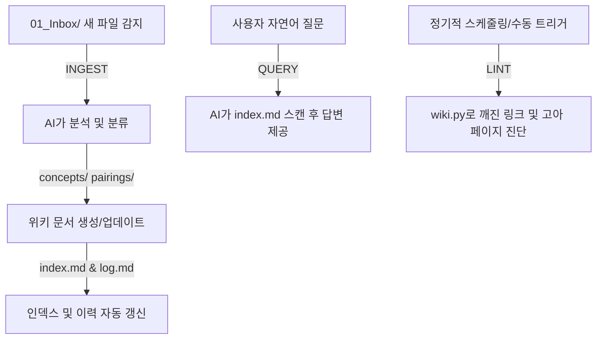

# 03. 확장: 사고를 시스템으로 만들기

이 가이드는 단순한 대화형 AI 사용을 넘어, 개인의 메모와 지식, 그리고 반복 작업을 AI와 연동하여 자동으로 진화하는 **'시스템'**으로 확장하는 방법을 다룹니다.

---

## 목차
1. [규칙 파일 설계 및 에이전트 개인화](#1-규칙-파일-설계-및-에이전트-개인화)
2. [CLAUDE.md 및 .cursorrules 파일 설계 템플릿](#2-claudemd-및-cursorrules-파일-설계-템플릿)
3. [옵시디언(Obsidian) LLM 위키 구축](#3-옵시디언obsidian-llm-위키-구축)
4. [크리에이터를 위한 바이브 코딩(Vibe Coding)](#4-크리에이터를-위한-바이브-코딩vibe-coding)
5. [모델 컨텍스트 프로토콜 (MCP)](#5-모델-컨텍스트-프로토콜-model-context-protocol-mcp)

---

## 0. 이 문서의 목적

> 02_루틴에서 설계한 반복 작업 전환이 안착되었다면, 이제 그 데이터를 축적하고 시스템으로 확장할 차례입니다.

메모를 쓰고 잊어버리는 파편화된 방식에서 벗어나, **데이터가 쌓일수록 AI가 사용자의 맥락을 더 깊이 이해하고 똑똑해지는 구조**로 전환하는 것이 본 문서의 목적입니다.

| 기존 방식 | 시스템적 확장 이후 |
| :--- | :--- |
| **메모 → 폴더 방치 → 망각** | 메모 → 연결 → AI가 패턴 발견 → 새로운 아이디어 도출 |
| **레퍼런스 수집 → 흩어짐** | 레퍼런스 → 스키마 태깅 → 유사 작업 자동 추천 및 자산화 |
| **경험이 머릿속에만 존재** | 경험 데이터가 검색 및 분석 가능한 구조화된 DB로 축적 |
| **반복 수작업 진행** | AI 기반의 도구(스크립트, 웹앱) 제작을 통한 프로세스 자동화 |

> [!NOTE]
> - **레벨 1~2**가 AI에게 **"어떻게 말하고 나를 기억시킬 것인가"**였다면,
> - **레벨 3(확장)**은 AI에게 **"어떻게 나의 사고 체계와 도구를 연결하여 자동화할 것인가"**가 핵심입니다.

---

## 1. 규칙 파일 설계 및 에이전트 개인화

매번 대화가 시작될 때마다 동일한 배경 정보를 제공하는 것은 리소스 낭비입니다. 규칙 파일은 AI가 대화 또는 작업을 시작할 때 가장 먼저 자동으로 로드하는 **"신입사원 업무 매뉴얼"** 역할을 합니다.

### 1-1. 각 서비스별 규칙 설정 방식
각 서비스에 맞게 규칙을 주입하여 일관된 답변 퀄리티를 유지합니다.

| 서비스 | 규칙 명칭 | 설정 위치 및 용량 | 특징 |
| :--- | :--- | :--- | :--- |
| **ChatGPT** | Custom Instructions (사용자 지정 지침) | `설정` → `개인화` → `사용자 지정 지침` (최대 1,500자) | 모든 새 채팅 세션에 일관되게 전역 적용 |
| **Claude** | Project Knowledge & Instructions | `Projects` → `New Project` → `Add Knowledge` (200K 토큰 제한) | 프로젝트별로 개별 지식 파일 및 지침 할당 가능 |
| **Gemini** | Gems (맞춤형 챗봇) | `Gem Manager` → `새 Gem 만들기` | 전문 역할군(예: 투자 분석가)에 최적화된 독립 챗봇 빌드 |

### 1-2. 기본 규칙 파일 템플릿
개인 업무 환경에 따라 빈 괄호 안의 매개변수를 정의하여 사용합니다.

```markdown
# 나의 AI 규칙 (Basic)

## 1. 프로필
- 이름: [이름]
- 직무/역할: [예: 프리랜서 사진작가 / 프로젝트 기획자]
- 핵심 업무: [예: 포트폴리오 관리, 클라이언트 미팅 및 견적 산출, 촬영 세팅 분석]

## 2. 인터랙션 스타일
- 언어 톤앤매너: [예: 전문적이고 간결하며 핵심만 짚는 개조식 말투]
- 답변 포맷: [예: 줄글 작성을 지양하고, 표와 마크다운 문법을 적극 활용]
- 피드백 루프: [예: 불확실한 수치나 정보는 추측하지 말고 질문으로 확인 요청]

## 3. 핵심 도메인 규칙
- [규칙 1: 예) 수치 데이터 제시 시 반드시 출처 또는 산출 근거를 표기한다.]
- [규칙 2: 예) 도량형 기준은 평(㎡ 병기) 및 억원(천만원 이하 절사) 단위를 준수한다.]
- [규칙 3: 예) 고유 명사나 전문 용어는 사전에 정의된 용어집을 우선 참조한다.]

## 4. 용어 사전
- [전문용어 1] = [대체어/의미]
- [전문용어 2] = [대체어/의미]
```

---

## 2. CLAUDE.md 및 .cursorrules 파일 설계 템플릿

로컬 개발 환경(Claude Code, Cursor, Antigravity 등)에서는 프로젝트 루트 디렉토리에 시스템 설정 파일(`CLAUDE.md` 또는 `.cursorrules`)을 배치하여 AI의 동작 방식을 정밀하게 통제합니다.

### 2-1. CLAUDE.md / .cursorrules 통합 템플릿

```markdown
# 프로젝트 규칙 (CLAUDE.md / .cursorrules)

## 1. 프로젝트 개요
- 역할: [예: 크리에이티브 아티스트를 위한 지식 베이스 관리 에이전트]
- 기술 스택: Python 3.10+, Obsidian Markdown, Shell Script
- 작업 디렉토리 구조:
  - `/01_Inbox` (수정 금지, Read-Only 원본 데이터)
  - `/concepts` (개념 및 테마 허브 노드)
  - `/pairings` (개별 분석 및 매칭 데이터)
  - `/02_Projects` (실제 프로젝트 작업 공간)

## 2. 에이전트 라우팅 및 역할 분배
- **Ingest Agent**: `/01_Inbox`에 새로운 파일이 생성되면 감지하고, `/schema` 규칙에 의거하여 자동 분류 프로세스를 트리거한다.
- **Query Agent**: 사용자 질문 시 `index.md` 목차를 우선 분석한 뒤, 관련 개념 및 페어링 문서를 탐색하여 답변을 구성한다.
- **Lint Agent**: 위키 내 깨진 링크, 고아 페이지, 중복 정의된 개념을 탐색하여 무결성을 유지한다.

## 3. 코딩 표준 및 자동화 실행 규칙
- 스크립트 작성 시 예외 처리를 철저히 하고 모든 단계를 표준 출력(stdout)으로 로깅한다.
- 파일 및 폴더 제어 시 EXIF 등 메타데이터 유실 방지를 위한 유효성 검증을 철수로 수행한다.
- 외부 라이브러리 의존성을 최소화하고 기본 라이브러리를 적극 활용한다.

## 4. 작업 프로세스 및 검증 워크플로우 (Verification Loop)
1. **분석**: 수정 대상 파일의 전체 스키마와 인접 연결 링크를 스캔한다.
2. **초안 작성**: 변경 사항을 임시 버퍼 영역에서 검증한다.
3. **무결성 검사**: `Lint` 스크립트를 실행하여 참조 무결성이 깨지지 않는지 체크한다.
4. **기록**: 수정 완료 시 변경 사항을 `log.md` 파일에 추가(Append-only)한다.

## 5. 산출물 명세 (Target Output Formats)
- 마크다운 파일 헤더에는 반드시 YAML Front Matter 형식으로 아래 메타데이터를 포함해야 한다.
```yaml
---
date: YYYY-MM-DD
tags: [카테고리1, 카테고리2]
status: [draft / review / completed]
---
```

---

## 3. 옵시디언(Obsidian) LLM 위키 구축

안드레 카파시(Andrej Karpathy)가 제시한 LLM 위키 개념은 기존 RAG(검색 증강 생성)의 한계를 보완합니다. 사용자가 정보를 단편적으로 검색하는 것을 넘어, **AI가 지식 간의 연결 관계를 능동적으로 파악하고 구조를 고도화**하는 시스템입니다.

### 3-1. RAG와 LLM 위키의 메커니즘 비교

```
[RAG 방식: 단순 검색 조각 취합]
질문 발생 ──> 원본 데이터베이스에서 연관 조각 검색 ──> 임시 맥락 주입 ──> 답변 출력

* 문제점: 데이터 노이즈가 많을 경우 왜곡이 심하며, 지식이 스스로 구조화되지 않음.

[LLM 위키 방식: 지속적인 가공 및 자산화]
원본 데이터 (/raw) ──> 스키마 기반 정제 ──> AI가 위키 문서 (/wiki) 작성 및 링크 연결

* 장점: 원본 노이즈 차단, 지식 간 양방향 연결([[링크]]) 구조 형성, 시간이 갈수록 고품질화.
```

### 3-2. Karpathy 모델 기반 3-폴더 아키텍처

로컬 컴퓨터의 옵시디언 금고(Vault)를 아래의 3가지 추상화 레이어로 구분하여 구성합니다.

```
옵시디언 금고 루트 (Vault Root)
├── /raw (Read-Only)      : 가공되지 않은 회의록, 촬영 원본 메타데이터, 스크랩 웹페이지
├── /wiki (AI-Managed)    : AI가 정리한 개념(concepts) 및 분석 페어링(pairings) 문서
└── /schema (Rules)       : 데이터 정제 규칙, 템플릿, CLAUDE.md 등 에이전트 지침
```

* **`/raw` (원본 데이터 레이어)**: 사용자가 입력하는 날 것 그대로의 정보입니다. AI는 이 폴더의 파일을 절대 임의로 수정하거나 삭제할 수 없으며 오직 읽기(Read-Only)만 수행합니다.
* **`/wiki` (정제 지식 레이어)**: AI가 스키마에 맞춰 정제하고 연결한 통합 지식 베이스입니다. 개념 간의 `[[양방향 링크]]`가 형성되는 공간입니다.
* **`/schema` (규칙 및 템플릿 레이어)**: 지식을 어떻게 정제하고, 어떤 양식으로 기록할지 정의하는 약속의 공간입니다.

### 3-3. 로컬 옵시디언 위키의 실제 디렉토리 구조 예시

```
REAL_HAEPA/ (Obsidian Vault Root)
├── 01_Inbox/                       # /raw에 대응하는 유저 업로드 경로
├── concepts/                       # /wiki에 대응하는 주제별 허브 노드
├── pairings/                       # /wiki에 대응하는 '콘텐츠 x 이론' 및 '실험 x 결과' 매칭 노드
├── 02_Projects/                    # 진행 중인 실제 프로젝트 작업 영역
│   └── ai-education/
├── index.md                        # 위키 전체 목차 및 네비게이션
├── log.md                          # 변경 이력 기록 (Append-only)
├── wiki.py                         # 위키 관리용 로컬 CLI 파이썬 스크립트
└── CLAUDE.md                       # LLM 위키 작동 규칙 설정 파일
```

### 3-4. 핵심 플러그인 4종 설정
옵시디언의 로컬 데이터 저장 장점을 극대화하기 위해 아래 플러그인을 활성화합니다.

1. **Smart Connections**: 노트 간 의미론적 유사성(Cosine Similarity)을 계산하여 사이드바에 연관 문서를 제안하고, 전체 로컬 노트를 맥락 삼아 AI와 종합 대화를 지원합니다.
2. **Copilot**: 작업 중인 화면 우측에서 즉시 LLM API를 연결하여 현재 보고 있는 문서를 요약하거나 액션 아이템을 추출합니다.
3. **Khoj**: 프라이버시가 극도로 중요한 경우, 데이터를 외부 서버로 전송하지 않고 Ollama와 같은 로컬 LLM을 통해 오프라인 벡터 검색과 추론을 수행합니다.
4. **Web Clipper**: 브라우저에서 마크다운 형태로 원클릭 웹 아카이빙을 진행하며, `/01_Inbox` 폴더로 지정 템플릿과 함께 자동 저장되도록 설정합니다.

### 3-5. 점진적 4단계 빌드 로드맵

> [!IMPORTANT]
> 처음부터 수십 개의 플러그인을 설치하면 복잡도 상승으로 시스템 구축에 실패합니다. 아래 로드맵을 엄격히 준수하십시오.

* **1주차 (기반 다지기)**: 옵시디언 기본 기능만 사용. `[[양방향 링크]]` 작성법을 익히고 매일의 기록을 남깁니다.
* **2주차 (Inbox 단일화)**: 모든 생성 파일, 스크랩 자료를 분류하지 않고 일단 `01_Inbox/` 폴더 하나에 수집하는 습관을 형성합니다.
* **3주차 (AI 연결 및 탐색)**: `Smart Connections` 플러그인을 설치하고, 과거 노트를 기반으로 AI에 질문하여 숨겨진 맥락적 관계성을 찾아냅니다.
* **4주차 (LLM 위키 가동)**: `CLAUDE.md` 규칙을 입력하고 AI(Claude Code, Cursor 등)에게 Inbox 스캔 및 위키 문서 빌드 작업을 본격적으로 위임합니다.

### 3-6. 실전 워크플로우 (INGEST → QUERY → LINT)



1. **INGEST (정보 흡수)**: 사용자가 메모를 던지면 AI가 이를 읽어 `pairings/` 템플릿에 맞추어 재작성하고 관련 `concepts/` 허브에 수동으로 추적 링크를 연결합니다.
2. **QUERY (지식 탐색)**: 사용자가 "허무주의 극복에 관한 내 생각과 레퍼런스들을 모아줘"라고 질의하면 AI는 `index.md` 구조를 파악하고 관련 문서를 탐색하여 종합적인 에세이 초안을 구성합니다.
3. **LINT (무결성 검사)**: 로컬 CLI 스크립트(`wiki.py`)가 정기적으로 구동되어 깨진 내부 링크(`[[존재하지않는노트]]`)와 상위 링크가 없는 고아 노트를 식별해 경고 보고서를 작성합니다.

---

### 3-7. 페어링 및 허브 노드 문서 템플릿

#### [페어링 템플릿 예시: 사진작가의 촬영 매칭 데이터]
```markdown
# [26/06/23] 브랜드A 야외촬영, 흐린 날 자연광 분석

## 1. 촬영 후기 및 현장 관찰
- 오후 3시경 구름 양 80% 상태. 반사판을 배치하지 않았음에도 부드러운 확산광 덕분에 명암 대비가 완만하여 얼굴 그림자가 억제됨.
- 85mm f/1.4 세팅은 심도 표현이 과하여 배경 맥락이 다소 유실됨. f/2.0이 더 적절했을 것으로 보임.

## 2. 기술적 요소 분석
### 확산광(Diffuse Light) 메커니즘
- **개념**: 구름이 대형 소프트박스 역할을 수행함.
- **원리**: 광원의 면적이 피사체 대비 극대화될수록 그림자의 경계선이 완화됨.
- **대응**: 반사판 없이 섀도우 디테일을 살리는 촬영에 적합함.

## 3. Action Items (다음 촬영 시 시도)
- [ ] 동일 조건 하 조리개값별(f/1.4 vs f/2.0) 배경 표현력 테스트 진행
- [ ] 흐린 날 반사판 적용 시 캐치라이트 광량 차이 데이터 수집

## 4. 양방향 링크
- 유사 사례: [[2026-05-10_잡지B_야외촬영]]
- 핵심 개념: [[자연광_인물촬영]], [[조리개_배경분리]]
```

#### [허브 노드 템플릿 예시: 자연광 인물촬영]
```markdown
# 자연광 인물촬영 (Hub Node)

> 인공 광원 없이 자연 환경의 광선(골든아워, 확산광 등)만을 활용하여 인물을 담아내는 기법 분석 및 누적 데이터베이스

## 1. 환경 조건별 최적 세팅 가이드라인 (데이터 기반 도출)
### 맑은 날 야외
- **골든아워**: ISO 200, f/2.8, 1/500초 내외 (역광 실루엣 표현)
- **한낮**: ISO 100, f/4.0, 1/1000초 (그늘막 확보 및 반사판 필수 활용)

### 흐린 날 야외 (소프트박스 효과)
- **기본값**: ISO 400~800, f/2.0~2.8, 1/250초
- **참고사항**: 반사판 사용은 선택적이며, 자연스러운 그림자를 유도함.

## 2. 연관 페어링 히스토리 (최신순)
- [[2026-06-23_브랜드A_야외촬영]] - 흐린 날 자연광, 반사판 미사용 분석
- [[2026-05-10_잡지B_야외촬영]] - 맑은 날 골든아워 시간대 역광 촬영 분석

## 3. 상시 검증 체크리스트
- [ ] 외부 스트로보나 지속광을 혼용한 경우 본 허브가 아닌 [[혼합조명_촬영]] 허브로 이관하였는가?
- [ ] 결과물 만족도 평점(★☆☆ ~ ★★★)을 기입 완료하였는가?
```

### 3-6. 유튜브 자막 기반 옵시디언 위키 지식 자산화 프로토콜

외부의 훌륭한 유튜브 강의나 지식 영상에서 자막 텍스트를 추출하여, 내 옵시디언 위키 폴더 구조(`raw/`, `wiki/`)의 양식에 맞추어 양방향 연결([[링크]]) 문서로 자동 정제해 자산화하는 프로토콜입니다.

* **추천 유튜브 영상 목록 (위키 구축/제2의 뇌 편)**:

  | 추천 영상 제목 / 채널 | 핵심 학습 목표 | 추천 이유 및 실전 활용 |
  | :--- | :--- | :--- |
  | **[How to Use Obsidian for Second Brain](https://youtu.be/L9SLwHsq788)**<br>(Ali Abdaal 등 생산성 채널) | 제2의 뇌 개념과 지식 연결의 기초 | 지식을 쪼개어 보관하고 나중에 필요할 때 연상 결합하여 창작의 재료로 삼는 디지털 노트 정리 철학을 파악합니다. |
  | **[Obsidian AI Plugins for Absolute Beginners](https://youtu.be/fL510vH10hU)**<br>(생산성 튜토리얼) | Smart Connections 등 AI 연동 실습 | 내 텍스트 데이터베이스와 대화하며, 과거에 적어둔 연관 아이디어를 AI가 대신 탐색하게 만드는 구축 노하우를 배웁니다. |

* **실전 유튜브 자막 기반 옵시디언 위키 추출 프롬프트 템플릿**:

  ```text
  [나의 옵시디언 위키 스키마]
  나는 /raw 폴더에 날것의 자료를 두고, 이를 정제하여 /wiki 폴더에 다음 두 가지 형식의 마크다운 파일로 기록한다:
  1. 페어링 노드(Pairing Node): 특정 날짜, 단일 프로젝트, 사건에 대한 관찰 기록. 파일명 형식은 `[[YYYY-MM-DD_프로젝트명]]`.
  2. 허브 노드(Hub Node): 여러 페어링 노트들을 묶어주는 상위 개념 정리 노트. 파일명 형식은 `[[개념명]]`.

  [추출한 유튜브 자막 대본]
  ---
  (여기에 Glasp 등으로 복사한 유튜브 자막 텍스트 전체 붙여넣기)
  ---

  [요청 사항]
  입력된 유튜브 자막 대본을 분석하여 다음 두 가지 문서 초안을 마크다운으로 생성해라.
  1. 이 영상의 핵심 주장이 담긴 페어링 노드 초안 (파일명: `[[오늘날짜_유튜브영상제목]]`)
     - 후기, 핵심 관찰 내용, 기술 분석 정리 포함.
  2. 이와 연결할 상위 개념을 정리한 허브 노드 초안 (파일명: `[[핵심개념명]]`)
     - 개념 정의, 가이드라인, 그리고 이 허브 노드 내부에 방금 생성한 페어링 노드에 대한 양방향 연결 링크(`[[오늘날짜_유튜브영상제목]]`)를 반드시 포함할 것.
  ```

---

## 4. 크리에이터를 위한 바이브 코딩(Vibe Coding)

바이브 코딩은 사용자가 구체적인 문법이나 코딩 지식 없이도, **AI에게 요구사항을 구어로 전달하여 실제 하드웨어와 소프트웨어를 제어하는 완성형 도구를 빌드하는 방식**을 의미합니다. 

특히 예술가나 비개발 기획자는 이를 통해 물리적 장치 제어부터 비즈니스 시스템 자동화까지 전 과정을 스스로 구축할 수 있습니다.

### 4-1. 바이브 코딩 핵심 실행 로직
```
[1단계] 요구사항 구어 설명 ──> [2단계] AI가 제어 스크립트 작성 ──> [3단계] 로컬 터미널에서 즉시 실행 ──> [4단계] 자동 도구 획득
```

#### [실전 자동화 스크립트 예시: EXIF 날짜 기준 사진 파일 자동 정렬 파이썬 코드]
```python
import os
from PIL import Image

def organize_and_rename_photos(source_dir, project_name):
    # 폴더 내 JPG 파일 스캔
    files = sorted([f for f in os.listdir(source_dir) if f.lower().endswith(('.jpg', '.jpeg'))])
    
    for idx, filename in enumerate(files, 1):
        file_path = os.path.join(source_dir, filename)
        try:
            img = Image.open(file_path)
            exif_data = img._getexif()
            
            # EXIF 촬영 날짜 데이터 추출 (태그 번호 36867)
            if exif_data and 36867 in exif_data:
                raw_date = exif_data[36867]
                date_str = raw_date.replace(':', '-')[:10]  # YYYY-MM-DD 포맷 변환
            else:
                date_str = "unknown-date"
        except Exception:
            date_str = "corrupted-exif"
            
        new_name = f"{date_str}_{project_name}_{idx:03d}.jpg"
        new_path = os.path.join(source_dir, new_name)
        os.rename(file_path, new_path)
        print(f"[정렬 완료] {filename} ──> {new_name}")

# 로컬 실행 테스트 경로 정의
# organize_and_rename_photos("/Users/haepa_mac/Pictures/shoot_0623", "BrandShoot")
```

---

### 4-2. 크리에이티브 아티스트를 위한 바이브 코딩 7대 영역 및 실전 적용 사례

#### 1) 하드웨어 제어 (Hardware Control)
물리적 공간 및 관객 반응형 전시 인프라를 직접 구축합니다.

* **관객 동선 반응형 조명 피드백**: 아두이노(Arduino)와 적외선 거리 측정 센서를 연동하고, 관객이 다가올 시 서보 모터와 LED 조도가 가변 동작하도록 회로도 설계 및 제어 소스코드를 AI를 통해 자동 생성합니다.
* **전시장 실시간 관객 카운팅 센서**: 라즈베리 파이(Raspberry Pi) 카메라 모듈에 초소형 비전 모델을 내장하여 실시간으로 관람 인원을 체크하고 통계를 누적하는 파이프라인을 구축합니다.

#### 2) 실시간 비주얼 및 공연 인터랙션 (Real-time Visuals)
사운드 및 신체 움직임을 시각 정보와 유기적으로 결합합니다.

* **TouchDesigner 패치 제어**: 오디오 인풋 파형의 주파수 대역별(Bass, Mid, High) 진폭 데이터를 기반으로 파티클의 방출 속도와 렌더링 컬러를 실시간 가변 제어하는 스크립트를 작성합니다.
* **무용수 트래킹 매핑 프로젝션**: 웹캠 피드를 받아 댄서의 관절(Keypoints) 위치 정보를 실시간으로 계산하고, 그 궤적을 따라 배경 빔프로젝터 영상이 실시간으로 왜곡 및 반응하는 코드를 구현합니다.

#### 3) 맞춤형 웹/앱 서비스 구축 (Custom Apps)
클라이언트 응대 및 전시 효율화를 돕는 전용 인터페이스를 개발합니다.

* **조건별 실시간 견적 웹앱**: 클라이언트가 웹 브라우저에서 촬영 형태, 소요 시간, 보정 컷 수, 출장 여부를 체크하면 단가표를 실시간 반영하여 정식 PDF 견적서로 다운로드할 수 있는 경량 웹 애플리케이션을 배포합니다.
* **선택형 포트폴리오 디지털 갤러리**: 클라이언트가 개인화된 링크를 통해 사진 리스트를 확인하고 마음에 드는 원본을 클릭하여 직접 장바구니에 담아 압축 다운로드할 수 있는 맞춤형 사이트를 제작합니다.
* **QR 코드 연동 AR 도슨트 서비스**: 스마트폰 카메라로 QR 코드를 스캔하면 증강 현실(AR) 인터페이스 상에 작품 설명 및 오디오 가이드가 렌더링되도록 WebXR 프레임워크 기반 코드를 빌드합니다.

#### 4) 비디오/오디오 처리 자동화 (Video/Audio)
대량의 미디어 소스를 정제하고 가공하는 단순 노동 시간을 단축합니다.

* **포트폴리오 쇼릴(Showreel) 자동 가공**: 촬영 원본 영상 폴더 내에서 메타데이터 또는 움직임 감지 알고리즘(Motion Detection)을 가동하여 가장 동적인 5초 구간들만 크롭하여 배경 음악 비트에 맞게 이어 붙이는 오토 컷 스크립트를 제작합니다.
* **음성 필러 워드(Filler Word) 정밀 삭제**: 팟캐스트 및 인터뷰 녹음 파일에서 '어', '음', '그니까' 등 불필요한 추임새 대역만 타임스탬프 기준으로 파악하여 오디오 파형을 자동으로 잘라내고 붙여주는 편집 프로세스를 처리합니다.
* **신체 모션 패턴 분석 시각화**: 댄스 영상 10여 개를 분석하여 안무 중 좌우 균형도 변화, 속도 변화율 곡선을 추출하고 엑셀 시트에 그래프 형태로 시각화 분석 보고서를 자동 추출합니다.

#### 5) 모션 캡처 및 자세 분석 (Motion Capture)
웹캠 수준의 장비만으로 신체 데이터를 추적하고 활용합니다.

* **웹캠 기반 포즈 추출**: 비싼 모션 캡처 수트 없이도 일반 웹캠 녹화 영상을 바탕으로 MediaPipe/OpenPose를 구동하여 3D 관절 좌표값(.csv)을 추출합니다.
* **연습 영상 및 레퍼런스 프레임 비교기**: 모니터 화면 좌측에는 오리지널 안무가의 영상, 우측에는 사용자의 연습 영상을 띄우고 프레임별로 관절 각도 차이(유사도 오차율)를 분석하여 자세가 가장 흐트러지는 순간에 빨간색 아웃라인으로 오버레이 표시해주는 시각 분석 도구를 빌드합니다.

#### 6) 커스텀 소프트웨어 플러그인 (Custom Plugins)
기존에 사용하는 전문 크리에이티브 툴의 한계를 스크립트로 극복합니다.

* **Lightroom 배치 보정 애드온**: 특정 룩앤필(Luminance, Contrast) 공식을 바탕으로 수백 장의 사진 톤을 정해진 프리셋에 맞추어 순차 보정해주는 커스텀 액션 스크립트를 작성합니다.
* **Premiere Pro 타이틀 스타일 일괄 스크립트**: 비디오 레이어 내 전체 한글 자막들의 서체와 윤곽선 두께, 안전 영역 위치를 JSON 설정 파일 기준으로 일괄 조절하는 스크립트를 제작합니다.
* **Blender 배치 시뮬레이터 애드온**: 좌표값이 정리된 엑셀(CSV) 파일을 불러오면 Blender 3D 공간 상의 지정 위치에 오브젝트들이 자동 정렬 및 로드되는 커스텀 파이썬 플러그인을 구현합니다.

#### 7) 비즈니스 및 스튜디오 워크플로우 자동화 (Business)
창작 활동 외에 발생하는 운영 업무의 소요 시간을 최소화합니다.

* **인스타그램 DM 견적 양식 자동 응답기**: 특정 키워드(예: '촬영 문의')를 포함한 인스타 DM 수신 시, 사전에 지정된 챗봇 로직이 실행되어 기본 단가표 이미지와 구글 폼 링크를 자동 발송하는 인입 프로세스를 구성합니다.
* **미팅 및 세부 정산 대시보드**: 매월 발생한 매출 계약서와 경비 영수증 이미지 폴더를 읽어 OCR로 텍스트를 추출한 후, 당월 실 수령액과 고정 지출 비율을 일목요연하게 차트로 나타내는 로컬 대시보드(Streamlit 등)를 구동합니다.

#### 4-3. 오늘 시작할 바이브코딩 1가지

1. Cursor 또는 Antigravity를 연다
2. "내 [직군] 작업에서 가장 귀찮은 반복 작업 1개를 자동화하는 스크립트를 만들어줘"라고 입력한다
3. 결과물이 50%만 맞아도 성공이다 — 나머지는 "이 부분 수정해줘"로 고친다

> 코드를 읽을 필요 없다. 동작하면 된다. 동작하지 않으면 에러 메시지를 그대로 붙여넣는다.

---

## 5. 모델 컨텍스트 프로토콜 (Model Context Protocol, MCP)

MCP는 AI 브레인에 **"물리적인 손과 발"**을 달아주는 기술 표준 규격입니다. MCP 환경이 구현된 AI는 텍스트 조언에 머물지 않고 로컬 컴퓨터의 파일을 직접 편집하거나, Notion·Google Drive·한글(HWPX) 등 외부 서비스와 양방향으로 데이터를 주고받을 수 있습니다. 아티스트에게는 촬영 원본 폴더 정리, 견적 시트 자동 반영, 노션 작업 일지 동기화 등 반복 연결 작업을 에이전트에게 위임할 수 있는 핵심 인프라입니다.

> **MCP 아키텍처, 설정, 서비스 목록 상세**: [01_도구 — 8. MCP 실전 가이드](01_도구_뭘_쓸_것인가.md#8-mcp-model-context-protocol-실전-가이드) 참조

### 5-1. MCP의 발전 전망
* **과거**: JSON 설정 파일(`config.json`)을 열어 API 토큰 값과 모듈 주소를 복잡하게 수작업 기입해야 사용 가능했습니다.
* **현재**: 주요 AI 클라이언트(Cursor, Antigravity) 환경에서 컴포넌트 추가 버튼을 통해 반자동 연결 프로세스를 지원합니다.
* **미래**: OS 시스템 수준 및 앱 마켓처럼 마우스 원클릭 설치를 통해 누구나 손쉽게 오프라인 프로그램 및 클라우드 데이터 공간을 AI 에이전트와 연결하게 될 것입니다.

---

## 실행 체크리스트

```
□ CLAUDE.md 또는 서비스별 규칙 파일을 1개 이상 등록했다
□ 옵시디언(또는 유사 도구)에 /raw, /wiki, /schema 3-폴더를 만들었다
□ 바이브코딩으로 스크립트 또는 도구를 1개 만들어봤다
□ MCP 서버를 1개 이상 연결해봤다 (→ 01_도구 참조)
```

> 이 단계가 안착되면, 다음은 에이전트를 역할별로 분리하는 것입니다.
> → [04_시스템 — 에이전트와 파이프라인](04_시스템_에이전트와_파이프라인.md)
