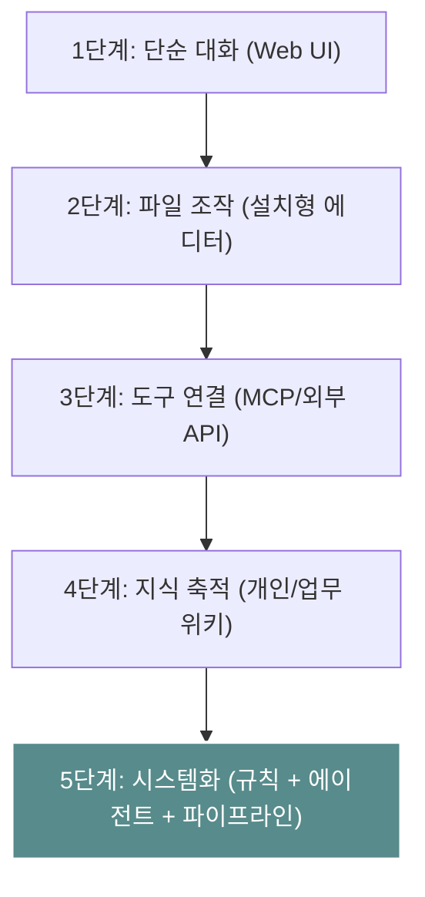
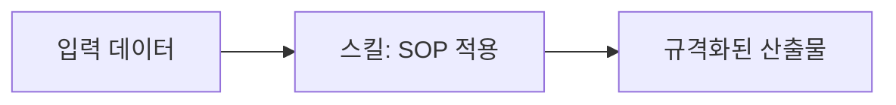
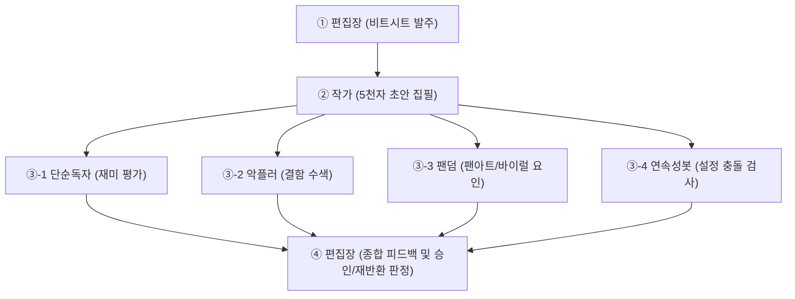
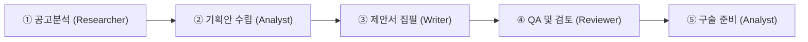

# 04. 시스템 — 에이전트와 파이프라인

> **이 문서는 AI를 단발성 대화 도구를 넘어, 스스로 역할을 인지하고 표준 절차(SOP)에 따라 일하며 상호 검증하는 '자율형 AI 시스템'으로 전환하기 위한 설계 매뉴얼입니다.**
> 에이전트 설계, 스킬 체인, 검증 루프, 파이프라인 구축까지 — 시스템화의 전 과정을 다룹니다.

---

## 목차

1. [AI 시스템의 개요: 도구에서 시스템으로](#1-ai-시스템의-개요-도구에서-시스템으로)
2. [규칙 파일 (Rule Files): AI의 기본 행동 지침](#2-규칙-파일-rule-files-ai의-기본-행동-지침)
3. [에이전트 (Agents): 역할 기반의 AI 분업화](#3-에이전트-agents-역할-기반의-ai-분업화)
4. [스킬 (Skills): 반복 과업의 SOP 정의](#4-스킬-skills-반복-과업의-sop-정의)
5. [검증 루프 (Validation Loop): 자체 검증 및 비판 시스템](#5-검증-루프-validation-loop-자체-검증-및-비판-시스템)
6. [크리에이티브 및 실무 파이프라인 시나리오](#6-크리에이티브-및-실무-파이프라인-시나리오)
7. [지식 축적 시스템: LLM과 옵시디언 위키의 연동](#7-지식-축적-시스템-llm과-옵시디언-위키의-연동)
8. [실행 체크리스트](#실행-체크리스트)

---

## 1. AI 시스템의 개요: 도구에서 시스템으로

AI 활용은 단순 대화에서 시작하여 점차 지식이 축적되고 시스템화되는 단계를 거칩니다.



| 단계 | 상태 | 비유 | 설명 |
| :--- | :--- | :--- | :--- |
| **레벨 1~2** | AI에게 매번 설명 | 매번 새로운 아르바이트생 교육 | 프롬프트를 매핑하고 기억시키는 단계 |
| **레벨 3** | AI가 데이터 참조 | 사내 공유 폴더에 접근 권한 부여 | 특정 데이터를 지식 베이스화하여 읽게 함 |
| **레벨 4 (시스템)** | **역할 + 규칙 + 절차 확립** | **SOP(표준절차서)를 숙지한 전문 직원** | **규칙 파일, 에이전트, 파이프라인의 유기적 결합** |

---

## 2. 규칙 파일 (Rule Files): AI의 기본 행동 지침

규칙 파일은 AI가 프로젝트 시작 시 자동으로 로드하여 항상 일관된 성격, 톤앤매너, 작업 스타일을 유지하도록 돕는 **시스템 명세서**입니다. 신입사원에게 업무 매뉴얼을 건네는 것처럼, AI에게도 매번 같은 맥락을 반복 입력하는 대신 규칙 파일 하나로 자동 적용합니다.

규칙 파일에는 사용자의 정체성(직업, 경력), 작업 스타일(톤앤매너, 출력 형식), 반복 작업의 규칙(견적서 양식, 캡션 규칙 등), 그리고 **금지 사항**(환각 방지, 상투적 표현 배제)을 포함합니다.

### 2-1. 도구별 규칙 파일 적용 방식

| 도구 | 파일명 / 설정 위치 | 적용 방식 |
| :--- | :--- | :--- |
| **Claude (Co-work)** | 프로젝트 설명 및 첨부파일 | 프로젝트 생성 후 설명란에 입력 시 자동 적용 |
| **Cursor** | `.cursorrules` (프로젝트 루트) | Cursor IDE가 자동으로 감지하여 코드 작성 및 채팅 시 참조 |
| **Antigravity** | `.cursorrules` 또는 `CLAUDE.md` | 에디터 환경에서 자동으로 기본 동작 지침으로 인식 |
| **Claude Code** | `CLAUDE.md` (프로젝트 루트) | 터미널 기반 작동 시 우선적으로 로드되는 프로젝트 컨텍스트 파일 |
| **ChatGPT** | 커스텀 명령어 (Custom Instructions) | 계정 설정의 맞춤 지침으로 일괄 적용 |

> [!NOTE]
> `CLAUDE.md`는 하위 폴더별 추가 구성이 가능합니다. 예컨대 `/견적서/CLAUDE.md` 또는 `/SNS/CLAUDE.md` 형태로 하위 작업에 특화된 로컬 규칙을 덮어쓸 수 있습니다.

### 2-2. 직군별 실전 규칙 파일 예시

````carousel
```markdown
# CLAUDE.md — 사진작가 어시스턴트

## 컨텍스트
- 나는 상업/인물 사진작가 (7년차)
- 주로 야외 자연광 + 보조조명 세팅
- 클라이언트: 브랜드, 잡지, 개인 (프로필/화보)
- 장비: Sony A7IV, 시그마 35mm Art, 소니 85mm f/1.4
- 보정: Lightroom Classic + Photoshop

## 촬영 체크리스트 생성 시
- 포함 항목: 장소 / 날씨 / 시간대 / 모델 수 / 콘셉트
- 장비 리스트 순서: 바디 → 렌즈 → 조명 → 악세서리 → 소품
- 과거 유사 촬영 세팅 참조 (첨부된 세팅 DB가 있으면 활용)
- 비상 장비 항목 포함 (여분 배터리, 메모리카드, 반사판)

## 견적서 생성 시
- 항목: 촬영비 / 보정비 / 출장비 / 장비대여 / 어시스턴트
- 촬영비 기본 단가: 시간당 15만원
- 보정비 기본 단가: 컷당 1만원 (기본보정), 3만원 (고급보정)
- VAT 별도 명시
- 결제 조건: 계약금 50%, 잔금 납품 시
- 톤: 깔끔, 간결, 전문적

## 캡션 생성 시
- 3줄 이내
- 해시태그 10개 이내 (한국어 5 + 영어 5)
- 감성적이되 과하지 않게
- "작업물" "촬영" 등 업계 용어 자연스럽게 사용

## 금지 사항
- "감성적인 한 컷" 같은 식상한 표현 금지
- 클라이언트 정보 임의 생성 금지
- 촬영 세팅값을 추측하지 말 것 (모르면 모른다고)
```
<!-- slide -->
```markdown
# CLAUDE.md — 영상 프로덕션 어시스턴트

## 컨텍스트
- 나는 다큐멘터리/교양 영상 제작자 (5년차)
- 기획 → 촬영 → 편집 → 납품 전 과정 관여
- 주 클라이언트: 방송사, 문화재단, 기업
- 편집: Premiere Pro + DaVinci Resolve
- 사운드: Logic Pro

## 시놉시스 작성 시
- 구조 (이 순서를 반드시 지킴):
  1. 로그라인 (1문장, 반드시 1문장)
  2. 기획의도 (A4 반 페이지)
  3. 에피소드 구성 (회당 구성안)
  4. 제작 계획 (일정 + 예산 + 인력)
  5. 제작진 이력

- 톤: 담백, 구체적, 수치 포함
- 분량: A4 2–3장

## 콜시트 생성 시
- 표 형식 필수
- 열 구성: 일자 / 시간 / 장소(주소 포함) / 출연자 / 스태프 / 장비 / 비고
- 시간은 24시간제
- 집결 시간과 촬영 시작 시간 분리 표기

## 결과보고서 작성 시
- 구조: 프로젝트 개요 → 수행 내용 → 성과(정량+정성) → 예산 집행 → 첨부
- 예산 집행 내역: 항목별 계획 vs 실집행 비교표
- 정량 성과: 조회수, 참여자 수, 매체 노출 등 수치 필수

## 금지 사항
- "영상미" 같은 모호한 표현 금지
- 예산 항목을 추측하지 말 것
- 촬영 장소 허가/섭외 상태를 임의로 "완료"로 적지 말 것
```
<!-- slide -->
```markdown
# CLAUDE.md — 안무/공연 어시스턴트

## 컨텍스트
- 나는 컨템포러리 댄서/안무가 (6년차)
- 장르: 컨템포러리 + 스트릿 퓨전
- 주로 솔로/듀엣 작업
- 공연 공간: 소극장 (100석 이하), 갤러리, 비정형 공간

## 안무 구조 논의 시
- 음악 구간별로 나눠서 이야기
- 동작을 설명할 때: 시작 자세 → 이동 경로 → 종료 자세
- 감정/에너지 레벨 표시 (1–10 스케일)

## 큐시트 생성 시
- 타임코드 필수
- 열 구성: 타임코드 / 구간 / 안무 키워드 / 조명 / 사운드 / 비고
- 조명은 한국어로 (핀스팟, 페이드, 풀라이트 등)

## 금지 사항
- "아름다운 움직임" 같은 모호한 표현 사용 금지
- 안무 동작을 임의로 제안하지 말 것 (아이디어를 물어볼 것)
- 음악 저작권 관련 조언은 하지 말 것 (전문가 영역)
```
````

> **상세 템플릿과 설계 원칙**: [03_확장 — 1. 규칙 파일 설계](03_확장_사고를_시스템으로.md#1-규칙-파일-설계-및-에이전트-개인화) 참조

---

## 3. 에이전트 (Agents): 역할 기반의 AI 분업화

에이전트는 하나의 거대한 인공지능에게 모든 과업을 포괄적으로 지시하는 대신, 개별 직무 영역과 판단 기준을 쪼개어 설계한 '역할 전문 단위'입니다.

### 3-1. 에이전트 설계 3대 원칙
1. **단일 목적성 (One Agent, One Sentence)**: "이 에이전트는 [X]를 처리한다"로 명료하게 정의되지 않는 에이전트는 설계 범위가 너무 넓은 상태입니다.
2. **부정적 규정 중심 (Negative Constraints)**: 해야 할 일보다 **"해서는 안 되는 행위(금지 사항)"**를 꼼꼼하게 규정하는 것이 환각 제어와 품질 유지에 결정적입니다.
3. **출력 양식의 고정 (Contract-based Output)**: 결과물의 포맷을 엄격히 약속해야만 다음 단계의 에이전트가 에러 없이 인풋 데이터로 파싱해 쓸 수 있습니다.

### 3-2. 에이전트 정의 템플릿

```markdown
# [에이전트 이름]

## 역할
- [한 문장으로 정의하는 핵심 임무]

## 호출 시점
- [상황 1]
- [상황 2]

## 핵심 원칙
1. [지켜야 할 원칙 1]
2. [지켜야 할 원칙 2]

## 참조 리소스
- [참조 파일/디렉토리 경로 1]
- [참조 파일/디렉토리 경로 2]

## 출력 인터페이스
- [산출물 마크다운 또는 데이터 구조 약속]

## 행동 규제 (금지 사항)
- [절대 금지할 동작 또는 단어 표현]
```

### 3-3. 범용 에이전트 구조

에이전트는 크게 두 계층으로 설계합니다.

| 계층 | 역할 | 예시 |
| :--- | :--- | :--- |
| **도메인 에이전트** | 업무 특화 요청을 수신하고 범용 에이전트를 연쇄 호출 | Portfolio Curator, Bid Writer |
| **범용 에이전트** | 리서치, 분석, 집필, 검토 등 공통 과업 수행 | Researcher, Writer, Reviewer |

```
              ┌──────────────────────┐
              │   도메인 에이전트     │
              │   (업무 특화 요청)    │
              └──────────┬───────────┘
                         │
                         ▼
┌────────────────────────────────────────────────────────┐
│                   범용 에이전트                          │
│ Researcher → Analyst → Writer → Reviewer → Monitor      │
│                     (스킬 및 업무 실행)                  │
└────────────────────────────────────────────────────────┘
```

### 3-4. 아티스트를 위한 에이전트 설계 예시

아래는 사진작가, 영상제작자, 댄서, 공간기획자가 공통으로 활용할 수 있는 에이전트 구성입니다. 자신의 작업 방식에 맞게 역할과 입출력을 조정하면 됩니다.

| 에이전트 | 역할 | 입력 | 출력 | 사용 예시 |
| :--- | :--- | :--- | :--- | :--- |
| **Portfolio Curator** | 포트폴리오 편집 & 큐레이션 | 작업 이미지 + 전시 테마 | 정리된 포트폴리오 시퀀스 + 작가 노트 초안 | 전시 응모, 클라이언트 프레젠테이션 |
| **Bid Writer** | 견적서 & 제안서 작성 | 프로젝트 브리프 + 단가표 | 견적서 초안 + 비교 분석 | 상업 촬영, 공간 기획 제안 |
| **Content Scheduler** | SNS 콘텐츠 기획 & 스케줄링 | 작업물 + 브랜드 가이드라인 | 주간 콘텐츠 캘린더 + 캡션 초안 | 인스타그램, 유튜브 운영 |
| **Critic** | 결과물 비평 & 개선 제안 | 초안 문서/이미지/영상 컨셉 | 개선점 3가지 + 대안 제시 | 모든 결과물의 최종 검증 |

**스킬 체인 예시 — 촬영 완료 후 워크플로우:**

```
[촬영 완료] → Portfolio Curator (선별+시퀀싱)
           → Bid Writer (해당 작업 기반 견적 템플릿 업데이트)
           → Content Scheduler (SNS 발행 일정 생성)
           → Critic (전체 흐름 검증)
```

### 3-5. 실전 사례: 투자운용사의 10종 에이전트 시스템

아래는 투자운용사(B-Square)가 실제로 운용 중인 에이전트 시스템입니다. 자신의 도메인에 맞게 이와 같은 구조를 설계할 수 있습니다.

#### A. 범용 에이전트 7종

##### 1. Researcher (심층 리서치)
*   **역할**: 타겟 정보(공고문, 정책, 업계 동향 등)를 심층 수집 및 정합성 검증하여 보고서 형태로 구성합니다.
*   **주요 태스크**: 시장 분석, 경쟁사 분석, 법규 검토.
*   **핵심 제약**: 정보 출처(기관, 시점) 표기 필수. 주관적 예측 표현 배제.

##### 2. Analyst (데이터 분석)
*   **역할**: 수치와 정량 데이터를 기반으로 시나리오 시뮬레이션 및 재무성 검증을 담당합니다.
*   **주요 태스크**: 투자 회수율(IRR) 민감도 분석, 배점 평가표 정량 항목 가중치 계산.
*   **핵심 제약**: 산출 과정의 수식 논리 공개 필수. 유추 데이터 사용 불가.

##### 3. Writer (문서 작성)
*   **역할**: 수집/분석된 데이터를 바탕으로 최종 제안서, 기획서, 보고서의 초안을 집필합니다.
*   **주요 태스크**: 제안서 작성, 사업 계획서 상세 집필.
*   **핵심 제약**: 사전에 정의된 목차와 가이드를 강제 적용. 화려한 수식어 금지.

##### 4. Reviewer (검토 및 교정)
*   **역할**: 완성된 문서 초안을 검사하여 수치 부정합, 논리적 비약, 맞춤법 오류를 교정합니다.
*   **주요 태스크**: 제안서 정합성 체크, 수치 크로스 검증.
*   **핵심 제약**: 칭찬 및 긍정적 멘트 작성 절대 금지. 감점 요인 및 오류 사항만 적시.

##### 5. PR Agent (커뮤니케이션/홍보)
*   **역할**: 내부 소식이나 투자 성과를 대외적 톤앤매너에 맞게 번역하여 홍보 문구를 작성합니다.
*   **주요 태스크**: 보도자료 초안 작성, SNS 캡션 개발.
*   **핵심 제약**: 기업 공식 가이드라인을 초과하는 미사여구 금지.

##### 6. Monitor (자동 모니터링)
*   **역할**: 지정된 주기에 맞춰 특정 포털, 뉴스레터, 공시 자료에서 타겟 정보를 크롤링 및 필터링합니다.
*   **주요 태스크**: 신규 출자 공고 체크, 업계 트렌드 동향 보고.
*   **핵심 제약**: 중복 뉴스 필터링. 스크랩 URL 누락 금지.

##### 7. Report Agent (리포트 생성)
*   **역할**: 펀드 현황 등 정형 데이터를 수신하여 LP(출자자) 및 이해관계자 보고 포맷으로 리빌딩합니다.
*   **주요 태스크**: LP 정기 분기 보고서, 수시 밸류업 보고서 양식 출력.
*   **핵심 제약**: 회사 공인 템플릿 엄수.

#### B. 도메인 특화 에이전트 3종

##### 8. Fund Agent (펀드 출자 전 과정 전담)
*   **설명**: 펀드 결성을 위한 공고 분석부터 제안서 기획, 구술심사 대본 도출까지 출자 전 과정을 핸들링하며 범용 에이전트(Researcher, Writer 등)를 연쇄 호출합니다.

##### 9. Ops Agent (수주 후 사업관리 전담)
*   **설명**: 출자 확정 후 발생하는 마일스톤 관리, 산출물 릴리즈 관리, LP 계약 조율 등 운영적 백오피스 업무를 관제합니다.

##### 10. Valuup Agent (피투자사 성장 지원 전담)
*   **설명**: 포트폴리오(피투자사)의 주요 정량 지표와 문제점을 트래킹하며 맞춤형 지원 패키지(경영 자문, 마케팅 전략 등)를 설계 및 호출합니다.

---

## 4. 스킬 (Skills): 반복 과업의 SOP 정의

스킬은 에이전트가 구체적인 결과를 도출할 때 따르는 실행 매뉴얼(SOP, Standard Operating Procedure)입니다.

### 4-1. 스킬 설계 원칙
*   **입력(Input)과 산출물(Output)의 엄격성**: 각 스킬은 이전 단계의 결과를 입력받아 정해진 규격의 최종 산출물을 내놓아야 다음 스킬 체인과 연동될 수 있습니다.



### 4-2. 실전 15종 스킬 체인 상세 명세

출자 공고 수주부터 구술 발표 자동화까지 이어지는 전체 스킬의 데이터 흐름입니다.

| 번호 | 스킬 이름 | 역할 및 기능 | 입력 데이터 (Input) | 최종 산출물 (Output) | 후속 연동 스킬 |
| :--- | :--- | :--- | :--- | :--- | :--- |
| **1** | **공고분석** | 공고문의 필수 자격 요건과 배점 구조 분석 | 출자 공고 원본 (PDF/Text) | 핵심 요구사항 분석표, 정량/정성 배점 요약 | 기획안 |
| **2** | **기획안** | 분석 결과에 따른 자사 강점 매칭 및 구조 기획 | 공고분석 결과 | 대응 전략서, 제안서 세부 목차 기획안 | 펀드출자제안서 |
| **3** | **펀드출자제안서** | 기획 구조에 맞춘 실제 제안 내용 상세 집필 | 기획안, 사내 실적 아카이브 | 제안서 본문 초안 | QA체크리스트 |
| **4** | **QA체크리스트** | 제안서 내 요구사항 누락 및 수치 불일치 검증 | 제안서 본문 초안 | 품질 체크 결과, 수정 델타 목록 | 펀드구술심사 |
| **5** | **펀드구술심사** | 구술 면접 및 Q&A 세션 대본 작성 | 제안서 최종본 | 예상 질문 풀 50선, 핵심 답변 스크립트 | 모의심사 |
| **6** | **모의심사** | 가상의 심사위원이 되어 답변의 맹점 지적 | 구술 답변 스크립트 | 취약점 비평 리포트, 보완 발언 | 발표자료자동화 |
| **7** | **발표자료자동화** | PT 슬라이드용 내용 및 스크립트 도출 | 제안서 최종본, 모의심사 결과 | 슬라이드별 구성안 및 스크립트 | - |
| **8** | **LP보고서** | 운용사 보고 주기에 맞춰 LP 보고서 생성 | 분기별 펀드 운용 지표 | 포맷팅된 정기 분기 보고서 | - |
| **9** | **투자심사보고서** | 딜 소싱 후 내부 심의를 위한 분석보고서 작성 | 투자 대상 실사 지표 | 투자 심사 보고서 초안 | - |
| **10** | **밸류업리포트** | 피투자사의 실적 관리 및 개선 과제 도출 | 피투자사 분기 데이터 | 밸류업 성과/자문 보고서 | - |
| **11** | **보도자료** | 주요 이벤트 배포용 공식 자료 작성 | 팩트 시트, 인터뷰 인용구 | 대외 배포용 보도자료 초안 | - |
| **12** | **경쟁사분석** | 경쟁 기업/컨소시엄 현황 파악 | 경쟁사 웹 데이터, 공시 정보 | SWOT 분석표, 상대 평가 매트릭스 | - |
| **13** | **정책분석** | 신규 세법이나 시행령 변화 시 리스크 감지 | 정부 고시, 규제 개정안 | 비즈니스 영향 보고서 | - |
| **14** | **뉴스모니터링** | 시장 동향 실시간 리포팅 | 키워드 목록 | 정제된 일간/주간 뉴스 브리핑 | - |
| **15** | **회의록정리** | 회의 기록의 구조화 및 실행 항목 도출 | 회의 음성 녹음본 (STT) | 의결 사항 요약, 액션 아이템 목록 | - |

---

## 5. 검증 루프 (Validation Loop): 자체 검증 및 비판 시스템

AI 시스템의 완성도는 "좋은 초안을 쓰는가"보다 **"스스로 결함을 잡아낼 수 있는가"**에 달려 있습니다.

### 5-1. 비평가 에이전트 ('악플러') 설정 규칙

AI의 동조 편향("모두 잘 썼습니다")을 제거하기 위해, 오직 결함만을 찾아내는 전용 비평 에이전트를 배치합니다.

```markdown
# 악플러 에이전트

## 역할
- 입력된 텍스트/기획안의 약점을 집요하게 찾아내고 비판한다. (칭찬 절대 금지)

## 8대 비평 항목 (사냥 목록)
1. **클리셰 사냥**: 진부하고 참신함이 결여된 전개나 논리
2. **동기 부재**: 캐릭터 혹은 기획 단계의 인과관계 누락
3. **편의적 전개**: 현실성 없이 입맛대로 설정된 비즈니스 구조/스토리
4. **감정 인플레**: 근거 없이 과도하게 장식된 미사여구나 서술
5. **설명충**: 객관적 사실(Show)을 보여주는 대신, 서사로 때우려는 태도(Tell)
6. **동어반복**: 단어나 논리가 여러 문단에 걸쳐 다르게 변주되며 중복되는 현상
7. **세계관 위반**: 앞서 정의한 규칙 파일이나 실적 데이터와 충돌하는 내용
8. **메시지 과잉**: 본질을 넘어선 교훈이나 장황한 목적성 주입
```

### 5-2. 변주 매트릭스 (Variation Matrix)
기획서나 포트폴리오가 일관된 패턴으로 반복되어 수용자(클라이언트/심사위원)가 복사 붙여넣기로 느끼지 않도록 제어하는 매트릭스입니다.

*   **전시 기획서 변주 매트릭스 예시**

| 기획 문서 | 공간 규모 | 작품 수 | 관객 동선 | 핵심 차별 요소 |
| :--- | :--- | :--- | :--- | :--- |
| **A 전시** | 소극장 80석 | 12점 | 원형 순회 | 관객 참여형 인터랙션 |
| **B 전시** | 소극장 80석 ⚠️ | 12점 ⚠️ | 원형 순회 ⚠️ | 몰입형 사운드스케이프 |

> [!WARNING]
> B 전시 검토 시 3가지 이상의 요소가 중복 감지되어 **'패턴 반복 리스크'** 경고를 반환합니다.

*   **포트폴리오 변주 매트릭스 예시**

| 포트폴리오 버전 | 대상 클라이언트 | 톤앤매너 | 수록 작업 | 작가 노트 |
| :--- | :--- | :--- | :--- | :--- |
| **국내 갤러리용** | 문화재단, 미술관 | 학술적, 맥락 중심 | 대표작 10점 + 프로세스 기록 | 작품론 중심 |
| **해외 레지던시용** | 국제 기관 | 간결, 비주얼 중심 | 대표작 8점 + 영상 링크 | 아티스트 스테이트먼트 (영문) |
| **상업 클라이언트용** | 브랜드, 에이전시 | 세련, 결과물 중심 | 상업 작업 위주 12점 | 작업 프로세스 + 성과 수치 |

### 5-3. 결정 로그 (Decision Log): 재론 금지

반복되는 대화나 빌드 과정에서 이미 결정했던 사항을 AI가 망각하여 재질문하는 현상을 방지하는 로그북입니다.

```markdown
# 결정 로그

- [D-01] 포트폴리오 대표작은 최대 12점으로 제한한다. (이유: 클라이언트 집중도 저하 방지)
- [D-02] 견적서의 보정비는 컷당 단가제만 적용한다. (이유: 패키지 단가는 분쟁 소지가 높음)
- [D-03] SNS 캡션은 3줄 이내, 해시태그 10개 이내로 고정한다. (이유: 인스타그램 알고리즘 최적화)
```

---

## 6. 크리에이티브 및 실무 파이프라인 시나리오

실제로 에이전트와 스킬을 연결하여 자율 가동 중인 다차원 파이프라인 시나리오들입니다.

### 6-1. 웹소설 6-에이전트 제작 파이프라인



*   **동작 매커니즘**: 작가 에이전트가 집필한 원고가 생성되면, 4개의 비평 에이전트가 동시에 동작하여 분석 보고서를 발생시킵니다. 편집장은 이 비평들을 취합하여 승인(Release) 혹은 수정 지시(Retake)를 내립니다.

### 6-2. B-Square 펀드 제안서 파이프라인



*   **성과 지표**: 수동 작성 대비 소요 시간을 **21시간(≈3일)에서 3시간(반나절)** 수준으로 단축하며, 배점 요구사항의 완전 충족을 지원합니다.

### 6-3. 아티스트/창작 실무 파이프라인 3종

#### A. 사진작가: 촬영 자동 세팅 파이프라인

```
[클라이언트 견적 문의]
       │
       ▼
[견적서 생성 에이전트] ──> 단가표 기준 견적 산출 및 메일 발송
       │
       ▼
[촬영 세팅 검색기] ──> 과거 촬영 세팅(날씨/조도) 검색 (옵시디언 연동)
       │
       ▼
[체크리스트 생성] ──> 장비 및 비상 부품 체크리스트 생성
       │
       ▼
[촬영 완료 후 SNS 매니저] ──> 캡션 3종 및 타겟 해시태그 생성
```

#### B. 공간기획자: 전시 기획 파이프라인

```
[공간 스펙 및 주제 입력] (예: 200평, 프로젝터 3대)
       │
       ▼
[세팅 검색기] ──> 유사 공간/과거 장비 배치 이력 검색
       │
       ▼
[리서치 요약기] ──> 최근 전시 트렌드 및 경쟁 전시 요약
       │
       ▼
[기획서 작성기] ──> 기획 의도, 시공 예산, 하드웨어 스펙 도출
       │
       ▼
[Midjourney 프롬프트 빌더] ──> 시각화용 무드보드 렌더링 프롬프트 생성
```

#### C. 댄서/안무가: 안무 및 무대 큐시트 파이프라인

```
[안무 영감 수집 (Instagram/YouTube)] ──> 동작 특징 키워드화
       │
       ▼
[옵시디언 위키] ──> 영감 노트 아카이빙 및 축적
       │
       ▼
[음악 분석기] ──> BPM 측정 및 에너지 레벨 구간 분할
       │
       ▼
[큐시트 생성기] ──> 타임코드별 안무, 조명(핀스팟/풀), 음향 연동 큐시트 표 생성
```

---

## 7. 지식 축적 시스템: LLM과 옵시디언 위키의 연동

대화는 휘발되지만 지식은 연결되어 시스템을 계속 진화시킵니다. 옵시디언 위키를 LLM과 연동하면 **INGEST(수집) → QUERY(조회) → LINT(정제)** 3단 오퍼레이션으로 지식을 자동 축적하고, 허브 노드 중심의 네트워크를 형성하여 새로운 프로젝트에서 과거 경험을 자동 참조할 수 있습니다.

> **옵시디언 LLM 위키 상세 설계**: [03_확장 — 3. 옵시디언 LLM 위키 구축](03_확장_사고를_시스템으로.md#3-옵시디언obsidian-llm-위키-구축) 참조

### 7-1. 허브 노드(Hub Node) 네트워크 구조

```
[허브 노드: 실패한 프로젝트/전시 공통점]
   ├── [예산 초과 요인]
   │     └── 2023-03 ○○갤러리 전시 예산 초과 케이스
   ├── [일정 지연 리스크]
   │     └── 2024-01 △△페스티벌 납기 지연 케이스
   └── [연결 사례]
         ├── 2025-01 ○○미술관 전시 기획 분석
         └── 2025-04 상업 촬영 견적 재검토
```

이와 같이 단편적 사례들이 허브 노드로 연결되면, AI는 새로운 프로젝트 의뢰를 만났을 때 과거 실패 허브 노드를 자동 검측하여 **"이번 갤러리 전시 기획 시 2024년 페스티벌과 유사한 일정 지연 리스크가 감지됩니다"**와 같은 수준 높은 경고를 발송할 수 있게 됩니다.

---

## 실행 체크리스트

```
□ 내 작업에 필요한 에이전트 3종을 정의했다
□ 각 에이전트에 규칙 파일을 연결했다 (→ 03_확장 참조)
□ Writer → Critic 검증 루프를 1회 이상 돌려봤다
□ 결정 로그를 만들어 재론 방지를 시작했다
□ 1개 이상의 스킬 체인을 설계했다
```

> 에이전트 시스템은 한 번에 완성되지 않는다. 1개 에이전트부터 시작하고, 필요할 때 분리한다.
