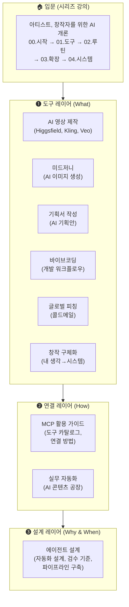

# AI MASTER CLASS ARCHIVE — 강의 세계관 설계도

## 교육 철학

> **"AI는 공부하는 게 아니다. AI는 도구다."**
> **"도구가 빠르게 바뀌는 시대에, 변하지 않는 것은 나 자신뿐이다. 그래서 나를 먼저 설계해야 한다."**

### AI의 네 가지 역할

| 역할 | 설명 |
|---|---|
| 🔧 **정리** | 복잡하고 귀찮은 것을 줄여준다 |
| 🔭 **확장** | 내 세계관을 넓혀준다 |
| 🖼️ **구체화** | 내 생각을 눈에 보이게 만든다 |
| ⚡ **실행** | "가능하다"를 아는 것이 곧 "할 수 있다"가 되었다 |

### 핵심 전환: 앎 ≈ 실행

```text
AI 이전:  "이런 게 가능해" → 내가 못 하면? → 포기 or 고용     (앎 ≠ 실행)
AI 이후:  "이런 게 가능해" → AI를 통해 실행 → 된다            (앎 ≈ 실행)
```

→ 그래서 **"어디까지 가능한지" 보여주는 것**이 곧 교육이다.

### 교육 3원칙

1. **설명하지 말고 보여줘라** — 데모가 인식을 바꾸고, 인식이 실행을 만든다
2. **기능이 아니라 가능성을 전달하라** — "이렇게 쓰세요"가 아니라 "이게 됩니다"
3. **항상 이 질문에 답하라** — "이것이 나의 시간과 에너지를 어떻게 바꿔줄 수 있는가?"

> 📄 상세 철학: [education_philosophy.md](file:///Users/haepa_mac/.gemini/antigravity/brain/951ff59c-4eac-4808-8ca0-cab981e9eca1/education_philosophy.md)

## 강의 구조 — 레이어 맵



---

## 각 강의의 역할과 경계

### 🏠 입문: 아티스트, 창작자를 위한 AI 개론 (시리즈)

| 회차 | 제목 | 이 강의에서만 다루는 것 |
|---|---|---|
| 00 | 시작 — 어디서부터 | AI 활용의 첫걸음, 마인드셋 |
| 01 | 도구 — 뭘 쓸 것인가 | 도구 종류 개괄, 선택 기준 |
| 02 | 루틴 — 어디에 넣을 것인가 | 일상 업무에 AI 끼워넣기 |
| 03 | 확장 — 사고를 시스템으로 | 단발성 → 반복 가능한 프로세스 |
| 04 | 시스템 — 에이전트와 파이프라인 | 자동화 개념 소개 (에이전트 설계의 프리뷰) |

> **경계**: 이 시리즈는 "AI를 처음 접하는 창작자"를 위한 **순차 커리큘럼**. 아래의 개별 강의들은 **독립 모듈**.

---

### ❸ 설계 레이어

#### 에이전트 설계 (`260715_agent_design`)

| 항목 | 내용 |
|---|---|
| **포커스** | 업무 자동화 **설계** 방법론 |
| **다루는 것** | 내 업무 분류(자동화 vs 수동), 검수 기준 설정, 파이프라인 설계, 워크플로우 |
| **다루지 않는 것** | 특정 도구(MCP, Canva 등)의 설치/설정법 |
| **이 강의의 핵심 질문** | "내 업무 중 뭘 AI에게 맡기고, 뭘 내가 검수할 것인가?" |

---

### ❷ 연결 레이어

#### MCP 실전 활용 가이드 (`260715_mcp_video`)

| 항목 | 내용 |
|---|---|
| **포커스** | MCP라는 **연결 기술** 자체 |
| **다루는 것** | MCP 개념, 서버 카탈로그(Canva·Notion·Slack·법률 등), 연결 방법 3가지 |
| **다루지 않는 것** | 워크플로우 설계 (→ 에이전트 설계), 영상 제작법 (→ AI 영상) |
| **이 강의의 핵심 질문** | "AI에게 어떤 도구를 연결할 수 있고, 어떻게 연결하나?" |

#### 실무 자동화 (`260212_automation`)

| 항목 | 내용 |
|---|---|
| **포커스** | AI 기반 콘텐츠 대량 생산 |
| **다루는 것** | 콘텐츠 자동화 실전, OSMU 변환, 반복 작업 효율화 |
| **다루지 않는 것** | MCP 연결법 (→ MCP 가이드), 자동화 설계 원칙 (→ 에이전트 설계) |

---

### ❶ 도구 레이어

| 강의 | 포커스 | 다루는 것 | 다루지 않는 것 |
|---|---|---|---|
| **AI 영상 제작** | Higgsfield·Kling·Veo | 도구 비교, 숏폼 파이프라인, 프롬프트 구조 | MCP 연결법, 자동화 설계 |
| **미드저니** | AI 이미지 생성 | 프롬프트 작성, 화풍 레퍼런스, 워크숍 | 영상 도구, 자동화 |
| **기획서 작성** | AI 기획안 | 기획서 구조, AI 활용 문서 작성 | 도구 연결, 자동화 |
| **바이브코딩** | 개발 워크플로우 | 코드 생성, AI 페어 프로그래밍 | 디자인 도구, 마케팅 |
| **글로벌 피칭** | 콜드메일 | 영문 피칭, 실리콘밸리 접근법 | 국내 마케팅, 도구 |
| **창작 구체화** | 아이디어 → 시스템 | 추상적 생각을 구체적 프로세스로 | 도구 설치법, 자동화 |

---

## 강의 간 연결 관계

```text
수강자 여정 예시:
─────────────────────────────────────

[입문자]
AI 개론 (00~04)  →  "AI가 뭔지 알겠다, 이제 뭘 하지?"
                         ↓
              ┌──────────┼──────────┐
              ↓          ↓          ↓
         미드저니    기획서작성    창작구체화     ← 관심 분야별 도구 선택
              └──────────┼──────────┘
                         ↓
                    MCP 가이드               ← 도구를 AI에 연결하는 법
                         ↓
                   에이전트 설계              ← 자동화 설계, 검수 기준
                         ↓
                    실무 자동화               ← 대량 생산 실전
```

---

## 분류 기준: 중복 방지 원칙

| 질문 | 답이 되는 강의 |
|---|---|
| "이 도구가 뭐고 어떻게 쓰나?" | **도구 레이어** (미드저니, 영상, 기획서 등) |
| "이 도구를 AI에 어떻게 연결하나?" | **MCP 가이드** |
| "뭘 자동화하고 뭘 검수할 건지 어떻게 정하나?" | **에이전트 설계** |
| "AI로 콘텐츠를 대량으로 찍어내는 실전은?" | **실무 자동화** |
| "AI를 처음 접하는데 어디서부터?" | **AI 개론 시리즈** |

> [!IMPORTANT]
> **하나의 강의에서 다른 레이어의 내용을 상세히 다루지 않습니다.**
> 필요하면 해당 강의로의 링크만 제공합니다.
> 예: MCP 가이드에서 "워크플로우 설계는 [에이전트 설계 가이드](link)를 참고하세요."

---

## 타겟별 추천 경로

| 타겟 | 추천 경로 |
|---|---|
| **아티스트/창작자 (입문)** | AI 개론 00→04 → 미드저니 → 창작 구체화 |
| **마케터** | AI 개론 00~02 → MCP 가이드 → 에이전트 설계 → 실무 자동화 |
| **영상 편집자** | AI 영상 제작 → MCP 가이드 (영상 MCP 연결) |
| **기획자/PM** | 기획서 작성 → 에이전트 설계 |
| **개발자** | 바이브코딩 → MCP 가이드 (Level 3) |
| **스타트업 대표** | AI 개론 00~01 → 글로벌 피칭 → 에이전트 설계 |

---

*이 설계도는 강의 콘텐츠를 추가/수정할 때 "이 내용이 어느 강의에 들어가야 하는가?"를 판단하는 기준 문서입니다.*
