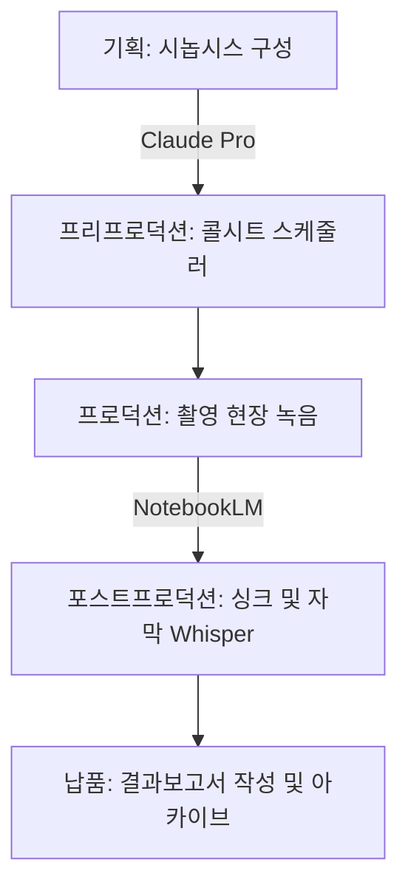
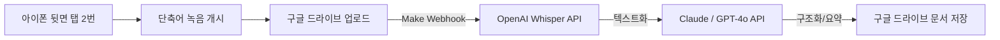

# 02. 루틴, 어디에 넣을 것인가


---

## 목차
1. [AI 협업의 기본 원칙](#1-ai-협업의-기본-원칙)
2. [루틴 분석 및 우선순위 설계](#2-루틴-분석-및-우선순위-설계)
3. [작업별 플랫폼 매칭 및 비용 효과](#3-작업별-플랫폼-매칭-및-비용-효과)
4. [아티스트 직군별 루틴 프로필](#4-아티스트-직군별-루틴-프로필)
5. [인스타 영감 아카이브 루틴화](#5-인스타-영감-아카이브-루틴화)
6. [아이폰 음성 단축어 및 Make 자동화 파이프라인](#6-아이폰-음성-단축어-및-make-자동화-파이프라인)
7. [프로젝트 파일 및 데이터 관리 자동화](#7-프로젝트-파일-및-데이터-관리-자동화)
8. [AI 최적화 마크다운(MD) 변환 및 검증 가이드라인](#8-ai-최적화-마크다운md-변환-및-검증-가이드라인)
9. [부록: 실행 체크리스트](#9-부록-실행-체크리스트)

---

## 1. AI 협업의 기본 원칙

AI를 도구로만 쓰는 단계에서 벗어나 유기적인 시스템으로 통합하기 위한 4대 대화 및 저장 원칙입니다.

### 1-1. 맥락 설계 프레임워크 (상·생·방·제·소)
AI에게 무작정 결과물을 요청하면 평균적이고 지루한 답변만 출력됩니다. 요청 전에 반드시 아래 5가지 맥락 요소를 정의하십시오.

```
[상황] 나는 지금 ~하고 있다 (구체적 현재 상태 및 리소스)
[생각] 이 작업에 대해 내가 가지고 있는 아이디어, 느낌, 질문
[방향] 도출해내고자 하는 결과물의 지향점 및 목적지
[제약] 반드시 배제해야 할 요소, 허용하지 않는 표현 및 조건
[소스] AI가 참조해야 할 실제 데이터, 문서, URL, 예시 자료
```

> [!TIP]
> 매번 5가지 요소를 완벽히 채울 필요는 없으나, **[상황]**과 **[방향]**은 필수값입니다.
> **[소스]**를 추가하면 AI가 내 실제 데이터를 기반으로 답하여 환각이 줄어들고 결과물의 정밀도가 높아집니다.
> 이 구조는 Google Gemini 공식 가이드의 **GCSE 프레임워크** (Goal·Context·Source·Expectations)와 동일한 원리입니다.

#### 분야별 프롬프트 적용 예시
* **창작 분야**
  ```text
  [상황] 단편 소설을 쓰려고 한다.
  [생각] 사람이 기계와 경쟁하는 올림픽이라는 이미지가 있다.
  [방향] 디스토피아가 아니라 인간 존재에 의문을 던지는 건조하고 차분한 톤.
  [제약] 결론을 내리지 마. 교훈을 주려 하지 마.
  [소스] (없음 — 창작 작업 시 소스 생략 가능)
  ```

* **비즈니스 분야**

  ```text
  [상황] 해양수산 분야 창업지원 프로그램 제안서를 써야 한다.
  [생각] 우리 회사의 가장 큰 강점은 실제 투자 유치 및 집행 실적이 존재한다는 것.
  [방향] 심사위원이 포트폴리오의 실현 가능성과 팀의 수행력을 확신할 수 있도록 구성.
  [제약] 과장된 수사어 금지. 수치 데이터는 내가 직접 제공한 것만 사용할 것.
  [소스] 첨부 문서: 2025년 투자 유치 실적 보고서, 팀 구성원 프로필 PDF
  ```

* **일상 관리 분야**
  ```text
  [상황] 어제 불만을 표출한 팀원과 오늘 면담을 진행해야 한다.
  [생각] 상대방의 감정적 억울함을 해소해주면서도 주간 마감 일정은 엄수하도록 지도하고 싶다.
  [방향] 감정은 수용하되 업무 규율은 명확히 확립하는 프로페셔널한 면담 스크립트.
  [제약] 모호한 위로의 말 금지. 반드시 면담 후 상호 합의할 액션 아이템이 도출되어야 함.
  [소스] 팀원이 보낸 불만 메시지 원문: "..."
  ```

---

### 1-2. AI 답변 피드백 및 제약 조건 제어

AI의 기본값은 대중적이고 긍정적이며 안전한 답변입니다. 이를 극복하고 날카롭고 실용적인 결과물을 얻으려면, 단순 감정적 거절이 아닌 **의도적인 피드백 루프(Feedback Loop)와 명확한 제약 조건(Constraints)**을 지정해야 합니다.

| # | 피드백 및 제약 조건 템플릿 | 활용 시점 및 목적 |
|---|----------|-----------------|
| 1 | `"이거 너무 뻔하다. 다시."` | 결과물이 누구나 할 수 있는 교과서적 답변일 때 |
| 2 | `"결론 내리지 마. 질문만 던져."` | AI가 임의로 훈계조의 아름다운 결말을 지으려 할 때 |
| 3 | `"칭찬하지 마. 문제점만 날카롭게 지적해."` | 제안서나 기획안의 실질적인 허점을 파악하고 싶을 때 |
| 4 | `"교과서적인 답 말고, 실제 필드에서 일어나는 리스크를 나열해."` | 이론적 해결책이 아닌 현실적인 장벽을 탐색할 때 |
| 5 | `"이 방향 아니야. 정반대의 극단적 관점에서 서술해봐."` | 확증 편향에 빠졌거나 완전히 새로운 각도가 필요할 때 |
| 6 | `"너무 길어. 수사구 걷어내고 핵심만 3줄 요약해."` | 장황한 답변을 요약하여 빠르게 스캔하고자 할 때 |
| 7 | `"이건 내가 이미 아는 거야. 뻔한 개념 말고 예외적 케이스를 알려줘."` | 기본 지식을 배제하고 고난도 인사이트를 요구할 때 |
| 8 | `"아름다운 그림 필요 없어. 불편한 진실만."` | 포장된 기획안이 아닌 날카로운 현장 피드백을 원할 때 |
| 9 | `"이 단어 쓰지 마: 혁신, 시너지, 패러다임, 미래지향적."` | 비즈니스 버즈워드를 배제하고 투명한 사실 위주로 기술할 때 |
| 10| `"네가 방금 한 주장의 가장 강력한 반대 논거를 3개 대봐."` | 기획안의 반박 논리를 미리 예측하고 방어 전략을 짤 때 |

> [!IMPORTANT]
> 피드백과 제약 조건 지정은 AI 모델에게 사용자의 **기준(Criteria)**을 정확하게 주입하는 과정입니다. 구체적인 조건이 추가될수록 답변의 밀도는 기하급수적으로 올라갑니다.

---

### 1-3. 채팅 휘발 방지를 위한 영구 저장 폴더 구조
대화 창을 닫는 순간 AI는 모든 맥락을 유실합니다. 이를 방지하기 위해 로컬 또는 클라우드에 아래와 같은 표준 디렉터리 템플릿을 생성하고 동기화하십시오.

```text
[프로젝트명]/
├── raw/          ← 회의 녹음 텍스트, 날것의 자막 데이터, 스크린샷, 메모
├── drafts/       ← AI와 공동 작업한 초안 및 파편적인 아티티팩트 (.md, .txt)
├── final/        ← 검증이 끝난 최종 제출본 및 실행 문서
└── rejected/     ← AI 결과물 중 피드백 과정에서 탈락했으나 나의 의도와 기준을 대변하는 반려 기록 보관소
```

#### 왜 `rejected/` 폴더를 운영해야 하는가?
피드백의 기록은 **'내가 원하지 않는 것의 명확한 경계선'**입니다. 다음 프로젝트 시작 시 이 폴더의 반려 문장을 모아 AI에게 "이러한 방향은 이전 프로젝트에서 제외되었으니 피하라"고 제약 조건으로 제공하면 시행착오를 절반 이하로 줄일 수 있습니다.

---

## 2. 루틴 분석 및 우선순위 설계

AI로 전환했을 때 가장 생산성 향상폭이 높은 작업을 찾기 위한 계량 분석법입니다.

### 2-1. 우선순위 산출 공식
$$\text{AI 전환 우선순위 점수} = \text{작업 빈도 점수} \times \text{소요 시간 점수} \times \text{업무 피로도 (1~5)}$$

* **작업 빈도 점수 (Frequency Score)**
  * 매일 수행: `5점`
  * 주 3~4회 수행: `4점`
  * 주 1~2회 수행: `3점`
  * 월 2~3회 수행: `2점`
  * 월 1회 이하: `1점`

* **소요 시간 점수 (Duration Score)**
  * 회당 2시간 이상: `5점`
  * 회당 1~2시간: `4점`
  * 회당 30분~1시간: `3점`
  * 회당 15~30분: `2점`
  * 회당 15분 이하: `1점`

* **업무 피로도 점수 (Irritation Score)**
  * 1점(지루하지 않음)부터 5점(극도로 귀찮고 수동적인 단순 노동)까지 주관적 평가 부여.

---

### 2-2. 나의 반복 작업 분석표 (워크시트)
아래 표를 로컬 메모에 복사하여 우선순위를 평가하고 작업을 전환하십시오.

| # | 작업명 | 빈도 점수 (1~5) | 시간 점수 (1~5) | 피로도 (1~5) | 총합 점수 | 우선순위 판정 |
|---|---|:---:|:---:|:---:|:---:|---|
| *예시* | *미팅 녹음 회의록 정리* | *4* | *3* | *5* | **`60`** | 🔴 즉시 전환 |
| *예시* | *프로젝트 견적서 작성* | *3* | *4* | *4* | **`48`** | 🔴 즉시 전환 |
| *예시* | *인스타그램 업로드용 캡션 작성* | *5* | *2* | *3* | **`30`** | 🟡 전환 추천 |
| 1 | | | | | | |
| 2 | | | | | | |
| 3 | | | | | | |

* **판정 기준 가이드라인**
  * **`40점 이상` (🔴 즉시 전환):** 가장 먼저 자동화 스크립트를 짜거나 AI 템플릿을 만들어 고정 루틴화해야 할 작업.
  * **`20~39점` (🟡 전환 추천):** 시간 여유가 있을 때 AI 챗봇의 Custom Instructions 또는 시스템 프롬프트로 고정시킬 작업.
  * **`20점 미만` (🟢 여유 있을 때):** 필요 시 수동으로 처리해도 무방한 작업.

---

## 3. 작업별 플랫폼 매칭 및 비용 효과

모든 작업을 한 모델로 처리하는 것은 비효율적입니다. 목적별 최적의 플랫폼 라인업과 유무료 플랜 포트폴리오를 제공합니다.

### 3-1. 도구별 추천 및 매칭표

| 작업 분류 | 권장 플랫폼 | 선정 배경 및 기술적 특징 |
|---|---|---|
| **기획서 / 견적서 구조화** | **Claude (Projects/Artifacts)** | 대량의 사전 콘텍스트 유지 능력 우수, 논리적 구조화 정밀도 최상 |
| **미팅 녹음 요약 및 마인드맵** | **NotebookLM** | 무료 소스 업로드, 출처가 명확히 링크된 요약본 및 마인드맵 자동 제공 |
| **SNS 홍보 문구 다량 생성** | **ChatGPT (GPT-4o)** | 톤 앤 매너 변경이 유연하고, 다채로운 스튜디오 톤 및 이모지 활용성 우수 |
| **리서치 및 최신 정보 팩트체크** | **Perplexity / Gemini Deep Research** | 실시간 웹 크롤링 및 인용 소스 표기, 다각도 심층 검색 보고서 생성 |
| **파일 이름 변경 / 자동 분류** | **Cursor / Antigravity** | 로컬 시스템 명령어 연동 및 Python 기반 자동화 스크립트 작성 및 실행 |
| **자막 싱크 및 텍스트 변환** | **Whisper (Local / API)** | 타임코드 매칭 정확도 최고, 민감한 개인 정보 보안을 위한 로컬 실행 지원 |
| **신속 시각 시안 제작** | **ChatGPT (DALL-E 3)** | 프롬프트 해석 능력이 우수하여 자연어 대화 도중 즉각 반영 가능 |
| **고품질 비주얼 제작** | **Midjourney / ComfyUI** | 디테일 렌더링 품질 최상, LoRA 및 ControlNet 활용한 정밀 제어 |

---

### 3-2. 유료 모델 구독 포트폴리오 분석
월 20달러의 비용 투입 대비 실질적인 시간 회수율을 분석한 결과입니다.

```

[구독 포트폴리오 제안]

- 메인 작가/기획자: Claude Pro ($20/월) + NotebookLM (무료) + Google Drive (무료/소액)
- 이미지/영상 집중형: Midjourney ($10~30/월) 추가
```

* **무료 플랜 위주 운용 시 리스크:**
  하루 질문 횟수 제한으로 인해 대화 중간 맥락이 끊겨 직접 수정하게 됨 → 건당 2~3시간 추가 소요 → 기회비용 기준 수십만 원의 손실 발생.
* **유료 플랜 가치 환산:**
  월 약 27,000원 지불로 인해 작업당 피드백 루프가 1회로 단축 → 매월 최소 20시간 이상의 순수 작업 시간 확보 (시급 25,000원 기준 500,000원 가치 창출).

---

## 4. 아티스트 직군별 루틴 프로필

세 가지 대표적인 크리에이터 직군의 하루 일과 중 AI 자동화 개입 지점을 타임라인 형식으로 상세 기술합니다.

### 4-1. 사진작가의 하루 루틴

```mermaid
gantt
    title 사진작가 AI 협업 일과
    dateFormat  HH:mm
    axisFormat %H:%M
    section 오전
    촬영 조건 리서치 & 장비 세팅 체크  :09:00, 09:30
    클라이언트 메일 요약 & 체크리스트 생성 :09:30, 10:00
    section 오후
    촬영 진행 (Manual Work) :13:00, 17:00
    RAW 파일 이름 일괄 변경 및 분류 :17:00, 17:15
    section 저녁
    SNS 설명 작성 및 해시태그 추출 :19:00, 19:30
```



| 시간대 | 수행 업무 | 개입 AI 도구 | 프로세스 상세 |
|---|---|---|---|
| **09:00 - 09:30** | 촬영 세팅 확인 | Gemini + 옵시디언 | 날씨 API 정보 입력 → 흐린 날 야외 인물용 동조기 및 필라이트 광량 조절 세팅을 옵시디언 기준 데이터베이스에서 즉각 검색 및 복원. |
| **09:30 - 10:00** | 요청서 분석 | Claude (Projects) | 클라이언트가 보낸 래퍼런스 메일 전문 업로드 → 렌즈 화각별 컷 수 요구사항 추출 및 현장 촬영 모바일 체크리스트 생성. |
| **17:00 - 17:15** | 파일 정리 | Cursor / Antigravity | SD 카드 장착 후 로컬 스크립트 실행 → EXIF 촬영 일시 기준으로 연/월/일 폴더 자동 생성 및 메타데이터 이름 자동 매칭. |
| **19:00 - 19:30** | SNS 마케팅 | ChatGPT | 보정된 인물 컷 분위기를 언어로 묘사하여 제공 → 채널 특성(브런치/인스타그램)에 맞는 텍스트 3종 피드 및 관련 해시태그 추출. |

---

### 4-2. 영상제작자의 워크플로우



* **[기획 단계] 시놉시스 구성:** 기획 아이디어 노트와 관련 기사를 Claude에 전달하여 공인 포맷의 시놉시스 및 신(Scene) 리스트 구조화 초안 작성 (기존 반나절 → **1시간**).
* **[프리프로덕션] 콜시트 자동 스케줄러:** 타임라인, 장소 5곳, 스태프 8명의 직무 역할을 입력하여 시간대별 이동 동선 및 긴급 연락망이 포함된 콜시트 PDF 포맷 자동 출력 (기존 2시간 → **15분**).
* **[프로덕션] 촬영 현장 녹음:** 대사 및 연출 수정사항을 모바일 음성 메모로 기록 후 즉시 NotebookLM에 통합하여 당일 수정 회의록 및 피드백 맵 작성 (기존 1시간 → **5분**).
* **[포스트프로덕션] 자막 자동 추출:** Whisper 로컬 엔진을 활용하여 촬영본 오디오에서 98% 정확도의 타임코드 싱크 자막 파일(.srt) 자동 추출 (기존 3시간 → **10분**).
* **[납품 단계] 결과보고서 작성:** 전체 기획서 히스토리와 최종 스크립트를 Claude에 업로드하여 양식에 맞춘 정산 보고 및 프로젝트 결과보고서 작성 (기존 3시간 → **30분**).

---

### 4-3. 공간기획자의 워크플로우
* **[리서치] 글로벌 레퍼런스 발굴:** `Gemini Deep Research`를 통해 최신 북유럽 몰입형 전시관 및 인터랙티브 미디어 아트 동향 보고서 추출 및 옵시디언 영감 라이브러리 저장 (기존 2일 → **2시간**).
* **[디자인 기획] 무드보드 생성:** 추출한 핵심 키워드를 기반으로 Midjourney를 구동하여 공간 톤 앤 매너(Tone & Manner) 가이드라인 이미지 10종 생성 및 제안서 삽입 (기존 1일 → **1시간**).
* **[현장 실무] 하드웨어 조건 검색:** 천장 높이, 전원 공급 용량, 빔 프로젝터 기종 사양을 옵시디언 로컬에 아카이빙해둔 후 현장에서 조건 입력 시 매칭 하드웨어 세팅 자동 검출 (기억 의존 → **즉시 확인**).
* **[제안 및 정산] 공간 제안서 작성:** 빌딩 도면 정보와 공간 레이아웃 기획안을 통합하여 Claude를 통해 클라이언트 보고용 기획 제안서 초안 렌더링 (기존 반나절 → **1시간**).

---

### 4-4. 댄서/안무가의 워크플로우

* **[리서치] 트렌드 및 레퍼런스 수집:** Grok으로 X(트위터) 내 최신 안무 챌린지·댄스 밈 트렌드를 실시간 수집하고, ChatGPT로 해외 안무 스타일 분류 및 무브먼트 키워드 추출 (기존 수시간 SNS 서핑 → **15분**).
* **[창작] 안무 구조 설계:** 음악 BPM과 구간(verse/chorus/bridge)을 입력하여 Claude로 포메이션 전환 타이밍표 및 동선 다이어그램 텍스트 초안 생성 (수기 노트 → **10분**).
* **[기록] 연습 영상 피드백:** 연습 영상 촬영 후 구두 피드백을 녹음 → NotebookLM에 업로드하여 수정 포인트 자동 정리 및 타임스탬프별 코멘트 생성 (기존 30분 → **5분**).
* **[프레젠테이션] 공연 기획서 작성:** 안무 컨셉 노트, 음악 정보, 의상·조명 참고 이미지를 Claude Projects에 통합하여 축제·공연 응모용 기획서 초안 작성 (기존 반나절 → **1시간**).
* **[운영] 수업/워크숍 커리큘럼:** 대상(초급/중급/상급), 시간, 장르를 입력하여 회차별 수업 구성안 + 음악 BPM 추천 리스트 자동 생성 (기존 2시간 → **20분**).

---

### 4-5. 아티스트 직군별 핵심 도구 조합 요약

| 직군 | 메인 프레임워크 | 서브 서포터 | 시너지 아티팩트 |
|---|---|---|---|
| **사진작가** | Claude Pro | ChatGPT (DALL-E 3) | EXIF 날짜 분류 스크립트 |
| **영상제작자** | Claude Pro | NotebookLM + Whisper | SRT 자막 파일 및 씬 리스트 |
| **공간기획자** | Gemini Deep Research | Midjourney + 옵시디언 | 조명/전력 세팅 사전 조건 검색기 |
| **댄서/안무가** | ChatGPT + Grok | NotebookLM + Claude | 포메이션 타이밍표 및 수업 커리큘럼 |


---

## 5. 인스타 영감 아카이브 루틴화

흘러가는 소셜 미디어 영감을 구조화된 자산으로 내재화하는 프로세스입니다.

```text
[인스타그램 스크롤 중 영감 발견] 
  → 스크린샷 캡처 
  → GPT-4o 모바일 업로드 
  → 시각 분석 및 키워드 태깅 
  → 옵시디언 영감 라이브러리 자동 정착
```

### 5-1. 영감노트 마크다운 템플릿
옵시디언 등 개인 지식 관리 도구에 아래 템플릿으로 파일을 생성하십시오.

```markdown
# 영감노트 — 2026-06-23

## 1. 출처 및 스크린샷
- 출처: Instagram @[계정명]
- 이미지 링크: ![[20260623_inspiration_001.png]]

## 2. AI 스타일 분석 결과
- **조명:** 로우 키(Low-key), 왼쪽 측면의 45도 강한 노란색 네온 사이드라이트.
- **색감:** 블루와 오렌지의 강한 대비, 암부의 미세한 그린 틴트 필터 처리.
- **구도:** 3분할 법칙 기준 오른쪽 하단 배치, 광각 렌즈 특유의 주변부 왜곡 발생.
- **키워드:** #네온조명 #스틸컷느낌 #사이버펑크 #광각구도 #시네마틱

## 3. 내 프로젝트와의 연결 링크
- [[프로젝트_사이버네틱스_포스터_기획]] - 메인 비주얼 조명으로 벤치마킹 고려.
- [[야간인물촬영_기초가이드]] - 네온 반사판 활용법 추가 업데이트 필요.
```

---

## 6. 아이폰 음성 단축어 및 Make 자동화 파이프라인

모바일 환경에서 생각난 아이디어나 미팅 음성을 최소한의 터치로 구조화된 클라우드 문서로 자동 변환하는 고성능 자동화 아키텍처입니다.



### 6-1. iOS 단축어(Shortcuts) 구성법
아이폰의 단축어 앱을 실행하고 다음과 같이 액션 블록을 빌드하십시오.

1. **[동작 1] 오디오 녹음:**
   * 입력: `오디오 녹음` 추가
   * 설정: 오디오 품질 `보통`(토큰 분석 시 용량 절약용), 녹음 시작 `즉시`, 녹음 중단 `수동으로 누를 때` 혹은 `시간 지정`.
2. **[동작 2] 파일 저장:**
   * 입력: `파일 저장` 추가
   * 경로: `Google Drive` 선택 후 특정 폴더(예: `/AI_Voice_Trans/`)로 지정.
   * *선택 옵션:* iCloud Drive에 임시 저장 후 Make Webhook으로 Direct POST 전송 설정도 가능.
3. **[동작 3] 알림 트리거:**
   * 입력: `알림 보기` 추가
   * 텍스트: "녹음 파일이 클라우드로 업로드되었습니다. 자동 분석이 시작됩니다."
4. **[뒷면 탭 연결]:**

   * 설정 → 손쉬운 사용 → 터치 → 뒷면 탭 → 이중 탭 → 위에서 제작한 '녹음 단축어'를 바인딩합니다.

---

### 6-2. Make(구 Integromat) 시나리오 설계서
Make.com에 로그인 후 다음과 같이 노드를 구성하십시오.

```text
[Google Drive: Watch Files] ──> [HTTP: OpenAI Whisper API] ──> [HTTP: Anthropic Claude API] ──> [Google Drive: Create a File]
```

* **Step 1: Google Drive (Watch Files in a Folder)**
  * **설정:** `Folder ID`에 아이폰 단축어가 업로드하는 `/AI_Voice_Trans/` 폴더를 입력합니다.
  * **수집 대상:** 새로 추가되는 파일 `.m4a` 또는 `.mp3`.
* **Step 2: HTTP (Make a Request) - OpenAI Whisper API 호출**
  * **URL:** `https://api.openai.com/v1/audio/transcriptions`
  * **Method:** `POST`
  * **Headers:**
    * `Authorization`: `Bearer [YOUR_OPENAI_API_KEY]`
  * **Body Type:** `Multipart/form-data`
  * **Fields:**
    * `file`: 구글 드라이브에서 가져온 파일 바이너리 데이터 매핑
    * `model`: `whisper-1`
    * `language`: `ko` (한국어 인식 성능 극대화)
* **Step 3: HTTP (Make a Request) - Anthropic Claude API 호출**
  * **URL:** `https://api.anthropic.com/v1/messages`
  * **Headers:**
    * `x-api-key`: `[YOUR_CLAUDE_API_KEY]`
    * `anthropic-version`: `2024-10-22`
    * `content-type`: `application/json`
  * **Body:**
    ```json
    {
      "model": "claude-sonnet-4-6-20260515",
      "max_tokens": 4000,
      "system": "너는 프로페셔널한 녹음 요약 비서다. 제공된 회의 녹음 텍스트를 분석하여 핵심 주제, 날짜/장소, 의사결정 사항, 담당자별 액션 아이템을 마크다운 표로 깔끔하게 정리해라. 전문적인 어조를 유지하고 불필요한 서사는 배제하라.",
      "messages": [
        {
          "role": "user",
          "content": "{{Step 2에서 반환된 text 데이터}}"
        }
      ]
    }
    ```
  > [!NOTE]
  > 위 JSON의 `"system"` 필드가 바로 **System Prompt**입니다. AI의 역할과 규칙을 고정하는 레이어로, 매번 달라지는 `"user"` 메시지(User Prompt)와 분리되어 동작합니다. [→ 03_확장 §1-0 원리 참조](03_확장.md#1-0-system-prompt-vs-user-prompt--원리-이해)

* **Step 4: Google Drive (Create a File)**
  * **폴더:** `/AI_Summaries/`
  * **파일명:** `{{Step 1의 파일명}}_요약본.md`
  * **내용:** Claude API의 Response `content[0].text` 데이터 바인딩.

> [!NOTE]
> 본 Make 시나리오 구성을 완료하면, 현장 인터뷰 및 브레인스토밍 종료 후 폰 뒷면을 탭하는 것만으로 **3분 이내에 구조화된 요약 문서(.md)**가 구글 드라이브에 자동으로 생성됩니다.

---

## 7. 프로젝트 파일 및 데이터 관리 자동화

수많은 미디어 리소스와 임시 파일들이 혼재하는 바탕화면을 정돈하기 위한 자동화 솔루션입니다.

### 7-1. 표준 파일 네이밍 규칙
공백이나 한글 특수문자는 AI 에이전트 및 코딩 툴이 로컬 경로를 파싱할 때 잦은 오류를 유발합니다. 규칙을 강제 적용하여 명명하십시오.

$$\text{파일명} = \text{YYYY-MM-DD} + \text{\_프로젝트명} + \text{\_리소스유형} + \text{\_일련번호} + \text{.확장자}$$

* **나쁜 예:** `IMG_4329 (1) 최종의최종 수정.jpg`
* **좋은 예:** `2026-06-23_PROJECT-A_model-a_001.jpg`

---

### 7-2. 프로젝트 생성 및 분류 자동화 스크립트 (Python)
Cursor 또는 Antigravity 에이전트에게 아래 지침을 복사하여 주입하면, 타깃 폴더 내에 완벽한 템플릿 디렉터리를 1초 만에 구성하고 파일을 정렬합니다.

```python
import os
import shutil
from datetime import datetime

def initialize_project(base_path, project_name):
    # 표준 디렉토리 구조 정의
    folders = [
        "01_기획/제안서", "01_기획/레퍼런스", "01_기획/회의록",
        "02_프리프로덕션/콜시트", "02_프리프로덕션/스케줄", "02_프리프로덕션/세팅",
        "03_촬영_원본/raw", "03_촬영_원본/selected",
        "04_편집/v1", "04_편집/v2", "04_편집/final",
        "05_납품/최종파일", "05_납품/결과보고서",
        "06_정산/견적서", "06_정산/세금계산서"
    ]
    
    project_root = os.path.join(base_path, f"{datetime.now().strftime('%Y-%m-%d')}_{project_name}")
    for folder in folders:
        path = os.path.join(project_root, folder)
        os.makedirs(path, exist_ok=True)
    print(f"[알림] 프로젝트 디렉터리 '{project_root}'가 생성되었습니다.")
    return project_root

# Cursor 구동용 프롬프트: "위 파이썬 스크립트를 로컬에서 실행할 수 있도록 터미널 명령어로 작성해줘."
```

---

### 7-3. 백업 3-2-1 원칙 및 플랫폼 비교
데이터를 영구 소실하지 않기 위한 분산 보관 전략입니다.

* **3:** **3개 이상의 복사본** 유지 (로컬 작업 드라이브, 외장하드 백업본, 클라우드 아카이브).
* **2:** **2개 이상의 다른 매체**에 저장 (로컬 SSD + 클라우드 스토리지).
* **1:** **1개 이상의 복사본은 외부 보관** (화재, 침수, 도난 리스크 방지를 위해 클라우드 스페이스 활용).

| 서비스명 | 무료 제공량 | 유료 최저 요금제 | 주요 특징 |
|---|---|---|---|
| **Google Drive** | 15 GB | 100 GB (₩2,400/월) | NotebookLM 소스 연동 성능 최상, 구글 생태계 유기적 결합 |
| **iCloud** | 5 GB | 50 GB (₩1,100/월) | Apple macOS 및 iOS 디바이스 백업 최적화 |
| **Dropbox** | 2 GB | 2 TB ($11.99/월) | 대용량 바이너리 미디어 파일의 델타 동기화 및 복구 속도 최상 |

---

## 8. AI 최적화 마크다운(MD) 변환 및 검증 가이드라인

AI가 문서를 인지하고 활용할 때 가장 뛰어난 생산성을 보여주는 포맷은 단연 마크다운(.md)입니다.

### 8-1. 문서 포맷별 토큰 효율성 및 비용 비교
동일한 내용의 텍스트(A4 10페이지 분량 기준)를 각 파일 포맷별로 AI 컨텍스트 창에 입력했을 때 소모되는 대략적인 토큰 수치 분석입니다.

| 파일 포맷 | 평균 소모 토큰 (입력당) | 토큰 효율 지수 | 비용 지수 | AI 해석의 정확도 및 한계점 |
|---|---|---|---|---|
| **HWP (아래아한글)** | `~4,500 Token` | 🔴 20% | 🔴 5.0x | 변환 라이브러리 가동 시 표 및 그리드 서식 깨짐 심각, 쓸데없는 스타일 메타데이터 정보가 토큰 대다수를 낭비함. |
| **PDF** | `~3,500 Token` | 🟡 40% | 🟡 3.5x | 다단 구성이나 도식 이미지 포함 시 레이아웃 인식이 어긋나 내용 혼선 유발, OCR이 필요하여 추가 API 비용 청구 가능. |
| **DOCX (MS워드)** | `~2,200 Token` | 🟢 70% | 🟢 2.2x | 양식은 안정적으로 읽히나 파서(Parser)의 종속성으로 인해 프롬프트 전처리 과정 필수. |
| **.md (마크다운)** | **`~800 Token`** | **🔵 100%** | **🔵 1.0x** | **텍스트 네이티브 포맷. 구조 정보를 마크업 부호만으로 인식하여 토큰 소모 극최소화. 내용 이해도 99% 달성.** |

> [!IMPORTANT]
> .md 포맷을 활용할 경우, HWP 포맷 대비 **토큰 비용을 80% 이상 절감**할 수 있으며 동일한 예산으로 약 5.6배 더 많은 양의 텍스트를 한 번에 검증하고 지시할 수 있습니다.

---

### 8-2. 공모전 제안서 검증을 위한 표준 가이드라인 MD 설계 프로세스
공모 심사 기준 및 사업계획서 체크 사항을 표준 가이드라인 MD 파일로 구축하여 AI에 검색용으로 제공하는 프레임워크입니다.

#### 표준 가이드라인 마크다운 템플릿 (`제안서-검증-기준.md`)
```markdown
# [가이드라인] 해양창업 지원사업 제안서 검증 기준

## 1. 행정적 필수 요건 (Pass/Fail)
- **사업 기간:** 2026.09.01 ~ 2027.08.31 (12개월)
- **예산 상한:** 총액 50,000,000원 이내 구성
- **필수 제출 서류:** 사업계획서(서식 1), 예산산출내역서(서식 2), 대표자 이력서

## 2. 배점 기준표 및 상세 검증 포인트
| 평가 항목 | 배점 | 핵심 평가 초점 | 필수 키워드 및 증빙 내용 |
|---|---|---|---|
| **사업 타당성** | 30 | 지역 어촌계 연계 및 시장성 | 로컬 파트너십 구축 증빙, 시장 데이터 인용 |
| **수행 역량** | 40 | 팀원 전문성 및 기존 실적 | 과거 유사 사업 2건 이상의 포트폴리오 기재 |
| **예산 적정성** | 30 | 산출 근거의 현실성 | 공인 노임 단가 적용, 일반 관리비 10% 미만 제한 |

## 3. 금지 및 감점 사항
- [WARNING] "독보적인", "세계 최고의", "혁신적인 패러다임" 등 정량적 근거 없는 형용사 표현 사용 시 감점.
- [CAUTION] 예산 내 인건비 비중이 총액의 50%를 초과하는 경우 서면 검토 즉시 탈락 처리.
```

#### 프롬프트 결합 및 검증 워크플로우
제안서 작성을 완료한 후, Claude 창에 `제안서-검증-기준.md` 파일과 `제안서_초안.md` 파일 두 개를 함께 업로드하고 아래 프롬프트를 실행하십시오.

```text
역할: 전문 공모 사업 심사위원

제시된 [제안서-검증-기준.md]의 검증 포인트와 제약 사항을 준수하여, 첨부된 [제안서_초안.md]에 대해 다음 양식으로 피드백을 출력하시오.

1. 필수 요건 통과 여부 (Pass/Fail)
2. 배점 항목별 예상 점수 및 감점 리스크 항목 (감점 사유 구체적 적시)
3. 금지 단어 사용 여부 및 구체적인 대체어 제안
```

---

### 8-3. 사진작가용 실제 촬영 기준 가이드라인 MD 예시
스튜디오 내부 자산으로 축적해가는 '살아있는 기준 문서'의 예시입니다.

```markdown
# [스튜디오 규격] 촬영 및 보정 가이드라인

## 1. 마스터 파일 납품 사양
- **기본 포맷:** RAW(.ARW) 촬영 후 보정본 JPEG 변환 납품
- **해상도:** 4200px (장축 기준) 이상 유지
- **컬러 스페이스:** 웹 업로드용 sRGB / 인쇄용 Adobe RGB 개별 아웃풋
- **네이밍 시퀀스:** `YYYYMMDD_[PROJECT-NAME]_Selected_[NUM].jpg`

## 2. 현장 기본 하드웨어 프리셋 정보
| 촬영 환경 | 조리개(f) 값 | 셔터 스피드 | 감도(ISO) | 권장 조명/반사판 셋팅 |
|---|---|---|---|---|
| **야외 맑은 날 정오** | f/4.0 - f/8.0 | 1/500s 이상 | ISO 100 | 은색 반사판 (역광 방지용 피사체 45도 측면 배치) |
| **야외 흐린 날** | f/2.8 - f/4.0 | 1/200s | ISO 200 - 400 | 동조 스트로브 1점 (디퓨저 장착 필수, 광량 1/16 발광) |
| **스튜디오 프로필** | f/8.0 | 1/160s | ISO 100 | 3점 조명 세팅 (Key, Fill, Rim Light 개별 동조 확인) |

## 3. 리터칭(보정) 핵심 제한조건
- [IMPORTANT] 피부 텍스처(요철 및 모공)를 뭉개는 블러 필터 과다 적용 금지. Frequency Separation 기법 기반 디테일 복구 적용 필수.
- [WARNING] 화이트밸런스 오차 ±100K 이내 준수. 그레이카드 측정 필수.
```

---

## 9. 부록: 실행 체크리스트

AI 루틴을 즉시 실천하기 위한 실천 목록입니다.

### 9-1. 매일의 루틴 프로토콜
* [ ] **[오전 09:00]** 오늘 수행할 메인 작업의 '상·생·방·제·**소**' 맥락 노트를 작성하여 AI 메인 챗봇에 입력했는가?
* [ ] **[작업 중]** 미팅 및 현장 회의 시 단축어/음성메모 녹음을 켰는가?
* [ ] **[작업 후]** SD카드 및 신규 리소스를 표준 파일 네임 템플릿(날짜_프로젝트_유형)으로 자동 분류하여 클라우드에 백업했는가?
* [ ] **[저녁 19:00]** 오늘 캡처한 영감 이미지를 AI 분석을 거쳐 키워드 태그와 함께 옵시디언 로컬에 정착시켰는가?

### 9-2. 주간/월간 검토
* [ ] **[주 1회 - 금요일]** 한 주 동안 쌓인 `rejected/` 폴더 내 반려 데이터를 열람하여 나의 기획 필터링 경향성을 업데이트했는가?
* [ ] **[월 1회 - 말일]** 3-2-1 백업 원칙에 따라 외장하드와 Google Drive가 정상 동기화되어 에러 없이 백업되었는지 물리적으로 체크했는가?
