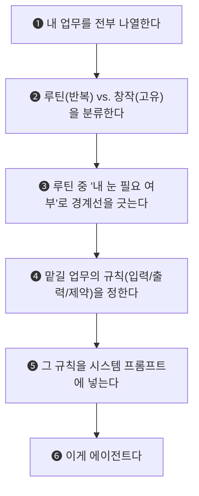

# 에이전트는 공부하는 게 아닙니다

> **"에이전트 어떻게 공부해요?"**
> 
> 이 질문을 정말 많이 받습니다.
> 그런데 저는 에이전트를 '공부'해야 하는 대상이라고 생각하지 않습니다.

---

## 1. 관점 전환: 에이전트 = 내 업무의 자동화 설계

에이전트라는 단어가 어렵게 느껴지는 이유는, 사람들이 이걸 **기술**로 접근하기 때문입니다.

| 흔한 오해 | 실제 본질 |
|---|---|
| "에이전트 프레임워크를 배워야 하나요?" | 프레임워크보다 **내 업무의 반복 지점**을 아는 게 먼저 |
| "코딩을 배워야 하나요?" | 코딩이 아니라 **검수할 것 vs. 맡길 것의 경계선**을 긋는 것 |
| "어떤 툴이 좋아요?" | 툴은 나중. **뭘 자동화할지**가 먼저 |
| "논문을 읽어야 하나요?" | 논문이 아니라 **내 루틴을 관찰**하는 것 |

### 에이전트의 정의를 바꿔보겠습니다

```
❌ 에이전트 = AI가 자율적으로 판단하는 고급 시스템
✅ 에이전트 = 내 손이 안 가도 되는 일의 목록 + 그 일을 처리하는 규칙
```

**에이전트는 기술 스펙이 아닙니다. 업무 설계입니다.**

내가 매일 하는 일 중에서:

- **매번 같은 패턴**으로 반복하는 것이 있고
- 그 중에서 **내 눈이 꼭 필요 없는 것**이 있습니다

이걸 찾아내서, 규칙을 정해서, 맡기는 것. 그게 에이전트입니다.

---

## 2. 업무 분해 3단계 프레임워크

에이전트를 설계하기 위해 필요한 건 **딱 3가지 질문**입니다.

### Step 1. 나열 — "나는 매주 반복적으로 뭘 하는가?"

종이에 적든, 메모장에 쓰든, 일주일 동안 내가 한 업무를 **전부** 나열합니다.

!!! tip "팁: 작은 것까지 적으세요"
    "이메일 확인"이나 "파일 이름 바꾸기" 같은 사소한 것도 반드시 포함합니다.
    오히려 이런 **사소한 반복**이 자동화했을 때 가장 체감이 큰 영역입니다.

```text
예시 — 어느 사진작가의 주간 업무 나열:
─────────────────────────────────────
□ 클라이언트 견적 문의 응대
□ 촬영 전 장비 체크리스트 확인
□ 촬영 후 RAW 파일 날짜별 폴더 정리
□ 보정 완료 사진 SNS 캡션 작성
□ 인보이스(세금계산서) 발행
□ 회의록 / 피드백 정리
□ 포트폴리오 웹사이트 업데이트
□ 레퍼런스 이미지 수집 및 무드보드 구성
```

---

### Step 2. 분류 — "매번 같은 패턴인가, 매번 다른가?"

나열한 업무를 두 종류로 나눕니다.

| 분류 | 정의 | 기준 |
|---|---|---|
| **🔁 루틴 (패턴 반복)** | 할 때마다 거의 같은 절차를 밟는 것 | "지난번에도 이렇게 했지" |
| **🎨 창작 (매번 고유)** | 할 때마다 새로운 판단이 필요한 것 | "이번엔 다르게 접근해야 해" |

```text
예시 — 위 업무의 분류 결과:
─────────────────────────────────────
🔁 루틴: RAW 파일 정리, 인보이스 발행, 장비 체크리스트,
         회의록 정리, SNS 캡션 작성
🎨 창작: 레퍼런스 무드보드 구성, 포트폴리오 큐레이션,
         촬영 현장 디렉팅
```

!!! warning "주의: 100% 창작인 업무는 거의 없습니다"
    "SNS 캡션 작성"은 창작 같지만, **채널별 톤앤매너, 해시태그 포맷, 글자 수 제한** 등은 매번 같은 규칙입니다.
    이 **규칙 부분만 자동화**하고, 최종 톤 조정만 내가 하면 됩니다.

---

### Step 3. 경계선 — "내 눈이 꼭 필요한가, 맡겨도 되는가?"

**이 단계가 가장 중요합니다.** 루틴 업무 중에서도 두 가지로 나뉩니다.

| 구분 | 의미 | 에이전트 전환 |
|---|---|---|
| **✅ 완전 위임** | 내가 안 봐도 됨. 규칙만 정해주면 끝 | → **자동 실행** |
| **👁️ 위임 + 검수** | AI가 초안을 만들고, 내가 최종 확인 | → **초안 생성 → 내 승인** |

```text
예시 — 경계선 판정 결과:
─────────────────────────────────────
✅ 완전 위임:
   - RAW 파일 날짜별 정리 (EXIF 기준 자동 분류)
   - 인보이스 발행 (견적서 양식 고정)
   - 장비 체크리스트 (과거 세팅 데이터 자동 검색)

👁️ 위임 + 검수:
   - 회의록 정리 (AI 요약 → 내가 누락 여부 확인)
   - SNS 캡션 작성 (AI 초안 3종 → 내가 톤 선택)
```

**이 "완전 위임" 영역이 바로 에이전트입니다.**
**"위임 + 검수" 영역은 에이전트 + 내 승인 루프입니다.**

---

## 3. 직군별 실전 예시: "내 일에선 이런 거야"

프레임워크는 하나지만, 직군마다 자동화 지점은 다릅니다.

아래 표를 보고 **"아, 내 일에도 이런 게 있네"** 하고 연결되는 지점을 찾아보세요.

### ✅ 완전 위임 가능 영역 (내 손 불필요)

| 직군 | 반복 업무 | 자동화 방법 |
|---|---|---|
| **사진작가** | 촬영 후 파일 날짜별 정리 | EXIF 기반 자동 분류 스크립트 |
| **영상PD** | 촬영본 자막 추출 | Whisper 로컬 자동 변환 |
| **기획자** | 회의 녹음 → 텍스트 변환 | NotebookLM 자동 업로드 |
| **마케터** | RSS 트렌드 기사 수집 | Gemini API + 스프레드시트 자동 수집 |
| **공간디자이너** | 과거 시공 사례 검색 | 옵시디언 위키 자동 쿼리 |
| **댄서/안무가** | 공연 영상 타임코드 정리 | Whisper 타임스탬프 + 자동 분류 |
| **작가/에디터** | 원고 맞춤법·띄어쓰기 교정 | 교정 에이전트 자동 실행 |
| **프리랜서 전반** | 인보이스·세금계산서 발행 | 양식 고정 자동 생성 |

### 👁️ 위임 + 검수 영역 (AI 초안 → 내 승인)

| 직군 | 반복 업무 | AI가 하는 것 | 내가 하는 것 |
|---|---|---|---|
| **사진작가** | SNS 캡션 작성 | 채널별 캡션 3종 초안 | 톤 선택 + 해시태그 확인 |
| **영상PD** | 시놉시스 구성 | 기획안 기반 구조화 초안 | 연출 의도 반영 여부 확인 |
| **기획자** | 회의록 요약 | 핵심 안건 + 액션아이템 추출 | 누락 여부 + 우선순위 조정 |
| **마케터** | 콜드메일 작성 | 타겟 분석 기반 개인화 초안 | 비즈니스 맥락 + 톤 최종 확인 |
| **공간디자이너** | 공간 제안서 작성 | 도면 데이터 기반 초안 렌더링 | 클라이언트 취향 반영 확인 |
| **작가/에디터** | 블로그 SEO 글 작성 | 키워드 기반 본문 초안 | 전문성·경험 기반 사실 확인 |

---

## 4. 에이전트 설계 워크시트

이제 직접 해볼 차례입니다.

아래 표를 복사하여 로컬 메모(노션, 엑셀, 종이 등)에 붙여넣고 채워보세요.

💡 **[자동 계산 엑셀(XLSX) 템플릿 다운로드](./files/agent_worksheet.xlsx)** &nbsp;&nbsp;|&nbsp;&nbsp; **[구글 스프레드시트 템플릿 복사하기](https://docs.google.com/spreadsheets/d/1yGaoK4TP2XLdBFqEuxfMdMtWNR32qGSvVnQzhDqvukw/copy?usp=sharing)**

### 4-1. 업무 분해표

| # | 내 반복 업무 | 유형 | 내 눈 필요? | 자동화 방법 (구체적 도구) | 에이전트 설계 |
|---|---|:---:|:---:|---|---|
| *예시* | *촬영 후 RAW 파일 정리* | *🔁 루틴* | *❌ 불필요* | *Python 스크립트 (EXIF 기반)* | *✅ 완전 위임* |
| *예시* | *SNS 캡션 작성* | *🔁 루틴* | *👁️ 검수만* | *ChatGPT 캡션 3종 생성* | *👁️ 위임+검수* |
| *예시* | *포트폴리오 사진 큐레이션* | *🎨 창작* | *✅ 필수* | *— (자동화 대상 아님)* | *🚫 수동 유지* |
| 1 | | | | | |
| 2 | | | | | |
| 3 | | | | | |
| 4 | | | | | |
| 5 | | | | | |

### 4-2. 판정 가이드라인

| 유형 + 내 눈 필요 여부 | → 판정 | 설명 |
|---|---|---|
| 🔁 루틴 + ❌ 내 눈 불필요 | **✅ 완전 위임 (에이전트)** | 규칙만 정해주면 AI가 알아서 실행. 가장 먼저 자동화할 영역 |
| 🔁 루틴 + 👁️ 검수만 필요 | **👁️ 위임 + 검수** | AI가 초안을 만들고, 내가 최종 확인만. 두 번째로 자동화할 영역 |
| 🎨 창작 + ✅ 내 눈 필수 | **🚫 수동 유지** | 자동화 대상이 아님. 이게 바로 **나의 핵심 가치**. 여기에 시간을 집중 |

### 4-3. 에이전트에게 줄 규칙 설계 (시스템 프롬프트)

"완전 위임" 또는 "위임 + 검수"로 판정된 업무 하나를 골라서, 아래 템플릿에 맞춰 규칙을 작성해보세요.

이 규칙이 곧 에이전트의 **시스템 프롬프트**이자 **CLAUDE.md / Custom Instructions**가 됩니다.

```text
[에이전트 규칙 설계 템플릿]
────────────────────────────────────────

1. 에이전트 이름: _______________
   (예: 파일정리봇, 캡션작성기, 회의록요약기)

2. 맡길 업무 한 줄 정의:
   "_______________ 을/를 자동으로 수행한다."

3. 입력 (Input): 이 에이전트에게 뭘 넣어줄 것인가?
   - 예: 촬영 완료된 SD카드의 RAW 파일들
   - 예: 회의 녹음 파일 (.m4a)

4. 출력 (Output): 이 에이전트가 뭘 내놓아야 하는가?
   - 예: 날짜별 폴더에 정리된 파일 + 파일명 변환 완료
   - 예: 핵심 안건 3줄 요약 + 액션아이템 리스트

5. 규칙 (Rules): 반드시 지켜야 할 것
   - 예: 원본 파일은 절대 삭제하지 않는다
   - 예: 요약은 500자를 넘기지 않는다
   - 예: 불확실한 내용은 [확인 필요]로 표기한다

6. 금지 사항 (Constraints): 절대 하면 안 되는 것
   - 예: 추측으로 내용을 채우지 않는다
   - 예: 클라이언트 이름을 임의로 변경하지 않는다

7. 내 검수 포인트 (승인이 필요한 경우만):
   - 예: 최종 캡션의 톤이 브랜드 가이드에 맞는지 확인
   - 예: 금액 관련 항목은 반드시 내가 재확인
```

---

## 5. 요약: 에이전트를 만드는 진짜 순서



!!! note "기억하세요"
    에이전트의 출발점은 **프레임워크도, 코딩도, 논문도 아닙니다.**
    
    출발점은 **"나는 매일 뭘 반복하고 있는가?"**라는 질문입니다.
    
    그 질문에 답하는 순간, 에이전트 설계는 이미 시작된 겁니다.

---

*본 가이드는 직군에 관계없이 누구나 적용할 수 있는 범용 에이전트 설계 프레임워크입니다.*
