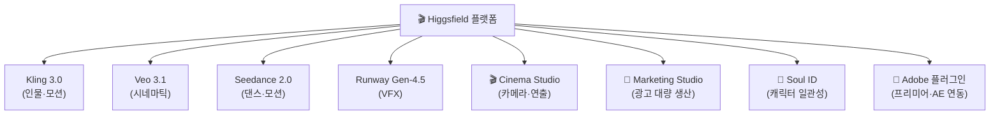
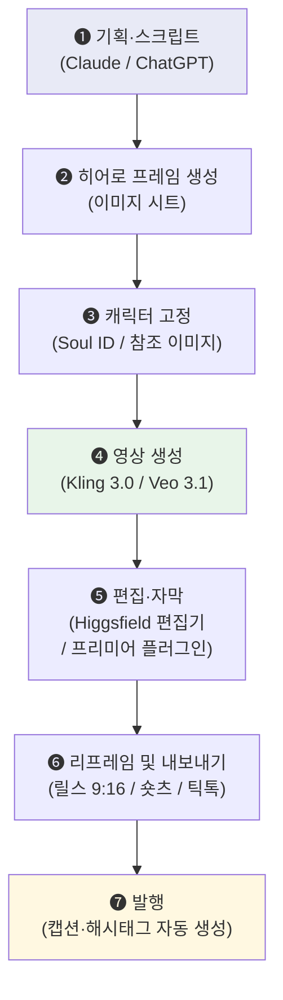

# AI 영상 자동 제작 가이드

> **"프롬프트 하나로 영상을 만드는 시대."**
>
> Higgsfield, Kling, Veo — 어떤 도구를, 언제, 왜 쓸 것인가.

---

## 1. AI 영상 도구 현황 (2026년 7월 기준)

### 1-1. 주요 도구 비교

| 도구 | 상태 | 강점 | 추천 용도 |
|---|---|---|---|
| **Higgsfield** | ✅ 통합 플랫폼 | 여러 모델 통합, Adobe 플러그인, 마케팅 스튜디오 | 대량 생산, 통합 워크플로우 |
| **Kling 3.0** | ✅ 인기 상승 | 실사 인물 모션, 감정 표현, 립싱크 | 인물 중심 숏폼, 광고 |
| **Google Veo 3.1** | ✅ 최상위 품질 | 영화적 품질, 네이티브 오디오, 물리 시뮬 | 시네마틱 콘텐츠, 브랜드 영상 |
| **Runway Gen-4.5** | ✅ 업계 표준 | VFX, 편집 스튜디오, 영상→영상 변환 | 전문 편집, 후반 작업 |
| ~~OpenAI Sora~~ | ❌ **서비스 종료** | — | 2026.04 서비스 종료 |

!!! warning "Sora 서비스 종료"
    OpenAI Sora는 **2026년 4월 26일** 공식 서비스 종료되었습니다.
    기존 Sora 사용자는 Kling 또는 Veo로 마이그레이션을 권장합니다.

### 1-2. Higgsfield — 왜 '통합 플랫폼'인가

Higgsfield는 단순한 영상 생성 도구가 아니라, **여러 AI 모델을 하나의 인터페이스에서 선택하여 사용하는 "영상 제작 OS"**입니다.



#### 핵심 기능 요약

| 기능 | 설명 |
|---|---|
| **Cinema Studio 3.5** | 카메라 화각(돌리, 크레인), 초점, 조명을 직접 지정하여 영상 연출 |
| **Marketing Studio** | 하나의 소스를 플랫폼별(릴스/숏츠/틱톡) 비율로 자동 리프레임 |
| **Soul ID** | 동일 인물(캐릭터)을 여러 영상에서 일관되게 유지 |
| **Adobe 플러그인** | 프리미어 프로 타임라인 안에서 바로 AI 편집 (배경 제거, 업스케일, 인페인팅) |
| **Draw to Edit** | 영상 위에 영역 그려서 오브젝트 삭제/교체/의상 변경 |

### 1-3. 모델 선택 가이드

| 상황 | 추천 모델 | 이유 |
|---|---|---|
| 인물이 말하는 광고 | **Kling 3.0** | 립싱크·표정이 가장 자연스러움 |
| 브랜드 시네마틱 영상 | **Veo 3.1** | 영화급 화질 + 배경음 자동 생성 |
| 아이디어 빠른 시각화 | **Veo 3.1** | 생성 속도 빠르고 직관적 |
| 기존 영상 후보정 (VFX) | **Runway Gen-4.5** | 날씨·조명·오브젝트 교체 특화 |
| 대량 광고 제작 | **Higgsfield Marketing Studio** | 하나의 소스 → 다수 포맷 자동 변환 |
| 캐릭터 일관성 유지 | **Higgsfield Soul ID** | 동일 인물 다수 영상 생산 |

---

## 2. 숏폼 자동 제작 파이프라인

### 2-1. 전체 워크플로우



### 2-2. 각 단계별 상세

#### Step ❶ 기획·스크립트 (LLM 활용)

```text
프롬프트 예시:
─────────────────────────────────────
"30초 숏폼 영상 스크립트를 작성해줘.

주제: [제품/서비스명]의 핵심 기능 소개
타겟: 20~30대 마케터
톤앤매너: 전문적이지만 친근한
구조:
- Hook (0~3초): 시청자를 멈추게 하는 질문 또는 충격적 사실
- 본문 (3~25초): 핵심 기능 3가지, 각 5초씩
- CTA (25~30초): 행동 유도

각 장면(Shot)마다 화면 설명을 포함해줘."
─────────────────────────────────────
```

!!! tip "실전 팁"
    **Hook(첫 3초)과 CTA(마지막 5초)는 반드시 사람이 직접 다듬으세요.**
    AI가 만든 본문은 효율적이지만, 첫인상과 행동 유도는 브랜드 톤을 아는 사람이 해야 합니다.

#### Step ❷~❸ 히어로 프레임 + 캐릭터 고정

```text
Higgsfield "Hero Frame First" 철학:
─────────────────────────────────────
1. 먼저 완벽한 정지 이미지(키 프레임)를 만든다
2. 캐릭터 참조(Soul ID)로 인물 외모를 고정한다
3. 그 다음에 모션을 입힌다 (이미지 → 영상 변환)

→ 이 순서를 지켜야 캐릭터 일관성이 유지됩니다.
```

#### Step ❹ 영상 생성 — 프롬프트 구조

```text
AI 영상 프롬프트 구조 공식:
─────────────────────────────────────
[주체] + [동작] + [환경] + [카메라] + [조명]

예시:
"A young Korean woman in a white blazer
 picks up a tablet and smiles at the camera,
 in a modern co-working space with floor-to-ceiling windows,
 medium close-up shot with a slow dolly-in,
 soft natural light from the left with warm golden hour tones."
```

#### Step ❺~❻ 편집 + 리프레임

| 기능 | 도구 | 설명 |
|---|---|---|
| 자동 자막 | Whisper / Descript | 음성 → 텍스트 자동 변환 + 타이밍 동기화 |
| 무음 구간 삭제 | Descript | 텍스트 기반 편집으로 무음/어... 자동 제거 |
| 리프레임 | Higgsfield | 16:9 → 9:16 자동 변환 (피사체 추적) |
| 배경 제거 | Higgsfield Adobe Plugin | 그린스크린 없이 인물 분리 |
| 업스케일 | Higgsfield | 720p → 4K/8K 자동 복원 |

---

## 3. 실습: 내 영상 제작 파이프라인 설계

| # | 영상 유형 | 현재 제작 시간 | AI로 대체할 단계 | 사용할 도구 | 내가 반드시 할 단계 |
|---|---|---|---|---|---|
| *예시* | *제품 소개 숏폼 (30초)* | *4시간* | *스크립트 초안 + 영상 생성 + 자막* | *Claude + Kling 3.0 + Whisper* | *톤 조정 + 최종 컬러* |
| 1 | | | | | |
| 2 | | | | | |
| 3 | | | | | |

---

## 4. 참고 자료

### 도구 바로가기

| 도구 | 링크 | 비고 |
|---|---|---|
| Higgsfield | [higgsfield.ai](https://higgsfield.ai) | 무료 체험 가능, Adobe 플러그인 |
| Kling | [klingai.com](https://klingai.com) | 일일 무료 크레딧 제공 |
| Google Veo | [ai.google](https://ai.google) | AI Ultra 요금제 포함 |
| Runway | [runway.com](https://runway.com) | Gen-4.5 에디터 |

### 추천 YouTube 영상

| 주제 | 검색 키워드 / 채널 |
|---|---|
| Higgsfield 전체 워크플로우 | [Higgsfield AI 공식 채널](https://www.youtube.com/@HiggsfieldAI) |
| Cinema Studio 튜토리얼 | "Higgsfield Cinema Studio Full Tutorial 2026" |
| Adobe 플러그인 | "Higgsfield Premiere Pro Plugin Tutorial" |
| Kling 3.0 실전 가이드 | "Kling 3.0 Tutorial Complete Guide" |
| Veo 3.1 vs Kling 3.0 비교 | "Veo 3.1 vs Kling 3.0 Comparison 2026" |
| AI 숏폼 제작 (한국어) | "AI 숏폼 자동 제작 워크플로우" |
| Descript 영상 편집 | "Descript Tutorial 2026" |

---

*본 가이드는 2026년 7월 기준으로 작성되었습니다. AI 영상 도구의 기능과 요금은 빠르게 변화합니다.*
