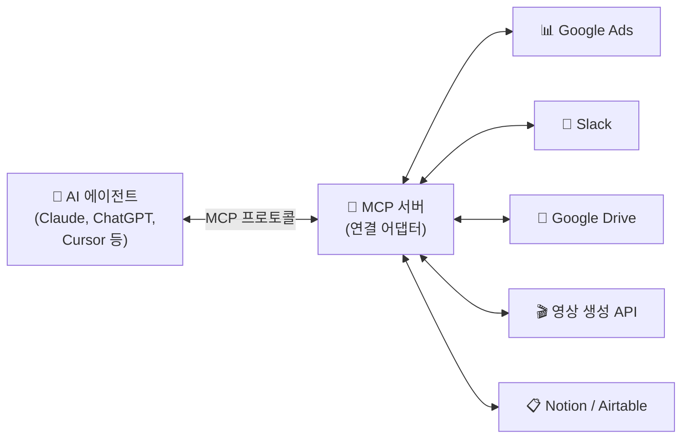
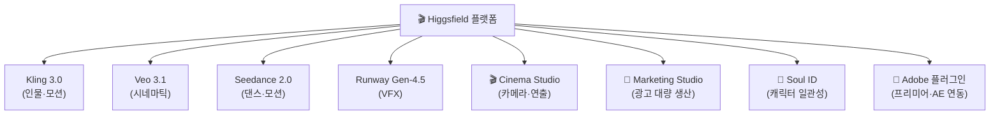
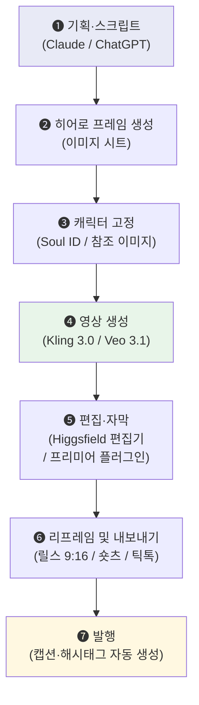

# MCP × AI 영상: 마케터와 영상 편집자를 위한 자동화 파이프라인

> **"AI 영상 도구를 하나씩 따로 쓰는 시대는 끝났습니다."**
> 
> 2026년, AI 에이전트가 마케팅 데이터와 영상 편집 도구를 **직접 연결**하여
> 기획부터 제작, 발행까지 한 번에 처리하는 시대가 왔습니다.

---

## 0. 이 강의에서 다루는 것

| 파트 | 내용 | 대상 |
|---|---|---|
| **Part 1** | MCP란 무엇인가 (AI의 USB-C 포트) | 전체 |
| **Part 2** | 마케터를 위한 MCP 자동화 워크플로우 | 마케터 |
| **Part 3** | AI 영상 도구 현황 (2026.07 기준) | 영상 편집자 |
| **Part 4** | 숏폼 자동 제작 파이프라인 | 전체 |
| **Part 5** | 실습: 내 워크플로우 설계하기 | 전체 |

---

## 1. MCP란 무엇인가: AI의 USB-C 포트

### 1-1. 기존 방식의 한계

```text
기존 방식 (2024~2025):
─────────────────────────
사람이 도구 A에서 데이터 복사 → AI에게 붙여넣기 → AI 답변 복사 → 도구 B에 붙여넣기
                        ↑
                  이게 전부 "사람 손"으로
```

### 1-2. MCP가 바꾸는 것

```text
MCP 방식 (2026~):
─────────────────────────
AI가 직접 도구 A에서 데이터 읽기 → AI가 판단 → AI가 직접 도구 B에 결과 쓰기
                        ↑
                  사람은 "지시"와 "검수"만
```

!!! tip "한 줄 정의"
    **MCP(Model Context Protocol)** = AI 에이전트가 외부 도구(앱, 데이터베이스, API)를 직접 조작할 수 있게 해주는 **연결 규격**.
    쉽게 말해 **"AI를 위한 USB-C 포트"**입니다.

### 1-3. MCP의 구조



| 구성 요소 | 역할 | 비유 |
|---|---|---|
| AI 에이전트 | 명령을 내리고 결과를 판단 | 감독(Director) |
| MCP 서버 | 특정 도구와의 통신을 중계 | USB-C 어댑터 |
| 외부 도구 | 실제 데이터가 있는 곳 | 장비(카메라, 조명 등) |

!!! note "코딩이 필요한가?"
    **필요 없습니다.** 이미 수천 개의 MCP 서버(어댑터)가 만들어져 있습니다.
    Claude Desktop이나 Cursor에 설정 파일 한 줄 추가하면 끝입니다.

---

## 2. 마케터를 위한 MCP 자동화 워크플로우

### 2-1. 대표 워크플로우 3가지

#### 워크플로우 ①: 캠페인 성과 자동 분석

```text
[매일 아침 9시 자동 실행]

Google Ads MCP → 성과 데이터 수집
     ↓
AI 에이전트 → 성과 저조 캠페인 식별 + 원인 분석
     ↓
Google Sheets MCP → 보고서 테이블 자동 생성
     ↓
Slack MCP → 팀 채널에 "성과 브리프" 자동 전송
     ↓
👁️ 마케터 → 예산 재배분 승인만
```

**기존**: 각 플랫폼 로그인 → 데이터 추출 → 엑셀 정리 → 보고서 작성 (2~3시간)
**MCP 적용 후**: AI가 전부 처리, 마케터는 승인만 (5분)

---

#### 워크플로우 ②: 콘텐츠 OSMU 자동 변환

```text
[블로그 글 1편 입력]

AI 에이전트 → 원문 분석 및 핵심 추출
     ↓
     ├→ 카드뉴스 (이미지 5장 + 캡션)
     ├→ 인스타 릴스 스크립트 (15초/30초/60초)
     ├→ 유튜브 쇼츠 스크립트
     ├→ 뉴스레터 요약본
     └→ 트위터/X 스레드 (5~7트윗)
```

!!! tip "OSMU = One Source Multi Use"
    하나의 원본 콘텐츠를 **여러 채널에 맞는 형식으로 자동 변환**하는 것.
    블로그 → 릴스, 숏츠, 카드뉴스, 뉴스레터까지 AI가 한 번에 처리합니다.

---

#### 워크플로우 ③: 경쟁사 모니터링 자동화

```text
[매주 월요일 자동 실행]

Apify MCP(웹 스크래핑) → 경쟁사 웹사이트 크롤링
     ↓
AI 에이전트 → 변경 사항 감지 (가격, 신제품, 문구, 디자인)
     ↓
Notion MCP → 경쟁사 분석 DB에 자동 업데이트
     ↓
Slack MCP → 주간 인텔리전스 보고서 전송
```

### 2-2. 마케터가 지금 바로 연결할 수 있는 MCP 서버

| 카테고리 | MCP 서버 | 용도 |
|---|---|---|
| **광고** | Google Ads, Meta Ads | 캠페인 성과 조회 및 예산 조정 |
| **CRM** | HubSpot, Salesforce | 고객 데이터 조회 및 리드 관리 |
| **커뮤니케이션** | Slack, Gmail | 보고서 전송 및 알림 |
| **데이터** | Google Sheets, Airtable, Notion | 데이터 저장 및 대시보드 |
| **리서치** | Apify(웹 스크래핑), Brave Search | 시장 조사 및 경쟁사 분석 |
| **CMS** | WordPress, Shopify | 콘텐츠 발행 및 상품 관리 |
| **소셜** | Twitter/X, Instagram | 포스팅 및 인게이지먼트 분석 |

---

## 3. AI 영상 도구 현황 (2026년 7월 기준)

### 3-1. 현재 주요 도구 비교

| 도구 | 상태 | 강점 | 추천 용도 |
|---|---|---|---|
| **Higgsfield** | ✅ 통합 플랫폼 | 여러 모델 통합, Adobe 플러그인, 마케팅 스튜디오 | 대량 생산, 통합 워크플로우 |
| **Kling 3.0** | ✅ 인기 상승 | 실사 인물 모션, 감정 표현, 립싱크 | 인물 중심 숏폼, 광고 |
| **Google Veo 3.1** | ✅ 최상위 품질 | 영화적 품질, 네이티브 오디오, 물리 시뮬 | 시네마틱 콘텐츠, 브랜드 영상 |
| **Runway Gen-4.5** | ✅ 업계 표준 | VFX, 편집 스튜디오, 영상→영상 변환 | 전문 편집, 후반 작업 |
| ~~OpenAI Sora~~ | ❌ **서비스 종료** | — | 2026.04 서비스 종료 |

!!! warning "Sora 서비스 종료"
    OpenAI Sora는 **2026년 4월 26일** 공식 서비스 종료되었습니다.
    기존 Sora 사용자는 Kling 또는 Veo로 마이그레이션을 권장합니다.

### 3-2. Higgsfield — 왜 '통합 플랫폼'인가

Higgsfield는 단순한 영상 생성 도구가 아니라, **여러 AI 모델을 하나의 인터페이스에서 선택하여 사용하는 "영상 제작 OS"**입니다.



#### 핵심 기능 요약

| 기능 | 설명 |
|---|---|
| **Cinema Studio 3.5** | 카메라 화각(돌리, 크레인), 초점, 조명을 직접 지정하여 영상 연출 |
| **Marketing Studio** | 하나의 소스를 플랫폼별(릴스/숏츠/틱톡) 비율로 자동 리프레임 |
| **Soul ID** | 동일 인물(캐릭터)을 여러 영상에서 일관되게 유지 |
| **Adobe 플러그인** | 프리미어 프로 타임라인 안에서 바로 AI 편집 (배경 제거, 업스케일, 인페인팅) |
| **Draw to Edit** | 영상 위에 영역 그려서 오브젝트 삭제/교체/의상 변경 |

### 3-3. 모델 선택 가이드: "언제 뭘 쓸 것인가"

| 상황 | 추천 모델 | 이유 |
|---|---|---|
| 인물이 말하는 광고 | **Kling 3.0** | 립싱크·표정이 가장 자연스러움 |
| 브랜드 시네마틱 영상 | **Veo 3.1** | 영화급 화질 + 배경음 자동 생성 |
| 아이디어 빠른 시각화 | **Veo 3.1** | 생성 속도 빠르고 직관적 |
| 기존 영상 후보정 (VFX) | **Runway Gen-4.5** | 날씨·조명·오브젝트 교체 특화 |
| 대량 광고 제작 | **Higgsfield Marketing Studio** | 하나의 소스 → 다수 포맷 자동 변환 |
| 캐릭터 일관성 유지 | **Higgsfield Soul ID** | 동일 인물 다수 영상 생산 |

---

## 4. 숏폼 자동 제작 파이프라인

### 4-1. 전체 워크플로우

기획부터 발행까지의 자동화 파이프라인입니다.



### 4-2. 각 단계별 상세

#### Step ❶ 기획·스크립트 (LLM 활용)

```text
프롬프트 예시:
─────────────────────────────────────
"30초 숏폼 영상 스크립트를 작성해줘.

주제: [제품/서비스명]의 핵심 기능 소개
타겟: 20~30대 마케터
톤앤매너: 전문적이지만 친근한
구조:
- Hook (0~3초): 시청자를 멈추게 하는 질문 또는 충격적 사실
- 본문 (3~25초): 핵심 기능 3가지, 각 5초씩
- CTA (25~30초): 행동 유도

각 장면(Shot)마다 화면 설명을 포함해줘."
─────────────────────────────────────
```

!!! tip "실전 팁"
    **Hook(첫 3초)과 CTA(마지막 5초)는 반드시 사람이 직접 다듬으세요.**
    AI가 만든 본문은 효율적이지만, 첫인상과 행동 유도는 브랜드 톤을 아는 사람이 해야 합니다.

#### Step ❷~❸ 히어로 프레임 + 캐릭터 고정

```text
Higgsfield "Hero Frame First" 철학:
─────────────────────────────────────
1. 먼저 완벽한 정지 이미지(키 프레임)를 만든다
2. 캐릭터 참조(Soul ID)로 인물 외모를 고정한다
3. 그 다음에 모션을 입힌다 (이미지 → 영상 변환)

→ 이 순서를 지켜야 캐릭터 일관성이 유지됩니다.
```

#### Step ❹ 영상 생성 — 프롬프트 구조

```text
AI 영상 프롬프트 구조 공식:
─────────────────────────────────────
[주체] + [동작] + [환경] + [카메라] + [조명]

예시:
"A young Korean woman in a white blazer
 picks up a tablet and smiles at the camera,
 in a modern co-working space with floor-to-ceiling windows,
 medium close-up shot with a slow dolly-in,
 soft natural light from the left with warm golden hour tones."
```

#### Step ❺~❻ 편집 + 리프레임

| 기능 | 도구 | 설명 |
|---|---|---|
| 자동 자막 | Whisper / Descript | 음성 → 텍스트 자동 변환 + 타이밍 동기화 |
| 무음 구간 삭제 | Descript | 텍스트 기반 편집으로 무음/어... 자동 제거 |
| 리프레임 | Higgsfield | 16:9 → 9:16 자동 변환 (피사체 추적) |
| 배경 제거 | Higgsfield Adobe Plugin | 그린스크린 없이 인물 분리 |
| 업스케일 | Higgsfield | 720p → 4K/8K 자동 복원 |

---

## 5. 실습: 내 워크플로우 설계하기

### 5-1. 마케터용 워크시트: MCP 연결 설계

아래 표를 채워보세요. **"어떤 반복 업무를, 어떤 MCP 서버로 연결하여 자동화할 것인가?"**

| # | 반복 업무 | 현재 소요 시간 | 연결할 MCP 서버 | AI가 할 일 | 내가 할 일(검수) |
|---|---|---|---|---|---|
| *예시* | *광고 성과 보고서 작성* | *주 3시간* | *Google Ads + Sheets + Slack* | *데이터 수집 → 보고서 생성 → 전송* | *수치 정확성 확인* |
| 1 | | | | | |
| 2 | | | | | |
| 3 | | | | | |

### 5-2. 영상 편집자용 워크시트: 제작 파이프라인 설계

| # | 영상 유형 | 현재 제작 시간 | AI로 대체할 단계 | 사용할 도구 | 내가 반드시 할 단계 |
|---|---|---|---|---|---|
| *예시* | *제품 소개 숏폼 (30초)* | *4시간* | *스크립트 초안 + 영상 생성 + 자막* | *Claude + Kling 3.0 + Whisper* | *톤 조정 + 최종 컬러* |
| 1 | | | | | |
| 2 | | | | | |
| 3 | | | | | |

### 5-3. 통합 자동화 파이프라인 설계

위의 두 워크시트를 합쳐서, **"기획 → 생성 → 편집 → 발행"** 전체를 하나의 파이프라인으로 설계해 보세요.

```text
나의 자동화 파이프라인:
─────────────────────────────────────
[입력] _________________ (예: 블로그 글 1편)
        ↓
[Step 1] _________________ 도구: _________
        ↓
[Step 2] _________________ 도구: _________
        ↓
[Step 3] _________________ 도구: _________
        ↓
[👁️ 내 검수] _________________ (무엇을 확인?)
        ↓
[출력] _________________ (예: 릴스 3종 + 캡션 + 해시태그)
```

---

## 6. 참고 자료 — MCP 개념부터 적용까지 + 공공·법률 자료

### 6-1. MCP 학습 로드맵 (개념 → 적용)

MCP를 **"몰라도 되는 수준"에서 "내 업무에 연결하는 수준"**까지 올리는 3단계 학습 경로입니다.

#### 🟢 Level 1: 개념 이해 (30분)

> "MCP가 뭔지, 왜 필요한지 이해하기"

| 자료 | 설명 | 링크 |
|---|---|---|
| Anthropic 공식 MCP 소개 | MCP의 존재 이유와 구조를 설명하는 공식 문서 | [anthropic.com/news/model-context-protocol](https://www.anthropic.com/news/model-context-protocol) |
| MCP 공식 문서 (한국어 지원) | 빠른 시작 가이드부터 아키텍처까지 | [modelcontextprotocol.io](https://modelcontextprotocol.io/) |
| 🎬 MCP 개요 및 아키텍처 완벽 가이드 | 초급자 대상 한국어 영상 | YouTube "MCP 개요 아키텍처 가이드" 검색 |
| 🎬 MCP Tutorial for Beginners (영어) | USB-C 비유부터 설치까지 | YouTube "MCP Tutorial Beginners Claude 2026" 검색 |

#### 🟡 Level 2: 실전 연결 (1~2시간)

> "코딩 없이 기존 MCP 서버를 Claude/Cursor에 연결해보기"

| 자료 | 설명 | 링크 |
|---|---|---|
| 🎬 개발자가 실무에서 사용해보고 MCP 9개 정리 | 실무 관점 MCP 도구 리뷰 (한국어) | YouTube "MCP 9개 정리 실무" 검색 |
| MCP 공식 서버 레포지토리 | 이미 만들어진 수천 개의 MCP 서버 목록 | [github.com/modelcontextprotocol/servers](https://github.com/modelcontextprotocol/servers) |
| Claude Desktop MCP 설정 가이드 | JSON 설정 파일 한 줄로 연결 | [modelcontextprotocol.io/quickstart](https://modelcontextprotocol.io/quickstart) |
| 🎬 인프런 — 모두를 위한 MCP 업무자동화 | Cursor 기반 실무 자동화 강의 (한국어) | [inflearn.com](https://www.inflearn.com/) "MCP 업무자동화" 검색 |

#### 🔴 Level 3: 심화 활용 (자율)

> "MCP 서버를 직접 만들거나, 복합 워크플로우 구축하기"

| 자료 | 설명 | 링크 |
|---|---|---|
| Anthropic Academy — MCP 전체 과정 | 무료 공식 교육 (Tools, Resources, Prompts) | [anthropic.skilljar.com](https://anthropic.skilljar.com/) |
| DeepLearning.AI — MCP: Build Rich-Context AI Apps | Andrew Ng 제작 단기 코스 | [deeplearning.ai/short-courses](https://www.deeplearning.ai/short-courses/) |
| 🎬 Let's Learn MCP: JavaScript | 첫 MCP 서버 직접 만들기 워크숍 | YouTube "Let's Learn MCP JavaScript" 검색 |
| 🎬 Build MCP Server Full Course 2026 | Python으로 MCP 서버 구축 전체 과정 | YouTube "Build MCP server full course" 검색 |

---

### 6-2. AI 영상 도구 참조 영상

| 주제 | 검색 키워드 / 채널 | 설명 |
|---|---|---|
| Higgsfield 전체 워크플로우 | [Higgsfield AI 공식 채널](https://www.youtube.com/@HiggsfieldAI) | Cinema Studio 튜토리얼, 신기능 데모 |
| Higgsfield Cinema Studio 튜토리얼 | "Higgsfield Cinema Studio Full Tutorial 2026" | Hero Frame 철학부터 멀티샷 시퀀스까지 |
| Higgsfield Adobe 플러그인 | "Higgsfield Premiere Pro Plugin Tutorial" | 배경 제거, 업스케일, Draw to Edit |
| Kling 3.0 실전 가이드 | "Kling 3.0 Tutorial Complete Guide" | 인물 모션, 립싱크, Elements 3.0 |
| Veo 3.1 vs Kling 3.0 비교 | "Veo 3.1 vs Kling 3.0 Comparison 2026" | 모델별 실제 품질·속도 비교 |
| Runway Gen-4.5 편집 스튜디오 | "Runway Gen 4.5 Edit Studio Tutorial" | VFX, 영상→영상 변환, Aleph |
| AI 숏폼 제작 워크플로우 (한국어) | "AI 숏폼 자동 제작 워크플로우" | 기획→생성→편집→발행 전체 과정 |
| OSMU 자동화 (한국어) | "AI 콘텐츠 OSMU 자동화" | 블로그 → 릴스/숏츠/카드뉴스 변환 |
| Descript 영상 편집 | "Descript Tutorial 2026" | 텍스트 기반 영상 편집, 무음 제거 |

---

### 6-3. 🇰🇷 한국에서 만든 MCP 서버 — 법률, 공공데이터, 기업공시

!!! tip "이게 진짜 MCP의 힘입니다"
    한국 개발자·공무원들이 **국가법령정보센터, 공공데이터포털, DART(전자공시)** 등의 공공 API를 MCP 서버로 만들어 놓았습니다.
    Claude에 연결하면 자연어로 법률 검색, 판례 분석, 기업 공시 조회가 가능합니다.

#### 🔌 지금 바로 연결 가능한 한국 MCP 서버

| MCP 서버 | 데이터 출처 | 주요 기능 | GitHub |
|---|---|---|---|
| **korean-law-mcp** | 법제처 국가법령정보센터 | 법령·판례·행정규칙·자치법규 검색, 조문 비교, 인용 환각 검증 | [chrisryugj/korean-law-mcp](https://github.com/chrisryugj/korean-law-mcp) |
| **kr-law-mcp** | 법제처 Open API | 법령·판례 검색 (경량 최적화, AI 도구 선택 정확도 ↑) | [dikehomme/kr-law-mcp](https://github.com/dikehomme/kr-law-mcp) |
| **korea-public-data-mcp** | 공공데이터포털 + DART + 법령 | 법령 + 기업공시 + 생활정보 통합 조회 | [hjsh200219/korea-public-data-mcp](https://github.com/hjsh200219/korea-public-data-mcp) |
| **서울시 공공데이터 MCP** | 서울 열린데이터광장 | 121개 권역 인구밀도, 대중교통, 대기질, 따릉이 실시간 데이터 | 2026.07 서울시 공식 시범 운영 |
| **awesome-mcp-korea** | — | 한국 특화 MCP 서버 큐레이션 목록 (법률, 부동산, 금융, 공공) | [darjeeling/awesome-mcp-korea](https://github.com/darjeeling/awesome-mcp-korea) |

#### 설정 방법 (Claude Desktop 예시)

```json
// claude_desktop_config.json
{
  "mcpServers": {
    "korean-law": {
      "command": "uvx",
      "args": ["korean-law-mcp"],
      "env": {
        "OPEN_LAW_ID": "발급받은_API_ID"
      }
    }
  }
}
```

!!! note "API 키 발급 (필수)"
    1. [국가법령정보 공동활용](https://open.law.go.kr) 접속 → 회원가입
    2. API 활용 신청 (1~2일 소요)
    3. 발급받은 ID를 환경변수에 설정
    
    공공데이터포털 API도 동일 방식: [data.go.kr](https://data.go.kr) → 활용신청

#### 실전 활용 예시

```text
Claude에게 이렇게 물어보세요:
─────────────────────────────────────
"근로기준법 제56조 연장근로 수당 관련 조문 전문 보여줘"

"2024년 이후 부당해고 관련 판례 3건 검색해줘"

"개인정보보호법에서 '동의' 관련 조항을 모두 찾아서 
 2023년 개정 전후 변경 사항을 비교해줘"

"삼성전자 최근 분기 공시 요약해줘" (DART MCP 연결 시)
─────────────────────────────────────
```

---

### 6-4. 🇰🇷 한국 AI 법률 및 정책 환경 (2026년)

#### AI 기본법 (2026.01.22 시행)

| 항목 | 내용 |
|---|---|
| 정식 명칭 | 「인공지능 발전과 신뢰 기반 조성 등에 관한 법률」 |
| 시행일 | 2026년 1월 22일 |
| 핵심 | **위험 기반 거버넌스** — AI 시스템을 위험도에 따라 분류 |
| 고영향 AI | 의료·채용·금융·행정 분야 → 위험 평가 및 투명성 의무 |
| 생성형 AI | AI 생성 콘텐츠 표기 의무 |
| 유예기간 | 대부분의 의무 사항에 1년 유예기간 부여 |

#### AI 친화적 문서 작성 개혁 (행정안전부, 2026.03~)

| 원칙 | 기존 → 개선 |
|---|---|
| 주어·서술어 명확 | "~에 대한 건" → "OO부서가 OO을 요청합니다" |
| 셀 병합 금지 | 복잡한 엑셀 → 단순 표 구조 |
| 마크다운 도입 | 워드/한글 서식 → AI 파싱 가능한 마크다운 |

!!! tip "왜 이게 중요한가?"
    **문서를 AI가 읽을 수 있게 쓰면, AI가 내 업무를 도울 수 있습니다.**
    
    - 회의록을 구조적으로 쓰면 → AI가 액션아이템을 자동 추출
    - 보고서를 마크다운으로 쓰면 → AI가 요약·번역·비교 가능
    - 데이터를 깔끔한 표로 쓰면 → AI가 분석·시각화 가능

#### 참고 포털

| 포털 | URL | 내용 |
|---|---|---|
| 국가법령정보센터 | [law.go.kr](https://law.go.kr) | 법령·판례·행정규칙 원문 |
| 국가법령 Open API | [open.law.go.kr](https://open.law.go.kr) | MCP 서버 연결용 API 키 발급 |
| 공공데이터포털 | [data.go.kr](https://data.go.kr) | 공공 API + AI 업무활용 가이드 |
| DART 전자공시 | [dart.fss.or.kr](https://dart.fss.or.kr) | 기업 공시 데이터 |
| 국가인공지능전략위원회 | [aikorea.go.kr](https://aikorea.go.kr) | AI 정책·가이드라인·보안 자료 |
| awesome-mcp-korea | [GitHub](https://github.com/darjeeling/awesome-mcp-korea) | 한국 특화 MCP 서버 전체 목록 |

---

### 6-5. 도구 바로가기

| 도구 | 링크 | 비고 |
|---|---|---|
| Higgsfield | [higgsfield.ai](https://higgsfield.ai) | 무료 체험 가능, Adobe 플러그인 |
| Kling | [klingai.com](https://klingai.com) | 일일 무료 크레딧 제공 |
| Google Veo | [ai.google](https://ai.google) | AI Ultra 요금제 포함 |
| Runway | [runway.com](https://runway.com) | Gen-4.5 에디터 |
| MCP 서버 목록 | [github.com/modelcontextprotocol/servers](https://github.com/modelcontextprotocol/servers) | 공식 레포지토리 |
| Anthropic Academy | [anthropic.skilljar.com](https://anthropic.skilljar.com/) | MCP 무료 공식 교육 |
| DeepLearning.AI MCP 코스 | [deeplearning.ai](https://www.deeplearning.ai/short-courses/) | Andrew Ng 단기 코스 |
| MCP 공식 문서 | [modelcontextprotocol.io](https://modelcontextprotocol.io/) | 한국어 지원 |

---

!!! note "기억하세요"
    **MCP = AI에게 내 도구를 연결해주는 것**
    **AI 영상 = 내 기획력을 시각화해주는 것**
    
    둘 다 **기술을 배우는 게 아니라, 내 업무 흐름에 끼워넣는 것**입니다.
    
    어떤 업무를 자동화할지는 [에이전트 설계 가이드](260715_agent_design.md)에서 먼저 정리해 보세요.

---

*본 가이드는 2026년 7월 기준으로 작성되었습니다. AI 도구의 기능과 요금은 빠르게 변화하므로, 각 서비스의 최신 문서를 병행 참고해 주세요.*

