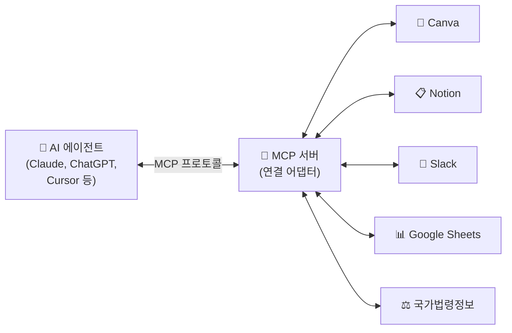

# MCP 실전 활용 가이드

> **"AI에게 뭘 시킬까?"를 넘어서**
> **"어떤 도구를 연결해서 일을 시킬까?"를 고민하는 시대.**

---

## 1. MCP란 무엇인가

### 1-1. 한 줄 정의

!!! tip "MCP = AI를 위한 USB-C 포트"
    **MCP(Model Context Protocol)** = AI 에이전트가 외부 도구(앱, 데이터베이스, API)를 **직접 조작**할 수 있게 해주는 연결 규격.

### 1-2. 기존 방식 vs MCP 방식

```text
기존 방식:
─────────────────────────────────────
사람이 캔바에서 디자인 → 복사 → AI에 붙여넣기 → AI 답변 복사 → 슬랙에 붙여넣기
                        ↑
                  전부 "사람 손"으로


MCP 방식:
─────────────────────────────────────
AI가 직접 캔바에서 디자인 생성 → AI가 판단 → AI가 직접 슬랙에 전송
                        ↑
                  사람은 "지시"와 "검수"만
```

### 1-3. MCP의 구조



| 구성 요소 | 역할 | 비유 |
|---|---|---|
| AI 에이전트 | 명령을 내리고 결과를 판단 | 감독 |
| MCP 서버 | 특정 도구와의 통신을 중계 | USB-C 어댑터 |
| 외부 도구 | 실제 데이터/기능이 있는 곳 | 장비 |

---

## 2. 지금 바로 쓸 수 있는 MCP 서버 카탈로그

### 2-1. 🎨 디자인 & 콘텐츠 제작

#### Canva MCP

| 항목 | 내용 |
|---|---|
| **연결 도구** | Claude (공식 커넥터 지원) |
| **할 수 있는 것** | 디자인 생성, 템플릿 자동 채우기, 리사이즈, PDF/PNG 내보내기, 브랜드 킷 적용 |
| **설정 방법** | Claude → Settings → Connectors → Canva → Connect |

```text
Claude에게 이렇게 말하세요:
─────────────────────────────────────
"인스타 릴스용 썸네일 3종을 만들어줘.
 주제는 '여름 세일', 브랜드 컬러(#FF6B35)를 사용하고,
 하나는 9:16, 하나는 1:1, 하나는 16:9로."

"이 디자인을 PDF로 내보내줘."

"내 캔바 라이브러리에서 '로고' 관련 에셋을 찾아줘."
─────────────────────────────────────
```

### 2-2. 📋 프로젝트 & 문서 관리

#### Notion MCP

| 항목 | 내용 |
|---|---|
| **할 수 있는 것** | 페이지 조회·생성·수정, 데이터베이스 쿼리, 할 일 관리, 회의록 자동 정리 |
| **실전 예시** | "오늘 마감인 태스크를 노션에서 찾아서 슬랙에 리마인드 보내줘" |

#### Google Sheets MCP

| 항목 | 내용 |
|---|---|
| **할 수 있는 것** | 시트 데이터 읽기·쓰기, 수식 계산, 차트 데이터 분석, 보고서 초안 생성 |
| **실전 예시** | "이번 달 지출 내역 시트를 읽어서 카테고리별 비용 분석해줘" |

#### Google Drive MCP

| 항목 | 내용 |
|---|---|
| **할 수 있는 것** | 파일 검색·조회, 문서 내용 읽기, 폴더 관리 |
| **실전 예시** | "드라이브에서 '2026 마케팅 기획' 관련 문서를 모두 찾아서 요약해줘" |

### 2-3. 💬 커뮤니케이션

#### Slack MCP

| 항목 | 내용 |
|---|---|
| **할 수 있는 것** | 메시지 검색·요약, 채널 알림 발송, 파일 공유, 스레드 정리 |
| **실전 예시** | "지난주 #마케팅 채널에서 논의된 피드백을 모아 정리해줘" |

#### Gmail MCP

| 항목 | 내용 |
|---|---|
| **할 수 있는 것** | 이메일 검색·읽기, 초안 작성, 라벨 관리, 첨부파일 처리 |
| **실전 예시** | "지난 7일간 '견적' 관련 이메일을 찾아서 금액과 업체를 표로 정리해줘" |

### 2-4. 📊 마케팅 & 데이터

#### Google Ads / Meta Ads MCP

| 항목 | 내용 |
|---|---|
| **할 수 있는 것** | 캠페인 성과 조회, 예산 확인, ROI 분석, 성과 저조 캠페인 식별 |
| **실전 예시** | "이번 주 Google Ads 성과를 분석해서 ROAS 낮은 캠페인 3개 추려줘" |

#### Brave Search MCP

| 항목 | 내용 |
|---|---|
| **할 수 있는 것** | 실시간 웹 검색, 트렌드 파악, 경쟁사 모니터링 |
| **실전 예시** | "우리 브랜드명으로 최근 1주일 뉴스를 검색해서 요약해줘" |

#### Zapier MCP (만능 커넥터)

| 항목 | 내용 |
|---|---|
| **할 수 있는 것** | 6,000개 이상의 앱과 연결. 전용 MCP가 없는 도구도 연결 가능 |
| **실전 예시** | "Airtable에서 신규 리드를 찾아서 Mailchimp에 자동 등록해줘" |

### 2-5. 🌐 웹 & 브라우저

#### Playwright / Puppeteer MCP (브라우저 자동화)

| 항목 | 내용 |
|---|---|
| **할 수 있는 것** | 웹사이트 탐색, 스크린샷 캡처, 데이터 추출, 폼 자동 입력 |
| **실전 예시** | "경쟁사 홈페이지에서 신규 상품 리스트를 스크래핑해서 표로 만들어줘" |

### 2-6. 🇰🇷 한국 특화 MCP 서버

!!! tip "한국 개발자·공무원들이 만든 실전 MCP 서버"
    국가법령정보센터, 공공데이터포털, DART(전자공시) 등의 공공 API를 MCP 서버로 만들어 놓았습니다. Claude에 연결하면 **자연어로 법률 검색, 판례 분석, 기업 공시 조회**가 가능합니다.

| MCP 서버 | 데이터 출처 | 주요 기능 | GitHub |
|---|---|---|---|
| **korean-law-mcp** | 법제처 국가법령정보센터 | 법령·판례·행정규칙 검색, 조문 비교, 인용 환각 검증 | [chrisryugj/korean-law-mcp](https://github.com/chrisryugj/korean-law-mcp) |
| **kr-law-mcp** | 법제처 Open API | 법령·판례 검색 (경량 최적화) | [dikehomme/kr-law-mcp](https://github.com/dikehomme/kr-law-mcp) |
| **korea-public-data-mcp** | 공공데이터포털 + DART + 법령 | 법령 + 기업공시 + 생활정보 통합 | [hjsh200219/korea-public-data-mcp](https://github.com/hjsh200219/korea-public-data-mcp) |
| **서울시 공공데이터 MCP** | 서울 열린데이터광장 | 인구밀도, 대중교통, 대기질, 따릉이 실시간 | 2026.07 서울시 공식 시범 운영 |
| **awesome-mcp-korea** | — | 한국 특화 MCP 서버 전체 큐레이션 | [darjeeling/awesome-mcp-korea](https://github.com/darjeeling/awesome-mcp-korea) |

```text
Claude에게 이렇게 물어보세요:
─────────────────────────────────────
"근로기준법 제56조 연장근로 수당 관련 조문 전문 보여줘"

"2024년 이후 부당해고 관련 판례 3건 검색해줘"

"개인정보보호법에서 '동의' 관련 조항을 모두 찾아서
 2023년 개정 전후 변경 사항을 비교해줘"

"삼성전자 최근 분기 공시 요약해줘" (DART MCP 연결 시)
─────────────────────────────────────
```

---

## 3. MCP 연결하는 법 (비개발자 가이드)

### 3-1. 방법 A: Claude 공식 커넥터 (가장 쉬움)

코딩 없이 클릭만으로 연결합니다.

```text
1. Claude 웹 또는 앱 열기
2. Settings → Connectors
3. 원하는 도구(Canva, Google Drive 등) 선택
4. Connect 클릭 → 로그인 → 권한 승인
5. 끝! 채팅에서 바로 사용
```

!!! note "현재 공식 커넥터 지원 도구"
    Canva, Google Drive, Notion, Slack 등 주요 도구는 Claude에서 공식 커넥터를 제공합니다.
    공식 커넥터가 없는 도구는 아래 방법 B를 사용합니다.

### 3-2. 방법 B: Claude Desktop 수동 설정

공식 커넥터가 없는 도구(한국 법률 MCP 등)는 설정 파일을 수정합니다.

```json
// claude_desktop_config.json
{
  "mcpServers": {
    "korean-law": {
      "command": "uvx",
      "args": ["korean-law-mcp"],
      "env": {
        "OPEN_LAW_ID": "발급받은_API_ID"
      }
    },
    "google-sheets": {
      "command": "npx",
      "args": ["-y", "@anthropic/mcp-google-sheets"]
    }
  }
}
```

### 3-3. 방법 C: 노코드 플랫폼 (Composio, NoClick)

MCP 서버 URL을 자동 생성해주는 서비스를 활용합니다.

```text
1. Composio 또는 NoClick 접속
2. 연결할 앱 선택 (노션, 슬랙, Airtable 등)
3. 로그인 → MCP 서버 URL 자동 생성
4. URL을 Claude Desktop 설정에 붙여넣기
5. 끝!
```

### 3-4. ⚠️ 보안 원칙 (필독)

| 원칙 | 설명 |
|---|---|
| **읽기 전용으로 시작** | 처음에는 Read-only 권한만 부여. 쓰기 권한은 신뢰가 쌓인 후 |
| **한 번에 1~2개** | MCP 서버를 너무 많이 연결하면 AI가 혼란. 자주 쓰는 것부터 |
| **비밀정보 주의** | 고객 개인정보, 회사 기밀이 있는 도구는 신중하게 |
| **공식 서버 우선** | 커뮤니티 MCP보다 공식 커넥터/서버를 우선 사용 |

---

## 4. 참고 자료 & 학습 로드맵

### 4-1. MCP 학습 3단계

#### 🟢 Level 1: 개념 이해 (30분)

| 자료 | 설명 | 링크 |
|---|---|---|
| Anthropic 공식 MCP 소개 | MCP 존재 이유와 구조 | [anthropic.com/news/model-context-protocol](https://www.anthropic.com/news/model-context-protocol) |
| MCP 공식 문서 (한국어 지원) | 빠른 시작~아키텍처 | [modelcontextprotocol.io](https://modelcontextprotocol.io/) |
| 🎬 MCP 개요 및 아키텍처 가이드 | 한국어 영상 | YouTube "MCP 개요 아키텍처 가이드" 검색 |
| 🎬 MCP Tutorial for Beginners | 영어 영상 | YouTube "MCP Tutorial Beginners Claude" 검색 |

#### 🟡 Level 2: 실전 연결 (1~2시간)

| 자료 | 설명 | 링크 |
|---|---|---|
| 🎬 MCP 9개 정리 (한국어) | 실무 MCP 도구 리뷰 | YouTube "MCP 9개 정리 실무" 검색 |
| MCP 서버 레포지토리 | 수천 개 MCP 서버 목록 | [github.com/modelcontextprotocol/servers](https://github.com/modelcontextprotocol/servers) |
| Claude Desktop 설정 가이드 | JSON 한 줄로 연결 | [modelcontextprotocol.io/quickstart](https://modelcontextprotocol.io/quickstart) |
| 🎬 인프런 MCP 업무자동화 | 한국어 실무 강의 | [inflearn.com](https://www.inflearn.com/) "MCP 업무자동화" 검색 |

#### 🔴 Level 3: 심화 활용 (자율)

| 자료 | 설명 | 링크 |
|---|---|---|
| Anthropic Academy | 무료 공식 MCP 교육 | [anthropic.skilljar.com](https://anthropic.skilljar.com/) |
| DeepLearning.AI MCP 코스 | Andrew Ng 단기 코스 | [deeplearning.ai/short-courses](https://www.deeplearning.ai/short-courses/) |
| 🎬 Build MCP Server | MCP 서버 직접 구축 | YouTube "Build MCP server full course" 검색 |

### 4-2. 도구 바로가기

| 도구 | 링크 | 비고 |
|---|---|---|
| MCP 공식 문서 | [modelcontextprotocol.io](https://modelcontextprotocol.io/) | 한국어 지원 |
| MCP 서버 목록 | [github.com/modelcontextprotocol/servers](https://github.com/modelcontextprotocol/servers) | 공식 레포지토리 |
| awesome-mcp-korea | [GitHub](https://github.com/darjeeling/awesome-mcp-korea) | 한국 특화 MCP 전체 목록 |
| Anthropic Academy | [anthropic.skilljar.com](https://anthropic.skilljar.com/) | 무료 공식 교육 |
| Canva MCP | [canva.dev](https://canva.dev) | 공식 MCP 연동 문서 |
| Composio | [composio.dev](https://composio.dev) | 노코드 MCP 연결 플랫폼 |
| NoClick | [noclick.com](https://noclick.com) | 노코드 MCP URL 생성 |

---

!!! note "기억하세요"
    MCP는 **기술을 배우는 게 아닙니다.**
    
    **"내가 매주 반복하는 업무 중, AI에게 도구까지 맡길 수 있는 게 뭘까?"**
    
    이 질문에 답하는 것이 MCP의 전부입니다.

---

*본 가이드는 2026년 7월 기준으로 작성되었습니다. MCP 생태계는 빠르게 성장 중이므로, 각 서비스의 최신 문서를 병행 참고해 주세요.*
